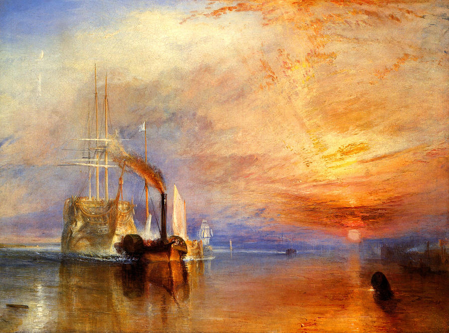

[link](https://thebookofshaders.com/)

```glsl
// Author @patriciogv - 2015
// http://patriciogonzalezvivo.com

#ifdef GL_ES
precision mediump float;
#endif

#define PI 3.1415926535
#define HALF_PI 1.57079632679

uniform vec2 u_resolution;
uniform float u_time;

uniform sampler2D u_tex0;
uniform vec2 u_tex0Resolution;

float speedMoon = 0.01;
float speedSun = 0.25;

vec3 sphereNormals(in vec2 uv) {
    uv = fract(uv)*2.0-1.0;
    vec3 ret;
    ret.xy = sqrt(uv * uv) * sign(uv);
    ret.z = sqrt(abs(1.0 - dot(ret.xy,ret.xy)));
    ret = ret * 0.5 + 0.5;
    return mix(vec3(0.0), ret, smoothstep(1.0,0.98,dot(uv,uv)) );
}

vec2 sphereCoords(vec2 _st, float _scale){
    float maxFactor = sin(1.570796327);
    vec2 uv = vec2(0.0);
    vec2 xy = 2.0 * _st.xy - 1.0;
    float d = length(xy);
    if (d < (2.0-maxFactor)){
        d = length(xy * maxFactor);
        float z = sqrt(1.0 - d * d);
        float r = atan(d, z) / 3.1415926535 * _scale;
        float phi = atan(xy.y, xy.x);

        uv.x = r * cos(phi) + 0.5;
        uv.y = r * sin(phi) + 0.5;
    } else {
        uv = _st.xy;
    }
    return uv;
}

vec4 sphereTexture(in sampler2D _tex, in vec2 _uv) {
    vec2 st = sphereCoords(_uv, 1.0);

    float aspect = u_tex0Resolution.y/u_tex0Resolution.x;
    st.x = fract(st.x*aspect + u_time*speedMoon);

    return texture2D(_tex, st);
}

void main(){
    vec2 st = gl_FragCoord.xy/u_resolution.xy;
    vec3 color = vec3(1.0);

    color *= sphereTexture(u_tex0, st).rgb;

    // Calculate sun direction
    vec3 sunPos = normalize(vec3(cos(u_time*speedSun-HALF_PI),0.0,sin(speedSun*u_time-HALF_PI)));
    vec3 surface = normalize(sphereNormals(st)*2.0-1.0);

    // Add Shadows
    color *= dot(sunPos,surface);

    // Blend black the edge of the sphere
    float radius = 1.0-length( vec2(0.5)-st )*2.0;
    color *= smoothstep(0.001,0.05,radius);

    color = 1.0-color;

    gl_FragColor = vec4(color,1.0);
}

```

# The Book of Shaders

## 0. Introduction (关于这本书)

### 0.1 引言


上面两幅图是由不同的方式制成的. 第一张是梵高一层一层徒手画出来的, 需要花费些时间. 第二张则是用 4个像素矩阵分秒钟生成的: 一个青色, 一个品红, 一个黄色, 和一个黑色矩阵. 关键的区别在于第二张图是用非序列方式实现的 (即不是一步一步实现, 而是多个同时进行).

这本书是关于这个革命性的计算机技术, 片段着色器 (fragment shaders), 它将数字生成的图像提到了新的层次. 你可以把它看做当年的古腾堡印刷术.

```glsl
// Author: tsone
// https://www.shadertoy.com/view/Mdf3Dn

#ifdef GL_ES
precision mediump float;
#endif

#define DOTSIZE 1.48
#define D2R(d) radians(d)
#define MIN_S 07.5
#define MAX_S 15.0
#define SPEED 0.3

#define SST 0.888
#define SSQ 0.288

uniform sampler2D u_tex0;
uniform vec2 u_resolution;
uniform vec2 u_mouse;
uniform float u_time;

vec2 ORIGIN = 0.5*u_resolution.xy;
float S = MIN_S+(MAX_S-MIN_S)*(0.5-0.5*cos(SPEED*u_time));
float R = SPEED*0.333*u_time;

vec4 rgb2cmyki (in vec4 c) {
    float k = max(max(c.r,c.g),c.b);
    return min(vec4(c.rgb/k,k),1.0);
}

vec4 cmyki2rgb (in vec4 c) {
    return vec4(c.rgb*c.a,1.0);
}

vec2 px2uv (in vec2 px) {
    return vec2(px/(u_resolution.xy*vec2(1.0,2.0))-vec2(1.0,0.0) );
}

vec2 grid (in vec2 px) {
    return px-mod(px,S);
}

vec4 ss(in vec4 v) {
    return smoothstep(SST-SSQ,SST+SSQ,v);
}

vec4 halftone (in vec2 fc,in mat2 m) {
    vec2 smp = (grid(m*fc)+0.5*S)*m;
    float s = min(length(fc-smp)/(DOTSIZE*0.5*S),1.0);
    vec4 c = rgb2cmyki(texture2D(u_tex0,px2uv(smp+ORIGIN)));
    return c+s;
}

mat2 rotm (in float r) {
    float cr = cos(r);
    float sr = sin(r);
    return mat2(
        cr,-sr,
        sr,cr
    );
}

void main() {
    vec2 st = gl_FragCoord.xy/u_resolution.xy;

    if (st.x > 0.5) {
        R = 3.14-(u_mouse.y/u_resolution.y)*(3.14/180.);
        S = 12.0-(u_mouse.x/u_resolution.x)*7.0;

        vec2 fc = gl_FragCoord.xy*2.0-ORIGIN;
        mat2 mc = rotm(R+D2R(15.0));
        mat2 mm = rotm(R+D2R(75.0));
        mat2 my = rotm(R);
        mat2 mk = rotm(R+D2R(45.0));

        float k = halftone(fc,mk).a;
        vec4 c = cmyki2rgb(ss(vec4(
            halftone(fc,mc).r,
            halftone(fc,mm).g,
            halftone(fc,my).b,
            halftone(fc,mk).a
        )));

        gl_FragColor = c;
    } else {
        st = vec2(st.x,st.y*0.5)*2.0;
        gl_FragColor = texture2D(u_tex0,st);
    }


}

```

fragment shaders (片断着色器) 可以让你控制像素在屏幕上的快速渲染. 这就是它在各种场合被广泛使用的原因, 从手机的视频滤镜到酷炫的 3D视频游戏.

### 0.2 这本书是为谁而写的 ?

这本书是写给有代码经验和线性代数、三角学的基本知识的创意编程者、游戏开发者和工程师, 还有那些想要提升他们的作品的图像质量到一个令人激动的新层次的人.

这本书会教你如何使用 shaders(着色器) 并把它整合进你的项目里, 以提升作品的表现力和图形质量. 因为 GLSL(OpenGL 的绘制语言) 的 shaders 在很多平台都可以编译和运行, 你将可以把在这里学的运用到任何使用 OpenGL, OpenGL ES 和 WebGl 的环境中.

### 0.3 这本书包含哪些内容 ?

这本书专门关于 GLSL pixel shaders. 首先我们会给出 shaders 的定义; 然后我们会学习如何制作程序里的形状, 图案, 材质, 和与之相关的动画. 你将会学到基础的着色语言并把它们应用到有用的情景中. 比如: 图像处理 (图像运算, 矩阵卷积, 模糊, 颜色滤镜, 查找表及其他效果) 和模拟 (Conway 的生命游戏, Gray-Scott 反应扩散, 水波, 水彩效果, Voronoi 细胞等等). 到书的最后我们将看到一系列基于光线追踪 (Ray Marching) 的进阶技术.

这本书里不包括的内容有:

- 这不是一本 openGL 或 webGL 的书. OpenGL / webGL 是一个比 GLSL 或 fragment shaders 更大的主题. 如果你想要学习 openGL / webGL 推荐看: 《OpenGL Introduction, the 8th edition of the OpenGL Programming Guide》(也被叫做红宝书)或《WebGL: Up and Running》.
- 这不是一本数学书. 虽然我们会涉及到很多关于线代和三角学的算法和技术, 但我们不会详细解释它. 关于数学的问题我推荐手边备一本: 《3rd Edition of Mathematics for 3D Game Programming and computer Graphics》或《2nd Edition of Essential Mathematics for Games and Interactive Applications》.

## 1. Getting started (开始)

### 1.1 什么是 fragment shader (片断着色器) ?

在之前的章节我们把 shaders 和古腾堡印刷术相提并论. 为什么这样类比呢? 更重要的是, 什么是 shader ?

如果你曾经有用计算机绘图的经验, 你就知道在这个过程中你需要画一个圆, 然后一个长方形, 一条线, 一些三角形... 直到画出你想要的图像. 这个过程很像用手写一封信或一本书 —— 都是一系列的指令, 需要你一件一件完成.

Shaders 也是一系列的指令, 但是这些指令会对屏幕上的每个像素同时下达. 也就是说, 你的代码必须根据像素在屏幕上的不同位置执行不同的操作. 就像活字印刷, 你的程序就像一个 function (函数), 输入位置信息, 输出颜色信息, 当它编译完之后会以相当快的速度运行.

### 1.2 为什么 shaders 运行特别快 ?

为了回答这个问题, 不得不给大家介绍并行处理 (parallel processing) 的神奇之处.

想象你的 CPU 是一个大的工业管道, 然后每一个任务都是通过这个管道的某些东西 (就像一个生产流水线那样). 有些任务要比别的大, 也就是说要花费更多时间和精力去处理. 我们就称它要求更强的处理能力. 由于计算机自身的架构, 这些任务需要串行, 即一次一个地依序完成. 现代计算机通常有一组四个处理器, 就像这个管道一样运行, 一个接一个地处理这些任务, 从而使计算机流畅运行. 每个管道通常被称为线程.

视频游戏和其他图形应用比起别的程序来说, 需要高得多的处理能力. 因为它们的图形内容需要操作无数像素. 想想看, 屏幕上的每一个像素都需要计算, 而在 3D游戏中几何和透视也都需要计算.

让我们回到开始那个关于管道和任务的比喻. 屏幕上的每个像素都代表一个最简单的任务. 单独来看完成任何一个像素的任务对 CPU 来说都很容易, 那么问题来了, 屏幕上的每个像素都需要解决这样的小任务! 也就是说, 哪怕是对于一个老式的屏幕 (分辨率 800X600) 来说, 都需要每帧处理 480000个像素, 即每秒进行 14400000次计算! 是的, 这对于 CPU 就是大问题了! 而对于一个现代的 2800X1800 视网膜屏, 每秒运行 60帧, 就需要每秒进行 311040000 次计算. 图形工程师是如何解决这个问题的?

这个时候, 并行处理就是最好的解决方案. 比起用三五个强大的微处理器 (或者说管道) 来处理这些信息, 用一大堆小的微处理器来并行计算, 就要好得多. 这就是图形处理器 (GPU: Graphic Processor Unit)的来由.

设想一堆小型微处理器排成一个平面的画面, 假设每个像素的数据是乒乓球. 14400000个乒乓球可以在一秒内阻塞几乎任何管理. 但是一面 800X600 的管道墙, 每秒接收30波 480000个像素的信息就可以流畅完成. 这在更高的分辨率下也是成立的, 并行的处理器越多, 可以处理的数据流就越大.

另一个 GPU 的魔法是特殊数学函数可以通过硬件加速. 非常复杂的数学操作可以直接被微芯片解决, 而无须通过软件. 这就表示可以有更快的三角和矩阵运算——和电流一样快.

### 1.3 GLSL 是什么 ?

GLSL 代表 OpenGL Shading Language, OpenGL 着色语言, 这是你在接下来章节看到的程序所遵循的具体标准. 根据硬件和操作系统的不同, 还有其他的着色器 (shaders). 这里我们将依照 [Khronos Group](https://www.khronos.org/opengl/) 的规则来执行. 了解 OpenGL 的历史将有助于你理解大多数奇怪的约定, 所以建议不妨阅读 [OpenGLBook](https://openglbook.com/chapter-0-preface-what-is-opengl.html).

### 1.4 为什么 Shaders 有名地不好学 ?

就像蜘蛛侠里的那句名言, 能力越大责任越大, 并行计算也是如此. GPU 的强大的架构设计也有其限制与不足.

为了能使许多管线并行运行, 每一个线程必须与其他的相独立. 我们称这些线程对于其他线程在进行的运算是"盲视"的. 这个限制就会使得所有数据必须以相同的方向流动. 所以就不可能检查其他线程的输出结果, 修改输入的数据, 或者是把一个线程的输出结果输入给另一个线程. 如果允许线程到线程的数据流动将使所有的数据面临威胁.

并且 GPU 会让所有并行的微处理器 (管道们) 一直处在忙碌状态: 只要它们一有空闲就会接到新的信息. 一个线程不可能知道它前一刻在做什么. 它可能是在画操作系统界面上的一个按钮, 然后渲染了游戏中的一部分天空, 然后显示一封 email 中的一些文字. 每个线程不仅是"盲视"的, 而且还是"无记忆"的. 同时, 它要求编写一个通用的规则, 依据像素在不同位置依次输出不同的结果. 这种抽象性, 和盲视, 无记忆的限制使得 shaders 在程序员新手中不是很受欢迎.

## 2. Hello World

"Hello world!" 通常都是学习一个新语言的第一个例子. 这是一个非常简单, 只有一行的程序. 它既是一个热情的欢迎, 也传达了编程所能带来的可能性.

然而在 GPU 的世界里, 第一步就渲染一行文字太难了, 所以我们改为选择一个鲜艳的欢迎色.

```glsl
#ifdef GL_ES
precision mediump float;
#endif

uniform float u_time;

void main() {
    gl_FragColor = vec4(1.0, 0.0, 1.0, 1.0);
}
```

尽管这几行简单的代码看起来不像有很多内容, 我们还是可以据此推测出一些知识点:

1. shader 语言有一个 `main`函数, 会在最后返回颜色值. 这点和 C 语言很像.
2. 最终的像素颜色取决于预设的全局变量 `gl_FragColor`.
3. 这个类 C 语言有内建的变量 (像 `gl_FragColor`), 函数和数据类型. 在本例中我们刚刚介绍了 `vec4`(四分量浮点向量). 之后我们会见到更多的类型, 像 `vec3`(三分量浮点向量) 和 `vec2`(二分量浮点向量), 还有非常著名的 `float`(单精度浮点型), `int`(整型) 和 `bool`(布尔型).
4. 如果我们仔细观察 `vec4`类型, 可以推测这四个变元分别响应红, 绿, 蓝和透明度通道. 同时我们也可以看到这些变量是规范化的, 意思是它们的值是从 0到 1的. 之后我们会学习如何规范化变量, 使得在变量间 map(映射)数值更加容易.
5. 另一个可以从本例看出来的很重要的类 C语言特征是, 预处理程序的宏指令. 宏指令是预编译的一部分. 有了宏才可以 `#define`(定义)全局变量和进行一些基础的条件运算 (通过使用 `#ifdef`和 `#endif`). 所有的宏都以#开头. 预编译会在编译前一刻发生, 把所有的命令复制到 `#defines`里, 检查 `#ifdef`条件句是否已被定义, `#ifdef`条件句是否没有被定义. 在我们刚刚的 "hello world!" 的例子中, 我们在第2行检查了 `GL_ES`是否被定义, 这个通常用在移动端或浏览器的编译中.
6. `float`类型在 shaders 中非常重要, 所以精度非常重要. 更低的精度会有更快的渲染速度, 但是会以质量为代价. 你可以选择每一个浮点值的精度. 在第一行 `precision mediump float;`就是用来设定了所有的浮点值都是中等精度. 我们也可以选择把这个值设为"低"(`precision lowp float;`)或者"高"(`precision highp float;`).
7. 最后可能也是最重要的细节是, GLSL语言规范并不保证变量会被自动转换类别. 这句话是什么意思呢? 显卡的硬件制造商各有不同的显卡加速方式, 但是却被要求有最精简的语言规范. 因而, 自动强制类型转换并没有包括在其中. 在我们的 "hello world!"例子中, `vec4`精确到单精度浮点, 所以应被赋予 `float`格式. 但是如果你想要代码前后一致, 不要之后花费大量时间 debug 的话, 最好养成在 float 型数值里加一个 `.`的好习惯.

```glsl
void main() {
    gl_FragColor = vec4(1, 0, 0, 1); // 可能出错
}
```

接下来可以试试一些好玩的小点子:

- 把单精度浮点值换成整型数值, 猜猜你的显卡能不能容忍这个行为.

- 试试把第八行注释掉, 不给函数赋任何像素的值.

- 尝试另外写个函数, 返回某个颜色, 然后在 `main()`里面使用这个函数. 

  ```glsl
  vec4 red() {
      return vec4(1.0, 0.0, 0.0, 1.0);
  }
  ```

- 有很多种构造 `vec4`类型的方式, 试试看其他方式.

  ```glsl
  vec4 color = vec4(vec3(1.0, 0.0, 1.0), 1.0);
  ```

尽管这个例子看起来不那么刺激, 它却是最最基础的 —— 我们把画布上的每一个像素都改成了一个确切的颜色. 在接下来的章节中我们将会看到如何用两种输入源来改变像素的颜色: 空间(依据像素在屏幕上的位置) 和时间 (依据页面加载了多少秒).

## 3. Uniforms

现在我们知道了 GPU 如何处理并行线程, 每个线程负责给完整图像的一部分配置颜色. 尽管每个线程和其他线程之间不能有数据交换, 但我们能从 CPU 给每个线程输入数据. 因为显卡的架构, 所有线程的输入值必须统一 (uniform), 而且必须设为只读. 也就是说, 每条线程接收相同的数据, 并且是不可改变的数据.

这些输入值叫做 `uniform`(统一值), 它们的数据类型通常为: `float, vec2, vec3, vec4, mat2, mat3, mat4, sampler2D, samplerCube`. uniform 值需要数值类型前后一致. 且在 shader 的开头, 在设定精度之后, 就对其进行定义.

```glsl
#ifdef GL_ES
precision mediump float;
#endif

uniform vec2 u_resolution; // 画布尺寸 (宽, 高)
uniform vec2 u_mouse; // 鼠标位置 (在屏幕上哪个像素)
uniform float u_time; // 时间 (加载后的秒数)
```

你可以把 uniforms 想象成连通 GPU 和 CPU 的许多小的桥梁. 虽然这些 uniforms 的名字千奇百怪, 但是在这一系列的例子中我们会一直用: `u_time`(时间), `u_resolution`(画面尺寸) 和 `u_mouse`(鼠标位置). 按业界传统应在 uniform 值的名字前加 u_, 这样一看即知是 uniform. 但也会有一些其他命名方式, 比如在 shadertoy 就用了如下的名字:

```glsl
uniform vec3 iResolution; // 视口分辨率 (以像素计)
uniform vec4 iMouse; // 鼠标坐标 xy: 当前位置, zw: 点击位置
uniform float iTime; // shader 运行时间 (以秒计)
```

现在来实际操作一下 uniform, 在下面的代码中我们使用 `u_time`加上一个 `sin`函数, 来展示图中红色的动态变化.

```glsl
#ifdef GL_ES
precision mediump float;
#endif

uniform float u_time;

void main() {
    gl_FragColor = vec4(abs(sin(u_time)), 0.0, 0.0, 1.0);
}
```

GLSL 还有更多惊喜. GPU 的硬件加速支持我们使用角度, 三角函数和指数函数.

接下来可以尝试:

- 降低颜色变化的速率, 直到肉眼都看不出来.
- 加速变化, 直到颜色静止不动.
- 玩一玩 RGB 三个通道, 分别给三个颜色不同的变化速度, 看看能不能做出有趣的效果.

**gl_FragCoord**

就像 GLSL 有个默认输出值 `vec4 gl_FragColor`一样, 它也有一个默认输入值 (`vec4 gl_FragCoord`). `gl_FragCoord`存储了活动线程正在处理的像素或屏幕碎片的坐标. 有了它我们就知道了屏幕上的哪一个线程正在运转. 为什么我们不叫 `gl_FragCoord` uniform (统一值)呢? 因为每个像素的坐标都不同, 所以我们把它叫做 varying (变化值).

```glsl
#ifdef GL_ES
precision mediump float;
#endif

uniform vec2 u_resolution;
uniform vec2 u_mouse;
uniform float u_time;

void main() {
    vec2 st = gl_FragCoord.xy / u_resolution;
    gl_FragColor = vec4(st.x, st.y, 0.0, 1.0);
}
```

上述代码中我们用 `gl_FragCoord.xy`除以 `u_resolution`, 对坐标进行了规范化. 这样做是为了使所有的值都落在 0.0 到 1.0 之间, 这样就可以轻松把 X 或 Y 的值映射到红色或绿色通道.

在 shader 的领域我们没有太多要 debug 的, 更多地是试着给变量赋一些很炫的颜色, 试图做出一些效果. 有时你会觉得用 GLSL 编程就像是把一艘船放到了瓶子里. 同等地困难, 美丽而令人满足.

现在我们来检验一下我们对上面代码的理解程度:

- 你明白 `(0.0, 0.0)`坐标在画布上的哪里吗?
- 那 `(1.0, 0.0), (0.0, 1.0), (0.5, 0.5), (1.0, 1.0)`呢?
- 你知道如何用未规范化 (normalized) 的 `u_mouse`吗? 你可以用它来移动颜色吗?
- 你可以用 `u_time`和 `u_mouse`来改变颜色的图案吗? 不妨琢磨一些有趣的途径.

## 4. Running your shader (运行你的 shader)

现在你可能跃跃欲试, 想在你熟悉的平台上小试牛刀了. 接下来会有一些比较流行的平台的示例代码, 展示如何在这些平台上配置 shader.

注释1: 如果你不想用这些平台来运行 shader, 且你想在浏览器外使用 shader, 你可以下载 [glslViewer](https://github.com/patriciogonzalezvivo/glslViewer). 这个 MacOS + 树莓派程序直接在终端运行, 并且是为本书的例子量身打造的.

注释2: 如果你想用 WebGL 显示 shader, 并不关心其他平台, 你可以用 [glslCanvas](https://github.com/patriciogonzalezvivo/glslCanvas).

### 4.1 Three.js

为人谦逊而非常有才华的 Ricardo Cabello (也就是 [MrDoob](https://twitter.com/mrdoob))和许多贡献者一起搭了可能是 WebGL 最知名的平台, [Three.js](https://threejs.org/). 你可以找到无数程序示例, 教程, 书籍, 教你如何用这个 JavaScript 库做出酷炫的 3D 图像.

```html
<body>
    <div id="container"></div>
    <script src="js/three.min.js"></script>
    <script id="vertexShader" type="x-shader/x-vertex">
    	void main() {
    		gl_Position = vec4(position, 1.0);
    	}
    </script>
    <script id="fragmentShader" type="x-shader/x-fragment">
    	uniform vec2 u_resolution;
    	uniform float u_time;
    	void main() {
    		vec2 st = gl_FragCoord.xy / u_resolution.xy;
    		gl_FragColor = vec4(st.x, st.y, 0.0, 1.0);
    	}
    </script>
    <script>
    	var container;
        var camera, scene, renderer;
        var uniforms;
        
        init();
        animate();
        
        function init() {
            container = document.getElementById('container');
            
            camera = new THREE.Camera();
            camera.position.z = 1;
            
            scene = new THREE.Scene();
            
            var geometry = new THREE.PlaneBufferGeometry(2, 2);
            
            uniforms = {
                u_time: { type: 'f', value: 1.0 },
                u_resolution: { type: 'v2', value: new THREE.Vector2() }
            };
            
            var material = new THREE.ShaderMaterial({
                uniforms,
                vertexShader: document.getElementById('vertexShader').textContent,
                fragmentShader: document.getElementById('fragmentShader').textContent
            });
            
            var mesh = new THREE.Mesh(geometry, material);
            scene.add(mesh);
            
            renderer = new THREE.WebGLRenderer();
            renderer.setPixelRatio(window.devicePixelRatio);
            
            container.appendChild(renderer.domElement);
            
            onWindowResize();
            window.addEventListener('resize', onWIndowResize, false);
        }
        
        function onWindowResize(event) {
            renderer.setSize(window.innerWidth, window.innerHeight);
            uniforms.u_resolution.value.x = renderer.domElement.width;
            uniforms.u_resolution.value.y = renderer.domElement.height;
        }
        
        function animate() {
            requestAnimationFrame(animate);
            render();
        }
        
        function render() {
            uniforms.u_time.value += 0.05;
            renderer.render(scene, camera);
        }
    </script>
</body>
```

### 4.2 Processing

2001年由 [Ben Fry](http://benfry.com/) 和 [Casey Reas](http://reas.com/) 创建, [Processing](https://processing.org/) 是一个极其简约而强大的环境, 非常适合初尝代码的人. 关于 OpenGL 和视频, Andres Colubri 为 Processing 平台做了很重要的更新, 使得环境非常友好, 玩 GLSL shader 比起以前大大容易了. 

```js
PShader shader;

void setup() {
    size(640, 360, P2D);
    noStroke();
    
    shader = loadShader('shader.frag');
}

void draw() {
    shader.set('u_resolution', float(width), float(height));
    shader.set('u_mouse', float(mouseX), float(mouseY));
    shader.set('u_time', millis() / 1000.0);
    shader(shader);
    rect(0, 0, width, height);
}
```

在 2.1 版之前的版本运行 shader, 需要在你的 shader 文件开头添加以下代码: `#define PROCESSING_COLOR_SHADER`, 所以 shader.frag 应该看起来是这样:

```glsl
#ifdef GL_ES
precision mediump float;
#endif

#define PROCESSING_COLOR_SHADER

uniform vec2 u_resolution;
uniform vec3 u_mouse;
uniform float u_time;

void main() {
    vec2 st = gl_FragCoord.st / u_resolution;
    gl_FragColor = vec4(st.x, st.y, 0.0, 1.0);
}
```

### 4.3 openFrameworks

[这个](https://openframeworks.cc/) C++ 框架打包了 OpenGL 和其他开源 C++ 库. 在很多方面它和 Processing 非常像, 但是明显和 C++ 编译器打交道一定比较麻烦.

```c++
void ofApp::draw() {
    ofShader shader;
    shader.load("", "shader.frag");
    
    shader.begin();
    shader.setUniform1f("u_time", ofGetElapsedTimef());
    shader.setUniform2f("u_resolution", ofGetWidth(), ofGetHeight());
    ofRect(0, 0, ofGetWidth(), ofGetHeight());
    shader.end();
}
```

## 5. Algorithmic drawing (算法绘画)

### 5.1 造型函数

这一章应该叫做宫城先生的粉刷课 (来自电影《龙威小子》的经典桥段). 之前我们把规范化后的 x,y 坐标映射(map)到了红色和绿色通道. 本质上说我们是建造了这样一个函数: 输入一个二维向量 (x, y), 然后返回一个四维向量 (r, g, b, a). 但在我们跨维度转换数据之前, 我们先从更加...简单的开始. 我们来建一个只有一维变量的函数. 你花越多的时间和精力在这上面, 你的 shader 功夫就越厉害.

接下来的代码结构就是我们的基本功. 在它之中我们对规范化的 x 坐标(st.x) 进行可视化. 有两种途径: 一种是用亮度 (度量从黑色到白色的渐变过程), 另一种是在顶层绘制一条绿色的线 (在这种情况下 x 被直接赋值给 y).

```glsl
#ifdef GL_ES
precision mediump float;
#endif

uniform vec2 u_resolution;
uniform vec2 u_mouse;
uniform float u_time;

float plot(vec2 st) {
    return smoothstep(0.02, 0.0, abs(st.y - st.x));
}

void main() {
    vec2 st = gl_FragCoord.xy / u_resolution.xy;
    
    float y = st.x;
    vec3 color = vec3(y);
    
    float pct = plot(st);
    color = (1.0 - pct) * color + pct * vec3(0.0, 1.0, 0.0);
    
    gl_FragColor = vec4(color, 1.0);
}
```

这些代码就是你的基本功; 遵守和理解它非常重要. 你将会一遍又一遍地回到 0.0 到 1.0 这个区间. 你将会掌握融合与构建这些代码的艺术.

这些 x 与 y(或亮度)之前一对一的关系称作**线性插值**(linear interpolation) (插值是离散函数逼近的重要方法, 利用它可通过函数在有限个点处的取值状态, 估算出函数在其他点处的近似值. 因为对计算机来说, 屏幕像素是离散的而不是连续的, 计算机图形学常用插值来填充图像像素之间的空隙.) 现在起我们可以用一些数学函数来改造这些代码行. 比如说我们可以做一个求 x 的 5次幂的曲线.

```glsl
#ifdef GL_ES
precision mediump float;
#endif

#define PI 3.14159265359

uniform vec2 u_resolution;
uniform vec2 u_mouse;
uniform float u_time;

float plot(vec2 st, float pct) {
    return smoothstep(pct - 0.02, pct, st.y) - smoothstep(pct, pct + 0.02, st.y);
}

void main() {
    vec2 st = gl_FragCoord.xy / u_resolution;
    
    float y = pow(st.x, 5.0);
    
    vec3 color = vec3(y);
    
    float pct = plot(st, y);
    color = (1.0 - pct) * color + pct * vec3(0.0, 1.0, 0.0);
    
    gl_FragColor = vec4(color, 1.0);
}
```

试着把指数 (pow)改为不同的值, 比如: 20.0, 2.0, 1.0, 0.0, 0.2 或 0.02. 理解值和指数之间的关系非常重要. 这些数学函数可以让你灵动地控制你的代码, 就像是给数据做针灸一样.

`pow()`(求 x 的 y 次幂) 是 GLSL 的一个原生函数, GLSL 有很多原生函数. 大多数原生函数都是硬件加速的, 也就是说如何你正确使用这些函数, 你的代码就会跑得更快.

另外可以试着换掉幂函数, 试试看 `exp()`(以自然常数 e 为底的指数函数), `log()`(对数函数) 和 `sqrt()`(平方根函数). 另外还可以利用宏定义的 PI 来使用某些方程.

### 5.2 step 和 smoothstep

GLSL 还有一些独特的原生插值函数可以被硬件加速.

`step()`插值函数需要输入两个参数. 第一个是极限或阈值, 第二个是我们想要检测或通过的值. 对任何小于阈值的值, 返回 0.0, 大于阈值, 则返回 1.0.

另一个 GLSL 的特殊函数是 `smoothstep()`. 当给定一个范围的上下限和一个数值, 这个函数会在已有的范围内给出插值. 前两个参数规定转换的开始和结束点, 第三个是给出一个值用来插值.

### 5.3 正弦和余弦函数

当你想用数学来制造动效, 形态或去混合数值, sin 和 cos 就是你的最佳伙伴.

这两个基础的三角形函数是构造圆的极佳工具. 很重要的一点是你需要知道他们是如何运转的, 还有如何把它们结合起来. 简单来说, 当我们给出一个角度 (这里采用弧度制), 它就会返回半径为1的圆上一个点的 x 坐标(cos) 和 y 坐标(sin). 正因为 sin 和 cos 返回的是规范化的值 (即值域在 -1 和 1 之间), 且如此流畅, 这就使得它成为一个极其强大的工具.


尽管描述三角函数和圆的关系是一件蛮困难的事情, 上图动画很棒地做到了这点, 视觉化展现了它们之间的关系.

```glsl
y = sin(x); // 平滑地在 y 轴 +1 和 -1 之间变化
y = sin(x + u_time); // sin 曲线随着时间在 x 轴动了起来
y = sin(x * PI); // sin 曲线每两个整数循环一次
y = sin(x * u_time); // 循环变得越来越频繁, 当 u_time 非常大时, 图像将难以辨认
y = sin(x) + 1.; // 曲线向上整体移动了
y = sin(x) * 2.; // 曲线增大了两倍
y = abs(sin(x)); // 弹力球的轨迹
y = fract(sin(x)); // 只取小数部分
y = ceil(sin(x)); // 向正无穷取整, 使得 sin 曲线变成只有 1 和 -1 的电子波
y = floor(sin(x)); // 向负无穷取整, 使得 sin 曲线变成只有 1 和 -1 的电子波
```

### 5.4 其他有用的函数

```glsl
y = mod(x, 0.5); // 返回 x 对 0.5 取模的值
y = fract(x); // 仅返回小数部分
y = ceil(x); // 向正无穷取整
y = floor(x); // 向负无穷取整
y = sign(x); // 提取 x 的正负号
y = abs(x); // 返回 x 的绝对值
y = clamp(x, 0.0, 1.0); // 把 x 的值限制在 0.0 到 1.0 之间
y = min(0.0, x); // 返回 x 和 0.0 中的较小值
y = max(0.0, x); // 返回 x 和 0.0 中的较大值
```

### 5.5 造型函数进阶

[Golan Levin](http://www.flong.com/) 写过关于更加复杂的造型函数的文档, 非常有帮助. 把它们引入 GLSL 是非常明智的选择, 这将是你的代码的广阔的素材库.

- [多项式造型函数](http://www.flong.com/archive/texts/code/shapers_poly/) (Polynomial Shaping Functions)
- [指数造型函数](http://www.flong.com/archive/texts/code/shapers_exp/) (Exponential Shaping Functions)
- [圆与椭圆的造型函数](http://www.flong.com/archive/texts/code/shapers_circ/) (Circular & Elliptical Shaping Functions)
- [贝塞尔和其他参数化造型函数](http://www.flong.com/archive/texts/code/shapers_bez/) (Bezier and Other Parametric Shaping Functions)

就像厨师自主选择辣椒和各种原料, 数字艺术家和创意编程者往往钟情于使用他们自己的造型函数.

[Iñigo Quiles](http://www.iquilezles.org/) 收集了一套[有用的函数](https://www.iquilezles.org/www/articles/functions/functions.htm).

- Almost Identity 1

  ```glsl
  float almostIdentity(float x, float m, float n) {
      if(x > m) return x;
      float a = 2.0 * n - m;
      float b = 2.0 * m - 3.0 * n;
      float t = x / m;
      return (a * t + b) * t * t + n;
  }
  // y = almostIdentity(st.x, 1.0, 0.0);
  ```

- Almost Identity 2

  ```glsl
  float almostIdentity(float x, float n) {
      return sqrt(x * x + n);
  }
  // y = almostIdentity(st.x, 0.01);
  ```

- Almost Unit Identity

  ```glsl
  float almostUnitIdentity(float x) {
      return x * x * (2.0 - x);
  }
  // y = almostUnitIdentity(st.x);
  ```

- Smoothstep Integral

  ```glsl
  float integralSmoothstep(float x, float T) {
      if(x > T) return x - T / 2.0;
      return x * x * x * (1.0 - x * 0.5 / T) / T / T;
  }
  // y = integralSmoothstep(st.x, 0.5);
  ```

- Exponential Impulse

  ```glsl
  float impulse(float x, float k) {
      float h = k * x;
      return h * exp(1.0 - h);
  }
  // y = impulse(st.x, 12.0);
  ```

- Polynomial Impulse

  ```glsl
  float quaImpulse(float k, float x) {
      return 2.0 * sqrt(k) * x / (1.0 + k * x * x);
  }
  // y = quaImpulse(st.x, 0.5);
  
  float polyImpulse(float k, float n, float x) {
      return (n / (n - 1.0)) * pow((n - 1.0) * k, 1.0 / n) * x / (1.0 + k * pow(x, n));
  }
  // y = polyImpulse(1.0, 3.14, st.x);
  ```

- Sustained Impulse

  ```glsl
  float expSustainedImpulse(float x, float f, float k) {
      float s = max(x - f, 0.0);
      return min(x * x / (f * f), 1.0 + (2.0 / f) * s * exp(-k * s));
  }
  // y = expSustainedImpulse(st.x, 1.0, 0.0);
  ```

- Cubic Pulse

  ```glsl
  float cubicPulse(float c, float w, float x) {
      x = abs(x - c);
      if(x > w) return 0.0;
      x /= w;
      return 1.0 - x * x * (3.0 - 2.0 * x);
  }
  // y = cubicPulse(0.5, 0.2, st.x);
  ```

- Exponential Step

  ```glsl
  float expStep(float x, float k, float n) {
      return exp(-k * pow(x, n));
  }
  // y = expStep(st.x, 10.0, 1.0);
  ```

- Gain

  ```glsl
  float gain(float x, float k) {
      float a = 0.5 * pow(2.0 * ((x < 0.5) ? x : 1.0 - x), k);
      return (x < 0.5) ? a : 1.0 - a;
  }
  // y = gain(st.x, 2.0);
  ```

- Parabola

  ```glsl
  float parabola(float x, float k) {
      return pow(4.0 * x * (1.0 - x), k);
  }
  // y = parabola(st.x, 1.0);
  ```

- Power Curve

  ```glsl
  float pcurve(float x, float a, float b) {
      float k = pow(a + b, a + b) / (pow(a, a) * pow(b, b));
      return k * pow(x, a) * pow(1.0 - x, b);
  }
  // y = pcurve(st.x, 3.0, 1.0);
  ```

- Sinc curve

  ```glsl
  float sinc(float x, float k) {
      float a = PI * (k * x - 1.0);
      return sin(a) / a;
  }
  // y = sinc(st.x, 10.0);
  ```

### 5.6 练习


来看看 [Kynd](http://www.kynd.info/log/) 帮大家制作的公式表. 看他如何结合各种函数及它们的属性, 始终控制值的范围在 0.0 到 1.0.

```glsl
float curve(float x) {
    return 1.0 - pow(abs(x), 0.5);
    return 1.0 - pow(abs(x), 1.0);
    return 1.0 - pow(abs(x), 1.5);
    return 1.0 - pow(abs(x), 2.0);
    return 1.0 - pow(abs(x), 2.5);
    return 1.0 - pow(abs(x), 3.0);
    return 1.0 - pow(abs(x), 3.5);
    //
    return pow(cos(PI * x / 2.0), 0.5);
    return pow(cos(PI * x / 2.0), 1.0);
    return pow(cos(PI * x / 2.0), 1.5);
    return pow(cos(PI * x / 2.0), 2.0);
    return pow(cos(PI * x / 2.0), 2.5);
    return pow(cos(PI * x / 2.0), 3.0);
    //
    return 1.0 - pow(abs(sin(PI * x / 2.0)), 0.5);
    return 1.0 - pow(abs(sin(PI * x / 2.0)), 1.0);
    return 1.0 - pow(abs(sin(PI * x / 2.0)), 1.5);
    return 1.0 - pow(abs(sin(PI * x / 2.0)), 2.0);
    return 1.0 - pow(abs(sin(PI * x / 2.0)), 2.5);
    return 1.0 - pow(abs(sin(PI * x / 2.0)), 3.0);
    //
    return pow(min(cos(PI * x / 2.0), 1.0 - abs(x)), 0.5);
    return pow(min(cos(PI * x / 2.0), 1.0 - abs(x)), 1.0);
    return pow(min(cos(PI * x / 2.0), 1.0 - abs(x)), 1.5);
    return pow(min(cos(PI * x / 2.0), 1.0 - abs(x)), 2.0);
    return pow(min(cos(PI * x / 2.0), 1.0 - abs(x)), 2.5);
    return pow(min(cos(PI * x / 2.0), 1.0 - abs(x)), 3.0);
    //
    return 1.0 - pow(max(0.0, abs(x) * 2.0 - 1.0), 0.5);
    return 1.0 - pow(max(0.0, abs(x) * 2.0 - 1.0), 1.0);
    return 1.0 - pow(max(0.0, abs(x) * 2.0 - 1.0), 1.5);
    return 1.0 - pow(max(0.0, abs(x) * 2.0 - 1.0), 2.0);
    return 1.0 - pow(max(0.0, abs(x) * 2.0 - 1.0), 2.5);
    return 1.0 - pow(max(0.0, abs(x) * 2.0 - 1.0), 3.0);
}

float y = fn(1.0 - (st.x * 2.0));
```

**填充你的工具箱**

这里有一些工具可以帮你更轻松地可视化这些函数.

- Grapher: 如果你是 MacOS 系统, 用 spotlight 搜 grapher 就会看到这个超级方便的工具了.
- [GraphToy](https://graphtoy.com/): 仍然是 [Iñigo Quilez](http://www.iquilezles.org/) 为大家做的工具, 用于在 WebGL 中可视化 GLSL 函数.
- [Shadershop](http://tobyschachman.com/Shadershop/): 这个超级棒的工具是 [Toy Schachman](http://tobyschachman.com/) 的作品. 它会以一种极其视觉化和直观的方式教你如何建造复杂的函数.

## 6. Colors (颜色)

我们目前为止还未涉及到 GLSL 的向量类型. 在我们深入向量之前, 学习更多关于变量和色彩主题是一个了解向量类型的好方法.

若你熟悉面向对象的编程范式 (或者说编程思维模式), 你一定注意到我们以一种类 C 的 struct 的方式访问向量数据的内部分量.

```glsl
vec3 red = vec3(1.0, 0.0, 0.0);
red.x = 1.0;
red.y = 0.0;
red.z = 0.0;
```

以 x, y, z 定义颜色是不是有些奇怪? 正因如此, 我们有其他方法访问这些变量 —— 以不同的名字. `.x, .y, .z`也可以被写作 `.r, .g, .b` 和 `.s, .t, .p`. (`.s, .t, .p`通常被用做后面章节提到的贴图空间坐标). 你也可以通过使用索引位置 [0], [1] 和 [2] 来访问向量.

```glsl
vec4 vector;
vector[0] = vector.r = vector.x = vector.s;
vector[1] = vector.g = vector.y = vector.t;
vector[2] = vector.b = vector.z = vector.p;
vector[3] = vector.a = vector.w = vector.q;
```

这些指向向量内部变量的不同方式是设计用来帮助你写出干净代码的术语. 着色语言所包含的灵活性为你互换地思考颜色和坐标位置.

GLSL 中向量类型的另一大特点是可以用你需要的任意顺序简单地投射和混合(变量)值. 这种能力被称为: 鸡尾酒.

```glsl
vec3 yellow, magenta, green;

yellow.rg = vec2(1.0); // red 和 green 为 1.0
yellow[2] = 0.0; // blue 为 0.0

magenta = yellow.rbg; // 注意 blue 和 green 互换了

green.rgb = yellow.bgb;
```

### 6.1 混合颜色

现在你了解到如何定义颜色, 是时候将先前所学的整合一下了! 在 GLSL 中, 有个十分有用的函数: `mix()`, 这个函数让你以百分比混合两个值. 百分比的取值范围是 0 到 1.

```glsl
#ifdef GL_ES
precision mediump float;
#endif

uniform vec2 u_resolution;
uniform float u_time;

vec3 colorA = vec3(0.149, 0.141, 0.912);
vec3 colorB = vec3(1.000, 0.833, 0.224);

void main() {
    vec3 color = vec3(0.0);
    
    float pct = abs(sin(u_time));
    
    color = mix(colorA, colorB, pct);
    
    gl_FragColor = vec4(color, 1.0);
}
```

Robert Penner 开发了一系列流行的计算机动画塑形函数, 被称为[缓动函数](https://easings.net/cn).


- easeInSine:

  ```css
  .ani {
      /* CSS */
      transition: transform 0.6s cubic-bezier(0.12, 0, 0.39, 0);
      /* 渐变 */ 
      background: linear-gradient(to bottom, #1473e6, cubic-bezier(0.12, 0, 0.39, 0), #247b5e);
  }
  ```

  ```glsl
  float easeInSine(float x) {
      return 1.0 - cos((x * PI) / 2.0);
  }
  ```

- easeOutSine:

  ```css
  .ani {
      /* CSS */
      transition: transform 0.6s cubic-bezier(0.61, 1, 0.88, 1);
      /* 渐变 */
      background: linear-gradient(to bottom, #1473e6, cubic-bezier(0.61, 1, 0.88, 1), #247b5e);
  }
  ```

  ```glsl
  float easeOutSine(float x) {
      return sin((x * PI) / 2.0);
  }
  ```

- easeInOutSine:

  ```css
  .ani {
      /* CSS */
      transition: transform 0.6s cubic-bezier(0.37, 0, 0.63, 1);
      /* 渐变 */
      background: linear-gradient(to bottom, #1473e6, cubic-bezier(0.37, 0, 0.63, 1), #247b5e);
  }
  ```

  ```glsl
  float easeInOutSine(float x) {
      return -(cos(PI * x) - 1.0) / 2.0;
  }
  ```

- easeInQuad:

  ```css
  .ani {
      /* CSS */
      transition: transform 0.6s cubic-bezier(0.11, 0, 0.5, 0);
      /* 渐变 */
      background: linear-gradient(to bottom, #1473e6, cubic-bezier(0.11, 0, 0.5, 0), #247b5e);
  }
  ```

  ```glsl
  float easeInQuad(float x) {
      return x * x;
  }
  ```

- easeOutQuad:

  ```css
  .ani {
      /* CSS */
      transition: transform 0.6s cubic-bezier(0.5, 1, 0.89, 1);
      /* 渐变 */
      background: linear-gradient(to bottom, #1473e6, cubic-bezier(0.5, 1, 0.89, 1), #247b5e);
  }
  ```

  ```glsl
  float easeOutQuad(float x) {
      return 1.0 - (1.0 - x) * (1.0 - x);
  }
  ```

- easeInOutQuad:

  ```css
  .ani {
      /* CSS */
      transition: transform 0.6s cubic-bezier(0.45, 0, 0.55, 1);
      /* 渐变 */
      background: linear-gradient(to bottom, #1473e6, cubic-bezier(0.45, 0, 0.55, 1), #247b5e);
  }
  ```

  ```glsl
  float easeInOutQuad(float x) {
      return x < 0.5 ? 2.0 * x * x : 1.0 - pow(-2.0 * x + 2.0, 2.0) / 2.0;
  }
  ```

- easeInCubic:

  ```css
  .ani {
      /* CSS */
      transition: transform 0.6s cubic-bezier(0.32, 0, 0.67, 0);
      /* 渐变 */
      background: linear-gradient(to bottom, #1473e6, cubic-bezier(0.32, 0, 0.67, 0), #247b5e);
  }
  ```

  ```glsl
  float easeInCubic(float x) {
      return x * x * x;
  }
  ```

- easeOutCubic:

  ```css
  .ani {
      /* CSS */
      transition: transform 0.6s cubic-bezier(0.33, 1, 0.68, 1);
      /* 渐变 */
      background: linear-gradient(to bottom, #1473e6, cubic-bezier(0.33, 1, 0.68, 1), #247b5e);
  }
  ```

  ```glsl
  float easeOutCubic(float x) {
      return 1.0 - pow(1.0 - x, 3.0);
  }
  ```

- easeInOutCubic:

  ```css
  .ani {
      /* CSS */
      transition: transform 0.6s cubic-bezier(0.65, 0, 0.35, 1);
      /* 渐变 */
      background: linear-gradient(to bottom, #1473e6, cubic-bezier(0.65, 0, 0.35, 1), #247b5e);
  }
  ```

  ```glsl
  float easeInOutCubic(float x) {
      return x < 0.5 ? 4.0 * x * x * x : 1.0 - pow(-2.0 * x + 2.0, 3.0) / 2.0;
  }
  ```

- easeInQuart:

  ```css
  .ani {
      /* CSS */
      transition: transform 0.6s cubic-bezier(0.5, 0, 0.75, 0);
      /* 渐变 */
      background: linear-gradient(to bottom, #1473e6, cubic-bezier(0.5, 0, 0.75, 0), #247b5e);
  }
  ```

  ```glsl
  float easeInQuart(float x) {
      return x * x * x * x;
  }
  ```

- easeOutQuart:

  ```css
  .ani {
      /* CSS */
      transition: transform 0.6s cubic-bezier(0.25, 1, 0.5, 1);
      /* 渐变 */
      background: linear-gradient(to bottom, #1473e6, cubic-bezier(0.25, 1, 0.5, 1), #247b5e);
  }
  ```

  ```glsl
  float easeOutQuart(float x) {
      return 1.0 - pow(1.0 - x, 4.0);
  }
  ```

- easeInOutQuart:

  ```css
  .ani {
      /* CSS */
      transition: transform 0.6s cubic-bezier(0.76, 0, 0.24, 1);
      /* 渐变 */
      background: linear-gradient(to bottom, #1473e6, cubic-bezier(0.76, 0, 0.24, 1), #247b5e);
  }
  ```

  ```glsl
  float easeInOutQuart(float x) {
      return x < 0.5 ? 8.0 * x * x * x * x : 1.0 - pow(-2.0 * x + 2.0, 4.0) / 2.0;
  }
  ```

- easeInQuint:

  ```css
  {
      /* CSS */
      transition: transform 0.6s cubic-bezier(0.64, 0, 0.78, 0);
      /* 渐变 */
      background: linear-gradient(to bottom, #1473e6, cubic-bezier(0.64, 0, 0.78, 0), #247b5e);
  }
  ```

  ```glsl
  float easeInQuint(float x) {
      return x * x * x * x * x;
  }
  ```

- easeOutQuint:

  ```css
  {
      /* CSS */
      transition: transform 0.6s cubic-bezier(0.22, 1, 0.36, 1);
      /* 渐变 */
      background: linear-gradient(to bottom, #1473e6, cubic-bezier(0.22, 1, 0.36, 1), #247b5e);
  }
  ```

  ```glsl
  float easeOutQuint(float x) {
      return 1.0 - pow(1.0 - x, 5.0);
  }
  ```

- easeInOutQuint:

  ```css
  {
      /* CSS */
      transition: transform 0.6s cubic-bezier(0.83, 0, 0.17, 1);
      /* 渐变 */
      background: linear-gradient(to bottom, #1473e6, cubic-bezier(0.83, 0, 0.17, 1), #247b5e);
  }
  ```

  ```glsl
  float easeInOutQuint(float x) {
      return x < 0.5 ? 16.0 * x * x * x * x * x : 1.0 - pow(-2.0 * x + 2.0, 5.0) / 2.0;
  }
  ```

- easeInExpo:

  ```css
  {
      /* CSS */
      transition: transform 0.6s cubic-bezier(0.7, 0, 0.84, 0);
      /* 渐变 */
      background: linear-gradient(to bottom, #1473e6, cubic-bezier(0.7, 0, 0.84, 0), #247b5e);
  }
  ```

  ```glsl
  float easeInExpo(float x) {
      return x == 0.0 ? 0.0 : pow(2.0, 10.0 * x - 10.0);
  }
  ```

- easeOutExpo:

  ```css
  {
      /* CSS */
      transition: transform 0.6s cubic-bezier(0.16, 1, 0.3, 1);
      /* 渐变 */
      background: linear-gradient(to bottom, #1473e6, cubic-bezier(0.16, 1, 0.3, 1), #247b5e);
  }
  ```

  ```glsl
  float easeOutExpo(float x) {
      return x == 1.0 ? 1.0 : 1.0 - pow(2.0, -10.0 * x);
  }
  ```

- easeInOutExpo:

  ```css
  {
      /* CSS */
      transition: transform 0.6s cubic-bezier(0.87, 0, 0.13, 1);
      /* 渐变 */
      background: linear-gradient(to bottom, #1473e6, cubic-bezier(0.87, 0, 0.13, 1), #247b5e);
  }
  ```

  ```glsl
  float easeInOutExpo(float x) {
      return x == 0.0 ? 0.0 : x == 1.0 ? 1.0 : x < 0.5 ? pow(2.0, 20.0 * x - 10.0) / 2.0 : (2.0 - pow(2.0, -20.0 * x + 10.0)) / 2.0;
  }
  ```

- easeInCirc:

  ```css
  {
      /* CSS */
      transition: transform 0.6s cubic-bezier(0.55, 0, 1, 0.45);
      /* 渐变 */
      background: linear-gradient(to bottom, #1473e6, cubic-bezier(0.55, 0, 1, 0.45), #247b5e);
  }
  ```

  ```glsl
  float easeInCirc(float x) {
      return 1.0 - sqrt(1.0 - pow(x, 2.0));
  }
  ```

- easeOutCirc:

  ```css
  {
      /* CSS */
      transition: transform 0.6s cubic-bezier(0, 0.55, 0.45, 1);
      /* 渐变 */
      background: linear-gradient(to bottom, #1473e6, cubic-bezier(0, 0.55, 0.45, 1), #247b5e);
  }
  ```

  ```glsl
  float easeOutCirc(float x) {
      return sqrt(1.0 - pow(x - 1.0, 2.0));
  }
  ```

- easeInOutCirc:

  ```css
  {
      /* CSS */
      transition: transform 0.6s cubic-bezier(0.85, 0, 0.15, 1);
      /* 渐变 */
      background: linear-gradient(to bottom, #1473e6, cubic-bezier(0.85, 0, 0.15, 1), #247b5e);
  }
  ```

  ```glsl
  float easeInOutCirc(float x) {
      return x < 0.5 ? (1.0 - sqrt(1.0 - pow(2.0 * x, 2.0))) / 2.0 : (sqrt(1.0 - pow(-2.0 * x + 2.0, 2.0)) + 1.0) / 2.0;
  }
  ```

- easeInBack:

  ```css
  {
      /* CSS */
      transition: transform 0.6s cubic-bezier(0.36, 0, 0.66, -0.56);
      /* 渐变 */
      background: linear-gradient(to bottom, #1473e6, cubic-bezier(0.36, 0, 0.66, -0.56), #247b5e);
  }
  ```

  ```glsl
  float easeInBack(float x) {
      const float c1 = 1.70158;
      const float c3 = c1 + 1.0;
      return c3 * x * x * x - c1 * x * x;
  }
  ```

- easeOutBack:

  ```css
  {
      /* CSS */
      transition: transform 0.6s cubic-bezier(0.34, 1.56, 0.64, 1);
      /* 渐变 */
      background: linear-gradient(to bottom, #1473e6, cubic-bezier(0.34, 1.56, 0.64, 1), #247b5e);
  }
  ```

  ```glsl
  float easeOutBack(float x) {
      const float c1 = 1.70158;
      const float c3 = c1 + 1.0;
      return 1.0 + c3 * pow(x - 1.0, 3.0) + c1 * pow(x - 1.0, 2.0);
  }
  ```

- easeInOutBack:

  ```css
  {
      /* CSS */
      transition: transform 0.6s cubic-bezier(0.68, -0.6, 0.32, 1.6);
      /* 渐变 */
      background: linear-gradient(to bottom, #1473e6, cubic-bezier(0.68, -0.6, 0.32, 1.6), #247b5e);
  }
  ```

  ```glsl
  float easeInOutBack(float x) {
      const float c1 = 1.70158;
      const float c2 = c1 * 1.525;
      return x < 0.5 ? (pow(2.0 * x, 2.0) * ((c2 + 1.0) * 2.0 * x - c2)) / 2.0 : (pow(2.0 * x - 2.0, 2.0) * ((c2 + 1.0) * (x * 2.0 - 2.0) + c2) + 2.0) / 2.0;
  }
  ```

- easeInElastic:

  ```css
  @keyframes easeInElastic {
      0% { transform: translateX(0%); }
      4% { transform: translateX(-0.04%); }
      8% { transform: translateX(-0.16%); }
      14% { transform: translateX(-0.17%); }
      18% { transform: translateX(0.04%); }
      26% { transform: translateX(0.58%); }
      28% { transform: translateX(0.55%); }
      40% { transform: translateX(-1.56%); }
      42% { transform: translateX(-1.64%); }
      56% { transform: translateX(4.63%); }
      58% { transform: translateX(4.4%); }
      72% { transform: translateX(-13.12%); }
      86% { transform: translateX(37.06%); }
      100% { transform: translateX(-100%); }
  }
  @keyframes opacity-easeInElastic {
      0% { opacity: 1; }
      4% { opacity: 1; }
      8% { opacity: 1; }
      14% { opacity: 1; }
      18% { opacity: 1; }
      26% { opacity: 1.01; }
      28% { opacity: 1.01; }
      40% { opacity: 0.98; }
      42% { opacity: 0.98; }
      56% { opacity: 1.05; }
      58% { opacity: 1.05; }
      72% { opacity: 0.87; }
      86% { opacity: 1.37; }
      100% { opacity: 0; }
  }
  ```

  ```glsl
  float easeInElastic(float x) {
      const float c4 = (2.0 * PI) / 3.0;
      return x == 0.0 ? 0.0 : x == 1.0 ? 1.0 : -pow(2.0, 10.0 * x - 10.0) * sin((x * 10.0 - 10.75) * c4);
  }
  ```

- easeOutElastic:

  ```css
  @keyframes easeOutElastic {
  	0% {
  		transform: translateX(0%);
  	}
  
  	16% {
  		transform: translateX(-132.27%);
  	}
  
  	28% {
  		transform: translateX(-86.88%);
  	}
  
  	44% {
  		transform: translateX(-104.63%);
  	}
  
  	59% {
  		transform: translateX(-98.36%);
  	}
  
  	73% {
  		transform: translateX(-100.58%);
  	}
  
  	88% {
  		transform: translateX(-99.8%);
  	}
  
  	100% {
  		transform: translateX(-100%);
  	}
  
  }
  
  @keyframes opacity-easeOutElastic {
  	0% {
  		opacity: 1;
  	}
  
  	16% {
  		opacity: -0.32;
  	}
  
  	28% {
  		opacity: 0.13;
  	}
  
  	44% {
  		opacity: -0.05;
  	}
  
  	59% {
  		opacity: 0.02;
  	}
  
  	73% {
  		opacity: -0.01;
  	}
  
  	88% {
  		opacity: 0;
  	}
  
  	100% {
  		opacity: 0;
  	}
  
  }
  ```

  ```glsl
  float easeOutElastic(float x) {
      const float c4 = (2.0 * PI) / 3.0;
      return x == 0.0 ? 0.0 : x == 1.0 ? 1.0 : pow(2.0, -10.0 * x) * sin((x * 10.0 - 0.75) * c4) + 1.0;
  }
  ```

- easeInOutElastic:

  ```css
  @keyframes easeInOutElastic {
  	0% {
  		transform: translateX(0%);
  	}
  
  	4% {
  		transform: translateX(-0.08%);
  	}
  
  	8% {
  		transform: translateX(-0.1%);
  	}
  
  	18% {
  		transform: translateX(0.52%);
  	}
  
  	20% {
  		transform: translateX(0.39%);
  	}
  
  	28% {
  		transform: translateX(-2.35%);
  	}
  
  	30% {
  		transform: translateX(-2.39%);
  	}
  
  	38% {
  		transform: translateX(9.27%);
  	}
  
  	40% {
  		transform: translateX(11.75%);
  	}
  
  	60% {
  		transform: translateX(-111.75%);
  	}
  
  	62% {
  		transform: translateX(-109.27%);
  	}
  
  	70% {
  		transform: translateX(-97.61%);
  	}
  
  	72% {
  		transform: translateX(-97.65%);
  	}
  
  	80% {
  		transform: translateX(-100.39%);
  	}
  
  	82% {
  		transform: translateX(-100.52%);
  	}
  
  	90% {
  		transform: translateX(-99.97%);
  	}
  
  	92% {
  		transform: translateX(-99.9%);
  	}
  
  	100% {
  		transform: translateX(-100%);
  	}
  
  }
  
  @keyframes opacity-easeInOutElastic {
  	0% {
  		opacity: 1;
  	}
  
  	4% {
  		opacity: 1;
  	}
  
  	8% {
  		opacity: 1;
  	}
  
  	18% {
  		opacity: 1.01;
  	}
  
  	20% {
  		opacity: 1;
  	}
  
  	28% {
  		opacity: 0.98;
  	}
  
  	30% {
  		opacity: 0.98;
  	}
  
  	38% {
  		opacity: 1.09;
  	}
  
  	40% {
  		opacity: 1.12;
  	}
  
  	60% {
  		opacity: -0.12;
  	}
  
  	62% {
  		opacity: -0.09;
  	}
  
  	70% {
  		opacity: 0.02;
  	}
  
  	72% {
  		opacity: 0.02;
  	}
  
  	80% {
  		opacity: 0;
  	}
  
  	82% {
  		opacity: -0.01;
  	}
  
  	90% {
  		opacity: 0;
  	}
  
  	92% {
  		opacity: 0;
  	}
  
  	100% {
  		opacity: 0;
  	}
  
  }
  ```

  ```glsl
  float easeInOutElastic(float x) {
      const float c5 = (2.0 * PI) / 4.5;
      return x == 0.0 ? 0.0 : x == 1.0 ? 1.0 : x < 0.5 ? -(pow(2.0, 20.0 * x - 10.0) * sin((20.0 * x - 11.125) * c5)) / 2.0 : (pow(2.0, -20.0 * x + 10.0) * sin((20.0 * x - 11.125) * c5)) / 2.0 + 1.0;
  }
  ```

- easeInBounce:

  ```css
  @keyframes easeInBounce {
  	0% {
  		transform: translateX(0%);
  	}
  
  	4% {
  		transform: translateX(-1.54%);
  	}
  
  	8% {
  		transform: translateX(-0.66%);
  	}
  
  	18% {
  		transform: translateX(-6.25%);
  	}
  
  	26% {
  		transform: translateX(-1.63%);
  	}
  
  	46% {
  		transform: translateX(-24.98%);
  	}
  
  	64% {
  		transform: translateX(-1.99%);
  	}
  
  	76% {
  		transform: translateX(-56.44%);
  	}
  
  	88% {
  		transform: translateX(-89.11%);
  	}
  
  	100% {
  		transform: translateX(-100%);
  	}
  
  }
  
  @keyframes opacity-easeInBounce {
  	0% {
  		opacity: 1;
  	}
  
  	4% {
  		opacity: 0.98;
  	}
  
  	8% {
  		opacity: 0.99;
  	}
  
  	18% {
  		opacity: 0.94;
  	}
  
  	26% {
  		opacity: 0.98;
  	}
  
  	46% {
  		opacity: 0.75;
  	}
  
  	64% {
  		opacity: 0.98;
  	}
  
  	76% {
  		opacity: 0.44;
  	}
  
  	88% {
  		opacity: 0.11;
  	}
  
  	100% {
  		opacity: 0;
  	}
  
  }
  ```

  ```glsl
  float easeInBounce(float x) {
      return 1.0 - easeOutBounce(1.0 - x);
  }
  ```

- easeOutBounce:

  ```css
  @keyframes easeOutBounce {
  	0% {
  		transform: translateX(0%);
  	}
  
  	12% {
  		transform: translateX(-10.89%);
  	}
  
  	24% {
  		transform: translateX(-43.56%);
  	}
  
  	36% {
  		transform: translateX(-98.01%);
  	}
  
  	54% {
  		transform: translateX(-75.02%);
  	}
  
  	74% {
  		transform: translateX(-98.37%);
  	}
  
  	82% {
  		transform: translateX(-93.75%);
  	}
  
  	92% {
  		transform: translateX(-99.34%);
  	}
  
  	96% {
  		transform: translateX(-98.46%);
  	}
  
  	100% {
  		transform: translateX(-100%);
  	}
  
  }
  
  @keyframes opacity-easeOutBounce {
  	0% {
  		opacity: 1;
  	}
  
  	12% {
  		opacity: 0.89;
  	}
  
  	24% {
  		opacity: 0.56;
  	}
  
  	36% {
  		opacity: 0.02;
  	}
  
  	54% {
  		opacity: 0.25;
  	}
  
  	74% {
  		opacity: 0.02;
  	}
  
  	82% {
  		opacity: 0.06;
  	}
  
  	92% {
  		opacity: 0.01;
  	}
  
  	96% {
  		opacity: 0.02;
  	}
  
  	100% {
  		opacity: 0;
  	}
  
  }
  ```

  ```glsl
  float easeOutBounce(float x) {
      const float n1 = 7.5625;
      const float d1 = 2.75;
      
      if(x < 1.0 / d1) {
          return n1 * x * x;
      } else if(x < 2.0 / d1) {
          return n1 * (x -= 1.5 / d1) * x + 0.75;
      } else if(x < 2.5 / d1) {
          return n1 * (x -= 2.25 / d1) * x + 0.9375;
      } else {
          return n1 * (x -= 2.625 / d1) * x + 0.984375;
      }
  }
  ```

- easeInOutBounce:

  ```css
  @keyframes easeInOutBounce {
  	0% {
  		transform: translateX(0%);
  	}
  
  	2% {
  		transform: translateX(-0.77%);
  	}
  
  	4% {
  		transform: translateX(-0.33%);
  	}
  
  	10% {
  		transform: translateX(-3%);
  	}
  
  	14% {
  		transform: translateX(-0.98%);
  	}
  
  	22% {
  		transform: translateX(-12.42%);
  	}
  
  	32% {
  		transform: translateX(-1%);
  	}
  
  	42% {
  		transform: translateX(-40.32%);
  	}
  
  	50% {
  		transform: translateX(-50%);
  	}
  
  	58% {
  		transform: translateX(-59.68%);
  	}
  
  	68% {
  		transform: translateX(-99.01%);
  	}
  
  	78% {
  		transform: translateX(-87.58%);
  	}
  
  	86% {
  		transform: translateX(-99.02%);
  	}
  
  	90% {
  		transform: translateX(-97%);
  	}
  
  	96% {
  		transform: translateX(-99.67%);
  	}
  
  	98% {
  		transform: translateX(-99.23%);
  	}
  
  	100% {
  		transform: translateX(-100%);
  	}
  
  }
  
  @keyframes opacity-easeInOutBounce {
  	0% {
  		opacity: 1;
  	}
  
  	2% {
  		opacity: 0.99;
  	}
  
  	4% {
  		opacity: 1;
  	}
  
  	10% {
  		opacity: 0.97;
  	}
  
  	14% {
  		opacity: 0.99;
  	}
  
  	22% {
  		opacity: 0.88;
  	}
  
  	32% {
  		opacity: 0.99;
  	}
  
  	42% {
  		opacity: 0.6;
  	}
  
  	50% {
  		opacity: 0.5;
  	}
  
  	58% {
  		opacity: 0.4;
  	}
  
  	68% {
  		opacity: 0.01;
  	}
  
  	78% {
  		opacity: 0.12;
  	}
  
  	86% {
  		opacity: 0.01;
  	}
  
  	90% {
  		opacity: 0.03;
  	}
  
  	96% {
  		opacity: 0;
  	}
  
  	98% {
  		opacity: 0.01;
  	}
  
  	100% {
  		opacity: 0;
  	}
  
  }
  ```

  ```glsl
  float easeInOutBounce(float x) {
      return x < 0.5 ? (1.0 - easeOutBounce(1.0 - 2.0 * x)) / 2.0 : (1.0 + easeOutBounce(2.0 * x - 1.0)) / 2.0;
  }
  ```

### 6.2 玩玩渐变

`mix()`函数有更多的用处. 我们可以输入两个互相匹配的变量类型而不仅仅是单独的 `float`变量, 在我们这个例子中用的是 `vec3`. 这样我们便获得了混合颜色单独通道 `.r, .g, .b`的能力.

```glsl
#ifdef GL_ES
precision mediump float;
#endif

#define PI 3.14159265359
    
uniform vec2 u_resolution;
uniform vec2 u_mouse;
uniform float u_time;

vec3 colorA = vec3(0.149, 0.141, 0.912);
vec3 colorB = vec3(1.000, 0.833, 0.224);

float plot(vec2 st, float pct) {
    return smoothstep(pct - 0.01, pct, st.y) - smoothstep(pct, pct + 0.01, st.y);
}

void main() {
    vec2 st = gl_FragCoord.xy / u_resolution.xy;
    vec3 color = vec3(0.0);
    
    vec3 pct = vec3(st.x);
    
    // pct.r = smoothstep(0.0, 1.0, st.x);
    // pct.g = sin(st.x * PI);
    // pct.b = pow(st.x, 0.5);
    
    color = mix(colorA, colorB, pct);
    
    color = mix(color, vec3(1.0, 0.0, 0.0), plot(st, pct.r));
    color = mix(color, vec3(0.0, 1.0, 0.0), plot(st, pct.g));
    color = mix(color, vec3(0.0, 0.0, 1.0), plot(st, pct.b));
    
    gl_FragColor = vec4(color, 1.0);
}
```

试试下列挑战:

- 创建一个渐变来代表 William Turner 的落日.

  

- 用 u_time 做一个日出和日落的动画.

- 能用我们所学的做一道彩虹吗?

- 用 step() 函数做一个五彩的旗子.

### 6.3 HSB

我们不能脱离色彩空间来谈论颜色. 正如你所知, 除了 rgb 值, 有其他不同的方法去描述定义颜色.

HSB 代表色相, 饱和度和亮度 (或称为值). 这更符合直觉也更有利于组织颜色. 稍微花些时间阅读下面的 `rgb2hsv()`和 `hsv2rgb()`函数.

将 x坐标(位置)映射到 Hue值并将 y 坐标映射到明度, 我们就得到了五彩的可见光光谱. 这样的色彩空间分布实现起来非常方便, 比起 RGB, 用 HSB 来拾取颜色也更直观.

```glsl
#ifdef GL_ES
precision mediump float;
#endif

uniform vec2 u_resolution;
uniform float u_time;

vec3 rgb2hsb(in vec3 c) {
    vec4 K = vec4(0.0, -1.0 / 3.0, 2.0 / 3.0, -1.0);
    vec4 p = mix(vec4(c.bg, K.wz), vec4(c.gb, K.xy), step(c.b, c.g));
    vec4 q = mix(vec4(p.xyw, c.r), vec4(c.r, p.yzx), step(p.x, c.r));
    
    float d = q.x - min(q.w, q.y);
    float e = 1.0e-10;
    return vec3(abs(q.z + (q.w - q.y) / (6.0 * d + e)), d / (q.x + e), q.x);
}

vec3 hsb2rgb(in vec3 c) {
    vec3 rgb = clamp(abs(mod(c.x * 6.0 + vec3(0.0, 4.0, 2.0), 6.0) - 3.0) - 1.0, 0.0, 1.0);
    rgb = rgb * rgb * (3.0 - 2.0 * rgb);
    return c.z * mix(vec3(1.0), rgb, c.y);
}

void main() {
    vec2 st = gl_FragCoord.xy / u_resolution;
    vec3 color = vec3(0.0);
    
    // map x (0.0 - 1.0) to the hue (0.0 - 1.0)
    // map y (0.0 - 1.0) to the brightness
    color = hsb2rgb(vec3(st.x, 1.0, st.y));
    gl_FragColor = vec4(color, 1.0);
}
```

### 6.4 极坐标下的 HSB

HSB 原本是在极坐标下产生的 (以半径和角度定义) 而并非在笛卡尔坐标系 (基于 xy 定义)下. 将 HSB 映射到极坐标我们需要取得角度和到像素屏中点的距离. 由此我们运用 `length`函数和 `atan(y, x)`函数 (在 GLSL 中通常用 `atan(y, x)`).

当用到矢量和三角学函数时, vec2, vec3 和 vec4 被当做向量对待, 即使有时候它们代表颜色. 我们开始把颜色和向量同等的对待, 事实上你会慢慢发现这种理念的灵活性有着相当强大的用途.

注意: 如果你想了解, 除 `length()`以外的诸多几何函数, 例如: `distance(), dot(), cross(), normalize(), faceforward(), reflect()`. GLSL 也有与向量相关的函数: `lessThan(), lessThanEqual(), greaterThan(), greaterThanEqual(), equal(), notEqual()`.

```glsl
#ifdef GL_ES
precision mediump float;
#endif

#define TWO_PI 6.28318530718
    
uniform vec2 u_resolution;
uniform float u_time;

vec3 hsb2rgb(in vec3 c) {
    vec3 rgb = clamp(abs(mod(c.x * 6.0 + vec3(0.0, 4.0, 2.0), 6.0) - 3.0) - 1.0, 0.0, 1.0);
    rgb = rgb * rgb * (3.0 - 2.0 * rgb);
    return c.z * mix(vec3(1.0), rgb, c.y);
}

void main() {
    vec2 st = gl_FragCoord.xy / u_resolution;
    vec3 color = vec3(0.0);
    
    vec2 toCenter = vec2(0.5) - st;
    float angle = atan(toCenter.y, toCenter.x);
    float radius = length(toCenter) * 2.0;
    
    color = hsb2rgb(vec3((angle / TWO_PI) + 0.5, radius, 1.0));
    
    gl_FragColor = vec4(color, 1.0);
}
```

一旦我们得到角度和长度, 我们需要单位化这些值: 0.0 到 1.0. 

来挑战下面的练习:

- 把极坐标映射的例子改成选择色轮, 就像"正忙"的鼠标图标.
- 把造型函数整合进来, 来让 HSB 到 RGB 的转换中强调某些特定值并且弱化其他的.
- 如果你仔细观察用来拾色的色轮, 你会发现它用一种根据 RYB 色彩空间的色谱. 例如, 红色的对面应该是绿色, 但在我们的例子里是青色. 你能找到一种修复的方式来让它看起来和下图一样么? (提示: 这是用塑形函数的好机会!)

**注意函数和变量**

在进入下一章之前让我们停下脚步回顾下. 复习下之前例子的函数. 你会注意到变量类型之前有个限定符 `in`, 在这个 `qualifier`(限定符)例子中它特指这个变量是只读的. 在之后的例子中我们会看到可以定义一个 `out` 或者 `inout` 变量. 最后这个 `inout` 在概念上类似于参照输入一个变量, 这意味着我们有可能修改一个传入的变量.

```glsl
int newFunction(in vec4 aVec4, // 只读
               out vec3 aVec3, // 只写
               inout int aInt) // 读写
```

## 7. Shapes (形状)

终于! 我们一直学习的技能就等着这一刻! 你已经学习过 GLSL 的大部分基础, 类型和函数. 你一遍又一遍的练习你的造型方程. 是时候把他们整合起来了. 你就是为了这个挑战而来的! 在这一章里, 你会学习到如何以一种并行处理方式来画简单的图形.

### 7.1 长方形

想象我们有张数学课上使用的方格纸, 而我们的作业是画一个正方形. 纸的大小是 10x10 而正方形应该是 8x8. 你会怎么做?

你是不是会涂满除了第一行第一列和最后一行和最后一列的所有格点?

这和着色器有什么关系? 方格纸上的每个小方形格点就是一个线程 (一个像素). 每个格点有它的位置, 就想棋盘上的坐标一样. 在之前的章节我们将 x 和 y 映射到 rgb 通道, 并且我们学习了如何将二维边界被限制在 0和1 之间. 我们如何用这些来画一个中心点位于屏幕中心的正方形?

我们从空间角度来判别的 if 语句伪代码开始. 这个原理和我们思考方格纸的策略异曲同工.

```
if((X GREATER THAN 1) AND (Y GREATER THAN 1))
	paint white
else
	paint black
```

现在我们有个更好的主意让这个想法实现, 来试试把 if 语句换成 step(), 并用 0到1 代替 10x10 的范围.

```glsl
uniform vec2 u_resolution;

void main() {
    vec2 st = gl_FragCoord.xy / u_resolution.xy;
    vec3 color = vec3(0.0);
    
    float left = step(0.1, st.x);
    float bottom = step(0.1, st.y);
    
    color = vec3(left * bottom);
    
    gl_FragColor = vec4(color, 1.0);
}
```

`step()`函数会让每一个小于 0.1 的像素变成黑色 (`vec3(0.0)`) 并将其余的变成白色 (`vec3(1.0)`). left 乘 bottom 效果相当于逻辑 AND —— 当 x y 都为 1.0 时乘积才能是 1.0. 这样做的效果就是画了两条黑线, 一个在画布的底边另一个在左边.

在这个代码例子中, 我们重复每个像素的结构 (左边和底边). 我们可以把原来的一个值换成两个值直接给 `step()`来精减代码.

```glsl
vec2 borders = step(vec2(0.1), st);
float pct = borders.x * borders.y;
```

目前为止, 我们只画了长方形的两条边 (左边和底). 再来把另外两条边画上.

```glsl
#ifdef GL_ES
precision mediump float;
#endif

uniform vec2 u_resolution;
uniform vec2 u_mouse;
uniform float u_time;

void main() {
    vec2 st = gl_FragCoord.xy / u_resolution.xy;
    vec3 color = vec3(0.0);
    
    // left-bottom
    vec2 lb = step(vec2(0.1), st);
    float pct = lb.x * lb.y;
    
    // right-top
    vec2 rt = step(vec2(0.1), 1.0 - st);
    pct *= rt.x * rt.y;
    
    gl_FragColor = vec4(color, 1.0);
}
```

是不是很有趣? 这种都是关于运用 `step()`函数, 逻辑运算和转置坐标的结合.

再进行下一个环节之前, 挑战下下面的练习:

- 改变长方形的比例和大小.
- 用 `smoothstep()`函数代替 `step()`函数, 试试在相同的代码下会有什么不同. 注意通过改变取值, 你不仅可以得到模糊边界也可以有漂亮的顺滑边界.
- 应用 `floor()`做个另外的案例.
- 挑个你最喜欢的做成函数, 这样未来你可以调用它, 并且让它灵活高效.
- 写一个只画长方形四边的函数.
- 想一下如何在一个画板上移动并放置不同的长方形? 如果你做出来了, 试着像 [Piet Mondrian](http://en.wikipedia.org/wiki/Piet_Mondrian) 一样创作以长方形和色彩的图画.

### 7.2 圆

在笛卡尔坐标系下, 用方格纸画画正方形和长方形是很容易的. 但是画圆就需要另一种方式了, 尤其我们需要一个对"每个像素"的算法. 一种解决办法是用 `step()`函数将重新映射的空间坐标来画圆.

如何实现? 让我们重新回顾一下数学课上的方格纸: 我们把圆规展开到半径的长度, 把一个针脚戳在圆的圆心上, 旋转着把圆的边界留下来.

将这个过程翻译给 shader 意味着纸上的每个方形格点都会隐含着问每个像素 (线程)是否在圆的区域之内. 我们通过计算像素到中心的距离来实现这个判断.

有几种方法来计算距离. 最简单的是用 `distance()`函数, 这个函数其实内部调用 `length()`函数, 计算不同两点的距离 (在此例中是像素坐标和画布中心的距离). `length()`函数内部只不过是用平方根(`sqrt()`)计算斜边的方程.
$$
c = \sqrt{a^2+b^2}
$$
你可以使用 `distance(), length() 或 sqrt()`计算到屏幕中心的距离. 下面的代码包含着三个函数, 毫无悬念的他们返回相同的结果.

```glsl
#ifdef GL_ES
precision mediump float;
#endif

uniform vec2 u_resolution;
uniform vec2 u_mouse;
uniform float u_time;

void main() {
    vec2 st = gl_FragCoord.xy / u_resolution;
    float pct = 0.0;
    
    // a. 使用 distance
    pct = distance(st, vec2(0.5));
    
    // b. 使用 length
    vec2 toCenter = vec2(0.5) - st;
    pct = length(toCenter);
    
    // c. 使用 sqrt
    vec2 tc = vec2(0.5) - st;
    pct = sqrt(tc.x * tc.x + tc.y * tc.y);
    
    vec3 color = vec3(pct);
    gl_FragColor = vec4(color, 1.0);
}
```

上回我们把到中心的距离映射为颜色亮度. 离中心越近的越暗. 注意映射值不宜过高, 因为从中心 (`vec2(0.5, 0.5)`)到最远距离才刚刚超过0.5一点. 仔细考察这个映射:

- 你能从中推断出什么?
- 我们怎么用这个方法来画圆?
- 试试有没有其他方法来实现这样画布内圆形渐变的效果.

### 7.3 距离场

我们也可以从另外的角度思考上面的例子: 把它当做海拔地图(等高线图) —— 越黑的地方意味着海拔越高. 想象下, 你就在圆锥的顶端, 那么这里的渐变就和圆锥的等高线图有些相似. 到圆锥的水平距离是一个常数 0.5. 这个距离值在每个方向上都是相等的. 通过选择从哪里截取这个圆锥, 你就会得到或大或小的圆纹面.

其实我们是通过"空间距离"来重新解释什么是图形. 这种技巧被称之为"距离场", 从字体轮廓到 3D图形被广泛应用.

来小试下牛刀:

- 用 `step()`函数把所有大于 0.5的像素点变成白色, 并把小于的变成黑色.

- 反转前景色和背景色.

- 调戏下 `smoothstep()`函数, 用不同的值来试着做出一个边界顺滑的圆.

- 一旦遇到令你满意的应用, 把他写成一个函数, 这样将来就可以调用了.

- 给这个圆来些缤纷的颜色吧!

- 再加点动画? 一闪一闪亮晶晶? 或者是砰砰跳动的心脏?

- 让它动起来? 能不能移动它并且在同一个屏幕上放置多个圆?

- 如果你结合函数来混合不同的距离场, 会发生什么呢?

  ```glsl
  pct = distance(st, vec2(0.4)) + distance(st, vec2(0.6));
  pct = distance(st, vec2(0.4)) * distance(st, vec2(0.6));
  pct = min(distance(st, vec2(0.4)), distance(st, vec2(0.6)));
  pct = max(distance(st, vec2(0.4)), distance(st, vec2(0.6)));
  pct = pow(distance(st, vec2(0.4)), distance(st, vec2(0.6)));
  ```

- 用这种技巧制作三个元素, 如果它们是运动的, 那就再好不过啦!

#### a. 添加自己的工具箱 (使用 `dot`代替 `sqrt`)

就计算效率而言, `sqrt()`函数, 以及所有依赖它的运算, 都耗时耗力. `dot()`点乘是另外一种用来高效计算圆形距离场的方式.

```glsl
#ifdef GL_ES
precision mediump float;
#endif

uniform vec2 u_resolution;
uniform vec2 u_mouse;
uniform float u_time;

float circle(in vec2 _st, in float _radius) {
    vec2 dist = _st - vec2(0.5);
    return 1.0 - smoothstep(_radius - (_radius * 0.01), _radius + (_radius*0.01), dot(dist, dist) * 4.0);
}

void main() {
    vec2 st = gl_FragCoord.xy / u_resolution.xy;
    vec3 color = vec3(circle(st, 0.9));
    
    gl_FragColor = vec4(color, 1.0);
}
```

#### b. 距离场的特点

距离场几乎可以用来画任何东西. 显示, 图形越复杂, 方程也越复杂. 但是一旦你找到某个特定图形的公式, 就很容易添加图形或应用像是过渡边界的效果. 正因如此, 距离场经常用于字体渲染, 例如 [Mapbox GL Labels](https://blog.mapbox.com/drawing-text-with-signed-distance-fields-in-mapbox-gl-b0933af6f817), [Matt DesLauriers](https://twitter.com/mattdesl) [Material Design Fonts](http://mattdesl.svbtle.com/material-design-on-the-gpu) 和 [as is describe on Chapter 7 of iPhone 3D Programming, O’Reilly](http://chimera.labs.oreilly.com/books/1234000001814/ch07.html#ch07_id36000921).

看看下面的代码:

```glsl
#ifdef GL_ES
precision mediump float;
#endif

uniform vec2 u_resolution;
uniform vec2 u_mouse;
uniform float u_time;

void main() {
    vec2 st = gl_FragCoord.xy / u_resolution.xy;
    st.x *= u_resolution.x / u_resuolution.y;
    vec3 color = vec3(0.0);
    float d = 0.0;
    // 把坐标系移到中心并把它映射到-1到1之间
    st = st * 2. - 1.;
    // 距离场方程, 我们计算点(.3,.3)或 vec3(.3) 到所有四象限的距离 (这就是 abs() 在起作用)
    d = length(abs(st) - .3);

    // d = length(min(abs(st) - .3, 0.)); // 取消这行注释, 会把四个点的距离用 min() 函数合并到 0, 从而产生了一个有趣的图案(十字).

    // d = length(max(abs(st) - .3, 0.)); // 取消这行注释, 这次使用 max() 函数, 从而产生了一个圆角矩形. 注意距离场的环形是如何离中心越远越光滑的.
    // 用 fract 函数来呈现这个距离场产生的图案.
    gl_FragColor = vec4(vec3(fract(d * 10.0)), 1.0);
    
    // 距离场的其他作用:
    // gl_FragColor = vec4(vec3(step(.3, d)), 1.0);
    // gl_FragColor = vec4(vec3(step(.3, d) * step(d, .4)), 1.0);
    // gl_FragColor = vec4(vec3(smoothstep(.3, .4, d) * smoothstep(.6, .5, d)), 1.0);
}
```

#### c. 极坐标下的图形

在关于颜色的章节我们通过如下的方程把每个像素的半径和角度笛卡尔坐标映射到极坐标.

```glsl
vec2 pos = vec2(0.5) - st;
float r = length(pos) * 2.0;
float a = atan(pos.y, pos.x);
```

我们用了部分方程在这章的开头来画圆, 即用 `length()`计算到中心的距离. 现在我们可以用极坐标来画圆.

极坐标这种方式虽然有所限制但却十分简单.

```glsl
y = cos(x * 3.);
y = abs(cos(x * 3.));
y = abs(cos(x * 2.5)) * 0.5 + 0.3;
y = abs(cos(x * 12.) * sin(x * 3.)) * .8 + .1;
y = smoothstep(-.5, 1., cos(x * 10.)) * .2 + .5;
```

```glsl
#ifdef GL_ES
precision mediump float;
#endif

uniform vec2 u_resolution;
uniform vec2 u_mouse;
uniform float u_time;

void main() {
    vec2 st = gl_FragCoord.xy / u_resolution.xy;
    vec3 color = vec3(0.0);
    
    vec2 pos = vec2(0.5) - st;
    
    float r = length(pos) * 2.0;
    float a = atan(pos.y, pos.x); // + u_time
    
    float f = cos(a * 3.);
    // f = abs(cos(a * 3.));
    // f = abs(cos(a * 2.5)) * .5 + .3;
    // f = abs(cos(a * 12.) * sin(a * 3.)) * .8 + .1;
    // f = smoothstep(-.5, 1., cos(a * 10.)) * 0.2 + 0.5;
    
    color = vec3(1. - smoothstep(f, f + 0.02, r));
    
    gl_FragColor = vec4(color, 1.0);
}
```

试着:

- 让这些图形动起来.
- 结合不同的造型函数来雕刻图形, 制作诸如花, 雪花和齿轮.
- 用我们在造型函数章节的 `plot()`函数画等高线.

#### d. 整合的魅力

到目前为止, 我们知道如何用 `atan()`函数来根据角度调整半径以获得不同的图形, 以及如何用 `atan()`结合所有和距离场有关的技巧得到可能的效果.

看下下面来自 [Andrew Baldwin](https://twitter.com/baldand) 的例子. 这里的技巧是用极坐标的方式通过定义多边形的边数来构建一个距离场.

```glsl
#ifdef GL_ES
precision mediump float;
#endif

#define PI 3.14159265359
#define TWO_PI 6.28318530718

uniform vec2 u_resolution;
uniform vec2 u_mouse;
uniform float u_time;

void main() {
    vec2 st = gl_FragCoord.xy / u_resolution.xy;
    st.x *= u_resolution.x / u_resolution.y;
    vec3 color = vec3(0.0);
    float d = 0.0;
    
    // 把坐标系移到中心并把它映射到-1到1之间
    st = st * 2. - 1.;
    
    int N = 3;
    
    float a = atan(st.x, st.y) + PI;
    float r = TWO_PI / float(N);
    
    d = cos(floor(.5 + a / r) * r - a) * length(st);
    
    color = vec3(1.0 - smoothstep(.4, .41, d));
    // color = vec3(d);
    
    gl_FragColor = vec4(color, 1.0);
}
```

试着:

- 改造一个输入位置, 指定图形(形状)的顶点数来返回一个距离场(的值)
- 结合使用 `min()`和 `max()`函数混合距离场.
- 用距离场画个自己感兴趣的 logo.

可以继续在 [PixelSpirit Deck](https://patriciogonzalezvivo.github.io/PixelSpiritDeck/) 上学习卡片组的形状.

## 8. Matrices (矩阵)

2D Matrices 二维矩阵

### 8.1 平移

之前的章节我们学习了如何制作一些图形, 而如何移动它们的技巧则是借助移动它们自身的参考坐标系. 我们只需要给 st 变量加上一个包含每个片段的位置的向量, 就可以移动整个坐标系了.

```glsl
// Author @patriciogv ( patriciogonzalezvivo.com ) - 2015

#ifdef GL_ES
precision mediump float;
#endif

uniform vec2 u_resolution;
uniform float u_time;

float box(in vec2 _st, in vec2 _size) {
    _size = vec2(0.5) - _size * 0.5;
    vec2 uv = smoothstep(_size, _size + vec2(0.001), _st);
    uv *= smoothstep(_size, _size + vec2(0.001), vec2(1.0) - _st);
    return uv.x * uv.y;
}

float cross(in vec2 _st, float _size) {
    return box(_st, vec2(_size, _size / 4.)) + box(_st, vec2(_size / 4., _size));
}

void main() {
    vec2 st = gl_FragCoord.xy / u_resolution.xy;
    vec3 color = vec3(0.0);
    
    vec2 translate = vec2(cos(u_time), sin(u_time));
    st += translate * 0.35;
    
    // 显示极坐标下的背景颜色
    // color = vec3(st.x, st.y, 0.0);
    
    color += vec3(cross(st, 0.25));
    
    gl_FragColor = vec4(color, 1.0);
}
```

试一下:

- 结合 `u_time`和造型函数来移动十字, 并试着让它有趣一点. 找一个你觉得你感兴趣的某种运动形式, 让这个十字也这样运动. 真实世界中的一些现象或许会对你有所启发 - 可以是波的运动, 摆动, 弹球, 汽车的加速运动, 一辆自行车的刹车等.

### 8.2 旋转

要移动物体, 我们同样需要移动整个空间(坐标)系统. 为此我们将使用一个矩阵. 矩阵是一个通过行和列定义的一组数. 用矩阵乘以一个向量是用一组精确的规则定义的, 这样做是为了以一组特定的方式来改变向量的值.
$$
\begin{bmatrix}
a & b \\
c & d
\end{bmatrix} \cdot \begin{bmatrix}
x \\
y
\end{bmatrix} = \begin{bmatrix}
ax + by \\
cx + dy
\end{bmatrix}
$$

$$
\begin{bmatrix}
a & b & c \\
d & e & f \\
0 & 0 & 1
\end{bmatrix} \cdot \begin{bmatrix}
x \\
y \\
1
\end{bmatrix} = \begin{bmatrix}
ax + by + c \\
dx + ey + f \\
1
\end{bmatrix}
$$

$$
\begin{bmatrix}
a & b & c \\
d & e & f \\
g & h & i
\end{bmatrix} \cdot \begin{bmatrix}
x \\
y \\
z
\end{bmatrix} = \begin{bmatrix}
ax + by + cz \\
dx + ey + fz \\
gx + hy + iz
\end{bmatrix}
$$

$$
\begin{bmatrix}
a & b & c & d \\
e & f & g & h \\
i & j & k & l \\
0 & 0 & 0 & 1
\end{bmatrix} \cdot \begin{bmatrix}
x \\
y \\
z \\
1
\end{bmatrix} = \begin{bmatrix}
ax + by + cz + d \\
ex + fy + gz + h \\
ix + jy + kz + l \\
1
\end{bmatrix}
$$

GLSL 本身支持 2维, 3维和 4维方阵 (矩阵): `mat2(2x2), mat3(3x3) 和 mat4(4x4)`. GLSL 同样支持矩阵相乘和特殊矩阵函数.

基于矩阵的特性, 我们便有可能构造一个矩阵来产生特定的作用. 比如我们可以用一个矩阵来平移一个向量:
$$
\begin{bmatrix}
1 & 0 & t_x \\
0 & 1 & t_y \\
0 & 0 & 1
\end{bmatrix} \cdot \begin{bmatrix}
x \\
y \\
1
\end{bmatrix} = \begin{bmatrix}
x + t_x \\
y + t_y \\
1
\end{bmatrix}
$$
更有趣的是, 我们可以用矩阵来旋转坐标系统
$$
\begin{bmatrix}
cos\empty & -sin\empty & 0 \\
sin\empty & cos\empty & 0 \\
0 & 0 & 1
\end{bmatrix} \cdot \begin{bmatrix}
x \\
y \\
1
\end{bmatrix} = \begin{bmatrix}
x.cos\empty - y.sin\empty \\
x.sin\empty + y.cos\empty \\
1
\end{bmatrix}
$$
看下下面构成2维旋转的矩阵的代码. 这个函数根据上面的公式, 将二维向量绕 vec2(0.0) 点旋转.

```glsl
mat2 rotate2d(float _angle) {
    return mat2(cos(_angle), -sin(_angle), sin(_angle), cos(_angle));
}
```

根据以往我们画形状的方式, 这并不是我们想要的. 我们的十字是画在画布中心的, 对应于点 `vec2(0.5)`. 所以, 再旋转坐标空间之间, 我们需要先把图形移到中心点, 坐标 `vec2(0.0)`, 再旋转坐标空间, 最后在移动回原点.

```glsl
#ifdef GL_ES
precision mediump float;
#endif

#define PI 3.14159265359
    
uniform vec2 u_resolution;
uniform float u_time;

mat2 rotate2d(float _angle) {
    return mat2(cos(_angle), -sin(_angle), sin(_angle), cos(_angle));
}

float box(in vec2 _st, in vec2 _size) {
    _size = vec2(0.5) - _size * 0.5;
    vec2 uv = smoothstep(_size, _size + vec2(0.001), _st);
    uv *= smoothstep(_size, _size + vec2(0.001), vec2(1.0) - _st);
    return uv.x * uv.y;
}

float cross(in vec2 _st, float _size) {
    return box(_st, vec2(_size, _size / 4.)) + box(_st, vec2(_size / 4., _size));
}

void main() {
    vec2 st = gl_FragCoord.xy / u_resolution.xy;
    vec3 color = vec3(0.0);
    
    // 移动到 vec2(0.0)
    st -= vec2(0.5);
    // 旋转
    st = rotate2d(sin(u_time) * PI) * st;
    // 移动回原始位置
    st += vec2(0.5);
    
    // 显示极坐标下的背景色
    // color = vec3(st.x, st.y, 0.0);
    
    color += vec3(cross(st, 0.4));
    
    gl_FragColor = vec4(color, 1.0);
}
```

试一下:

- 取消 `color = vec3(st.x, st.y, 0.0);`, 看看会发生什么.
- 将旋转之前的平移注释掉, 观察结果.
- 用旋转改进在平移练习中模拟的动画.

### 8.3 缩放

我们看到了如何用矩阵平移和旋转物体. (或者更准确的说, 如何通过变换坐标系统来旋转和移动物体.) . 接下来通过矩阵来缩放物体的大小.
$$
\begin{bmatrix}
S_x & 0 & 0 \\
0 & S_y & 0 \\
0 & 0 & S_z
\end{bmatrix} \cdot \begin{bmatrix}
x \\
y \\
z
\end{bmatrix} = \begin{bmatrix}
S_x \cdot x \\
S_y \cdot y \\
S_z \cdot z
\end{bmatrix}
$$
根据上面的公式, 我们知道如何构造一个2D缩放矩阵:

```glsl
mat2 scale(vec2 _scale) {
    return mat2(_scale.x, 0.0, 0.0, _scale.y);
}
```

```glsl
// Author @patriciogv ( patriciogonzalezvivo.com ) - 201

#ifdef GL_ES
precision mediump float;
#endif

#define PI 3.14159265359
    
uniform vec2 u_resolution;
uniform float u_time;

mat2 scale(vec2 _scale) {
    return mat2(_scale.x, 0.0, 0.0, _scale.y);
}

float box(in vec2 _st, in vec2 _size) {
    _size = vec2(0.5) - _size * 0.5;
    vec2 uv = smoothstep(_size, _size + vec2(0.001), _st);
    uv *= smoothstep(_size, _size + vec2(0.001), vec2(1.0) - _st);
    return uv.x * uv.y;
}

float cross(in vec2 _st, float _size) {
    return box(_st, vec2(_size, _size / 4.)) + box(_st, vec2(_size / 4., _size));
}

void main() {
    vec2 st = gl_FragCoord.xy / u_resolution.xy;
    vec3 color = vec3(0.0);
    
    st -= vec2(0.5);
    st = scale(vec2(sin(u_time) + 1.0)) * st;
    st += vec2(0.5);
    
    // 显示极坐标下的背景色
    // color = vec3(st.x, st.y, 0.0);
    
    color += vec3(cross(st, 0.2));
    
    gl_FragColor = vec4(color, 1.0);
}
```

试一下:

- 取消极坐标背景色的代码注释, 来观察空间坐标是如何被缩放的.
- 注释掉缩放前后的平移, 看看会发生什么.
- 试着结合旋转矩阵和缩放矩阵. 注意他们的先后顺序. 先乘以一个矩阵, 再乘以向量.
- 现在你知道如何画不同的图形, 知道如何移动, 旋转和缩放它们了, 是时候用这些来创作了. 设计一个 [fake UI or HUD (heads up display)](https://www.pinterest.com/patriciogonzv/huds/). 参考 [Ndel](https://www.shadertoy.com/user/ndel) 在 ShaderToy 上的例子.

### 8.4 矩阵的其他应用: YUV 颜色

[YUV](http://en.wikipedia.org/wiki/YUV) 是个用来模拟照片和视频的编码的色彩空间. 这个色彩空间考虑人类的感知, 减少色度的带宽.

下面的代码展现一种利用 GLSL 中的矩阵操作来切换颜色模式的有趣可能.

```glsl
// Author @patriciogv - 2015
// http://patriciogonzalezvivo.com
#ifdef GL_ES
precision mediump float;
#endif

uniform vec2 u_resolution;
uniform float u_time;

// YUV to RGB matrix
mat3 yuv2rgb = mat3(1.0, 0.0, 1.13983,
                   1.0, -0.39465, -0.58060,
                   1.0, 2.03211, 0.0);
// RGB to YUV matrix
mat3 rgb2yuv = mat3(0.2126, 0.7152, 0.0722,
                   -0.09991, -0.33609, 0.43600,
                   0.615, -0.5586, -0.05639);

void main() {
    vec2 st = gl_FragCoord.xy / u_resolution.xy;
    vec3 color = vec3(0.0);
    
    st -= 0.5; // -0.5 to 0.5
    st *= 2.0; // -1.0 to 1.0
    
    color = yuv2rgb * vec3(0.5, st.x, st.y);
    
    gl_FragColor = vec4(color, 1.0);
}
```

在如你所见, 我们用对向量乘以矩阵的方式对待色彩. 用这种方式, 我们 "移动" 这些值.

## 9. Patterns (图案)

因为着色器按一个个像素执行, 那么无论你重复一个图形多少次, 计算的数量仍然是个常数.

本章中我们将综合我们目前所学的并应用在画布上. 和前几章一样, 我们的策略依然基于乘以空间坐标(0 到 1 之间), 这样我们的画在 0 到 1 之间的图形就会重复地形成网格.

<!--网格提供一种基于人的直觉发明事物的框架, 并且可以颠覆. 自然的混沌肌理提供一种对比和秩序的迹象. 从早期罗马浴场里的陶瓷图案到几何镶嵌, 人们那时候就习惯用网格来点缀他们的生活.--> [*10 PRINT*, Mit Press, (2013)](http://10print.org/)

首先让我们记住 `fract()`函数. 它返回一个数的分数部分, 本质上是除 1 的余数(`mod(x, 1.0)`). 换句话说, `fract()`返回小数点后的数. 我们单位化的坐标系变量 `st`已经是 0.0 到 1.0 之间的了.所以像下面这么做并没有必要:

```glsl
void main() {
    vec2 st = gl_FragCoord.xy / u_resolution;
    vec3 color = vec3(0.0);
    st = fract(st);
    color = vec3(st, 0.0);
    gl_FragColor = vec4(color, 1.0);
}
```

但如果我们放大单位化坐标系, 比如说3倍. 我们会得到三组 0 到 1 的线性插值的数列: 第一组在 0-1 之间, 第二组在 1-2 之间以及第三组在 2-3 之间的浮点数.

```glsl
#ifdef GL_ES
precision mediump float;
#endif

uniform vec2 u_resolution;
uniform float u_time;

float circle(in vec2 _st, in float _radius) {
    vec2 l = _st - vec2(0.5);
    return 1. - smoothstep(_radius - (_radius * 0.01), _radius + (_radius * 0.01), dot(l, l) * 4.0);
}

void main() {
    vec2 st = gl_FragCoord.xy / u_resolution.xy;
    vec3 color = vec3(0.0);
    
    st *= 3.0; // 放大3倍
    st = fract(st);
    
    color = vec3(st, 0.0);
    // color = vec3(circle(st, 0.5));
    
    gl_FragColor = vec4(color, 1.0);
}
```

试试下面的练习来深入理解:

- 把空间乘以不同的数. 试试用浮点数, 还有分别给 x 和 y 不同的系数.
- 把这个平铺技巧做成一个可以反复使用的函数.
- 把画布分成 3行 3列. 指出如何定义行和列的线程的, 并用这种方式改变显示着的图形. 试着做一个井字棋.

### 9.1 在图案内部应用矩阵

鉴于每个细分或者说单元都是我们正在使用的单位化坐标系的小单元, 我们可以对每个内部空间施以矩阵变换来平移, 旋转和缩放.

```glsl
#ifdef GL_ES
precision mediump float;
#endif

uniform vec2 u_resolution;
uniform float u_time;

#define PI 3.14159265358979323846
 
vec2 rotate2D(vec2 _st, float _angle) {
    _st -= 0.5;
    _st = mat2(cos(_angle), -sin(_angle), sin(_angle), cos(_angle)) * _st;
    _st += 0.5;
    return _st;
}

vec2 tile(vec2 _st, float _zoom) {
    _st *= _zoom;
    return fract(_st);
}

float box(vec2 _st, vec2 _size, float _smoothEdges) {
    _size = vec2(0.5) - _size * 0.5;
    vec2 aa = vec2(_smoothEdges * 0.5);
    vec2 uv = smoothstep(_size, _size + aa, _st);
    uv *= smoothstep(_size, _size + aa, vec2(1.0) - _st);
    return uv.x * uv.y;
}

void main() {
    vec2 st = gl_FragCoord.xy / u_resolution.xy;
    vec3 color = vec3(0.0);
    
    st = tile(st, 4.);
    
    st = rotate2D(st, PI * 0.25);
    
    color = vec3(box(st, vec2(0.7), 0.01));
    
    gl_FragColor = vec4(color, 1.0);
}
```

试一下:

- 想想怎么让这些图案有趣的动起来. 考虑颜色, 形状, 运动的变换. 做三种动画.
- 通过组合不同的形状重新创造更复杂的图案.
- 结合多层图案来制作你自己的 [Scottish Tartan Patterns](https://www.google.com/search?q=scottish+patterns+fabric&tbm=isch&tbo=u&source=univ&sa=X&ei=Y1aFVfmfD9P-yQTLuYCIDA&ved=0CB4QsAQ&biw=1399&bih=799#tbm=isch&q=Scottish+Tartans+Patterns).

### 9.2 偏移图案

假如我们想要模仿砖墙. 砖墙是不是一半的砖在 x 方向上偏移了一半砖的长度, 每隔一行偏移一次.

第一步我们需要知道某行的线程是奇数还是偶数, 我们可以通过奇偶来决定是否要在 x 方向上偏移那一行.

要判断是奇数行还是偶数行, 我们要用到 2.0 的 `mod()`. 然后再根据是否大于 1.0 来判断.

```glsl
y = mod(x, 2.0);
// 可以用一个三元运算来检查
y = mod(x, 2.0) < 1.0 ? 0. : 1.;
// 也可以用 step() 函数做相同的操作
y = step(1.0, mod(x, 2.0));
// 任何时候都可以安全地假设内置函数总比非内置的函数快.
```

```glsl
// Author @patriciogv ( patriciogonzalezvivo.com ) - 2015

#ifdef GL_ES
precision mediump float;
#endif

uniform vec2 u_resolution;
uniform float u_time;

vec2 brickTile(vec2 _st, float _zoom) {
    _st *= _zoom;
    // 奇数行偏移
    _st.x += step(1., mod(_st.y, 2.0)) * 0.5;
    return fract(_st);
}

float box(vec2 _st, vec2 _size) {
    _size = vec2(0.5) - _size * 0.5;
    vec2 uv = smoothstep(_size, _size + vec2(1e-4), _st);
    uv *= smoothstep(_size, _size + vec2(1e-4), vec2(1.0) - _st);
    return uv.x * uv.y;
}

void main() {
    vec2 st = gl_FragCoord.xy / u_resolution.xy;
    vec3 color = vec3(0.0);
    
    // Modern metric brick of 215mm x 102.5mm x 65mm
    // http://www.jaharrison.me.uk/Brickwork/Sizes.html
    // st /= vec2(2.15, 0.65) / 1.5;
    
    st = brickTile(st, 5.0);
    
    color = vec3(box(st, vec2(0.9)));
    
    // color = vec3(st, 0.0);
    
    gl_FragColor = vec4(color, 1.0);
}
```

试一下:

- 试着根据时间变化对偏移量做动画.

- 另做一个动画, 让偶数行向左移, 奇数行向右移动.

- 能不能根据列重复这样的效果?

- 试着结合x, y 轴的偏移来得到以下效果

  ```glsl
  // Author @patriciogv - 2015 - patricio.io
  
  #ifdef GL_ES
  precision mediump float;
  #endif
  
  const float PI = 3.1415926535897932384626433832795;
  
  uniform vec2 u_resolution;
  uniform vec2 u_mouse;
  uniform float u_time;
  
  vec2 movingTiles(vec2 _st, float _zoom, float _speed){
      _st *= _zoom;
      float time = u_time*_speed;
      if( fract(time)>0.5 ){
          if (fract( _st.y * 0.5) > 0.5){
              _st.x += fract(time)*2.0;
          } else {
              _st.x -= fract(time)*2.0;
          }
      } else {
          if (fract( _st.x * 0.5) > 0.5){
              _st.y += fract(time)*2.0;
          } else {
              _st.y -= fract(time)*2.0;
          }
      }
      return fract(_st);
  }
  
  float circle(vec2 _st, float _radius){
      vec2 pos = vec2(0.5)-_st;
      return smoothstep(1.0-_radius,1.0-_radius+_radius*0.2,1.-dot(pos,pos)*3.14);
  }
  
  void main() {
      vec2 st = gl_FragCoord.xy/u_resolution.xy;
      st.x *= u_resolution.x/u_resolution.y;
  
      st = movingTiles(st,10.,0.5);
  
      vec3 color = vec3( 1.0-circle(st, 0.3 ) );
  
      gl_FragColor = vec4(color,1.0);
  }
  ```

### 9.3 Truchet 瓷砖

目前我们学习了如何区分奇数行 / 列或偶数行 / 列. 类似的我们可以用这个技巧根据位置来设计元素. 考虑到 [Truchet Tiles](https://en.wikipedia.org/wiki/Truchet_tiles) 的例子, 即一个单一设计元素可以以四种不同的方式呈现:


通过改变对角瓷砖的图案, 便可能组成无限种复杂设计的可能.


仔细观察下面代码中的 `rotateTilePattern()`函数, 它把坐标空间细分成四个单元并赋予每一个旋转值.

```glsl
// Author @patriciogv ( patriciogonzalezvivo.com ) - 2015

#ifdef GL_ES
precision mediump float;
#endif

#define PI 3.14159265358979323846

uniform vec2 u_resolution;
uniform float u_time;

vec2 rotate2D(vec2 _st, float _angle) {
    _st -= 0.5;
    _st = mat2(cos(_angle), -sin(_angle), sin(_angle), cos(_angle)) * _st;
    _st += 0.5;
    return _st;
}

vec2 tile(vec2 _st, float _zoom) {
    _st *= _zoom;
    return fract(_st);
}

vec2 rotateTilePattern(vec2 _st) {
    // 每格tile再分成2x2
    _st *= 2.0; 
    
    float index = 0.0;
    index += step(1., mod(_st.x, 2.0));
    index += step(1., mod(_st.y, 2.0)) * 2.0;
    
    //     |
    //  2  |  3
    //     |
    //------------
    //     |
    //  0  |  1
    //     |
    
    _st = fract(_st);
    if(index == 1.0) {
        _st = rotate2D(_st, PI * 0.5);
    } else if(index == 2.0) {
        _st = rotate2D(_st, PI * -0.5);
    } else if(index == 3.0) {
        _st = rotate2D(_st, PI);
    }
    return _st;
}

void main() {
    vec2 st = gl_FragCoord.xy / u_resolution.xy;
    
    st = tile(st, 3.0);
    st = rotateTilePattern(st);
    
    // st = tile(st, 2.0);
    // st = rotate2D(st, -PI * u_time * 0.25);
    // st = rotateTilePattern(st * 2.);
    // st = rotate2D(st, PI * u_time * 0.25);
    
    gl_FragColor = vec4(vec3(step(st.x, st.y)), 1.0);
}
```

- 取消注释尝试创建新的设计.
- 把黑白三角形变成其他元素, 例如: 半圆, 旋转的方形或直线.
- 编写根据元素自身位置旋转的图形代码.
- 创作一个根据其他位置改变其他属性的图案.

易经卦

```glsl
// Author @patriciogv ( patriciogonzalezvivo.com ) - 2015
// Title: IChing series

#ifdef GL_ES
precision mediump float;
#endif

#define PI 3.14159265359
#define TWO_PI 6.28318530718

uniform vec2 u_resolution;
uniform float u_time;

float shape(vec2 st, float N){
    st = st*2.-1.;
    float a = atan(st.x,st.y)+PI;
    float r = TWO_PI/N;
    return abs(cos(floor(.5+a/r)*r-a)*length(st));
}

float box(vec2 st, vec2 size){
    return shape(st*size,4.);
}

float rect(vec2 _st, vec2 _size){
    _size = vec2(0.5)-_size*0.5;
    vec2 uv = smoothstep(_size,_size+vec2(1e-4),_st);
    uv *= smoothstep(_size,_size+vec2(1e-4),vec2(1.0)-_st);
    return uv.x*uv.y;
}

float hex(vec2 st, float a, float b, float c, float d, float e, float f){
    st = st*vec2(2.,6.);

    vec2 fpos = fract(st);
    vec2 ipos = floor(st);

    if (ipos.x == 1.0) fpos.x = 1.-fpos.x;
    if (ipos.y < 1.0){
        return mix(box(fpos, vec2(0.84,1.)),box(fpos-vec2(0.03,0.),vec2(1.)),a);
    } else if (ipos.y < 2.0){
        return mix(box(fpos, vec2(0.84,1.)),box(fpos-vec2(0.03,0.),vec2(1.)),b);
    } else if (ipos.y < 3.0){
        return mix(box(fpos, vec2(0.84,1.)),box(fpos-vec2(0.03,0.),vec2(1.)),c);
    } else if (ipos.y < 4.0){
        return mix(box(fpos, vec2(0.84,1.)),box(fpos-vec2(0.03,0.),vec2(1.)),d);
    } else if (ipos.y < 5.0){
        return mix(box(fpos, vec2(0.84,1.)),box(fpos-vec2(0.03,0.),vec2(1.)),e);
    } else if (ipos.y < 6.0){
        return mix(box(fpos, vec2(0.84,1.)),box(fpos-vec2(0.03,0.),vec2(1.)),f);
    }
    return 0.0;
}

float hex(vec2 st, float N){
    float b[6];
    float remain = floor(mod(N,64.));
    for(int i = 0; i < 6; i++){
        b[i] = 0.0;
        b[i] = step(1.0,mod(remain,2.));
        remain = ceil(remain/2.);
    }
    return hex(st,b[0],b[1],b[2],b[3],b[4],b[5]);
}

void main(){
    vec2 st = gl_FragCoord.xy/u_resolution.xy;
    st.y *= u_resolution.y/u_resolution.x;

    st *= 10.0;
    vec2 fpos = fract(st);
    vec2 ipos = floor(st);

    float t = u_time*5.0;
    float df = 1.0;
    df = hex(fpos,ipos.x+ipos.y+t)+(1.0-rect(fpos,vec2(0.7)));

    gl_FragColor = vec4(mix(vec3(0.),vec3(1.),step(0.7,df)),1.0);
}
```

### 9.4 制定自己的规则

制作程序图案是种寻找最小可重复元素的古老练习. 我们作为长时间使用网格和图案来装饰织物, 地面和物品的镶边的物种. 从古希腊的弯曲图案, 到中国的窗栅设计, 重复和变化的愉悦吸引我们的想象. 花些时间浏览 [decorative](https://archive.org/stream/traditionalmetho00chririch#page/130/mode/2up) [patterns](https://www.pinterest.com/patriciogonzv/paterns/) 并看看在漫长的历史里, 艺术家和设计师是如何寻找在秩序的预测性和由混沌与衍变产生的惊奇之间的边界的. 从阿拉伯几何图案, 到斑斓的非洲编制艺术, 这里有一整个图案的宇宙要学习.

## 10. Generative designs (生成设计)

### 10.1 随机

随机性是熵的最大表现。我们如何在看似可预测而且严苛的代码环境中生成随机性呢？

```
y = fract(sin(x)*1.0);
```

上面的例子中，我们提取了 `sin` 函数其波形的分数部分。值域为 -1.0 到 1.0 之间的 `sin` 函数被取了小数点后的部分，并返回 0.0 到 1.0 间的正值。我们可以通过这种效果通过把正弦函数打散成小片段来得到一些伪随机数。如何实现呢？通过在 sin(x) 的值上乘以大些的数，比如将上面的 1.0 改成更大的数字。

当你加到 100000.0, 将再也区分不出 sin 波。小数部分的粒度将 sin 的循环变成为伪随机的混沌。

### 10.2 控制混沌

在上个例子中你可以看到 `sin()`在 -1.5707 和 1.5707 上有较大波动，那是因为这就是 sin 取得的最大值和最小值的地方。

使用随机会很难，它不是太混沌难测就是有时又不够混乱。所以一般我们使用 `rand()` 函数。

如果仔细观察随机分布，会注意到相比边缘，中部更集中。

```glsl
y = rand(x);
y = rand(x) * rand(x);
y = sqrt(rand(x));
y = pow(rand(x), 5.);
```

谨记我们用的 `rand()`是确定性随机，也被称作是伪随机。这就意味着，就 `rand(1.)`为例，总会返回相同的值。

### 10.3 2D 随机

对随机有了深入的理解，是时候将它应用到二维，x轴和y轴。为此我们需要将一个二维向量转化为一维浮点数。这里有几种不同的方法来实现，但 `dot()`函数在这个例子中尤其有用。它根据两个向量的方向返回一个 0.0 到 1.0 之间的值。

```glsl
// Author @patriciogv - 2015
// http://patriciogonzalezvivo.com

#ifdef GL_ES
precision mediump float;
#endif

uniform vec2 u_resolution;
uniform vec2 u_mouse;
uniform float u_time;

float random (vec2 st) {
    return fract(sin(dot(st.xy,
                         vec2(12.9898,78.233)))*
        43758.5453123);
}

void main() {
    vec2 st = gl_FragCoord.xy/u_resolution.xy;

    float rnd = random( st );

    gl_FragColor = vec4(vec3(rnd),1.0);
}
```

看下第13行到15行，注意如何操作 `vec2 st`和另一个二维向量 `vec2(12.9898,78.233)`。

- 试着改变14和15行的值。看看随机图案的变化。
- 好好用鼠标(u_mouse)和时间 (u_time)调戏这个随机函数。

### 10.4 使用混沌

二维的随机看起来是不是像电视的噪点？对组成图像来说，随机是个难用的原始素材。让我们学着如何来利用它。

我们的第一步是在网格上的应用；用 `floor()`函数，将会产生一个单元整数列表。如下代码，尤其是22行和23行。

```glsl
// Author @patriciogv - 2015
// Title: Mosaic

#ifdef GL_ES
precision mediump float;
#endif

uniform vec2 u_resolution;
uniform vec2 u_mouse;
uniform float u_time;

float random (vec2 st) {
    return fract(sin(dot(st.xy,
                         vec2(12.9898,78.233)))*
        43758.5453123);
}

void main() {
    vec2 st = gl_FragCoord.xy/u_resolution.xy;

    st *= 10.0; // Scale the coordinate system by 10
    vec2 ipos = floor(st);  // get the integer coords
    vec2 fpos = fract(st);  // get the fractional coords

    // Assign a random value based on the integer coord
    vec3 color = vec3(random( ipos ));

    // Uncomment to see the subdivided grid
    // color = vec3(fpos,0.0);

    gl_FragColor = vec4(color,1.0);
}
```

在缩放空间10倍后(在21行)，我们将坐标系统的整数和小数部分分离。我们对最后一步操作不陌生，因为我们曾经用这种方法来将空间细分成 0.0 到 1.0 的小单元。我们根据得到坐标的整数部分作为一个通用值来隔离一个区域的像素，让它看起来像个单独的单元。然后我们可以用这个通用值来为这个区域得到一个随机值。因为我们的随机函数是伪随机，在单元内的所有像素返回的随机值都是同一个常量。

取消第29行保留我们坐标的小数部分，这样我们仍旧可以将其作为一个坐标系统，并在单元内部画图形。

结合这两个量 - 坐标的整数部分和小数部分 - 将使你可以结合变化和秩序。

看下这个著名的 `10 PRINT CHR$(205.5+RND(1)); : GOTO 10`迷宫管理局吕的 GLSL 代码块。

```glsl
// Author @patriciogv - 2015
// Title: Truchet - 10 print

#ifdef GL_ES
precision mediump float;
#endif

#define PI 3.14159265358979323846

uniform vec2 u_resolution;
uniform vec2 u_mouse;
uniform float u_time;

float random (in vec2 _st) {
    return fract(sin(dot(_st.xy,
                         vec2(12.9898,78.233)))*
        43758.5453123);
}

vec2 truchetPattern(in vec2 _st, in float _index){
    _index = fract(((_index-0.5)*2.0));
    if (_index > 0.75) {
        _st = vec2(1.0) - _st;
    } else if (_index > 0.5) {
        _st = vec2(1.0-_st.x,_st.y);
    } else if (_index > 0.25) {
        _st = 1.0-vec2(1.0-_st.x,_st.y);
    }
    return _st;
}

void main() {
    vec2 st = gl_FragCoord.xy/u_resolution.xy;
    st *= 10.0;
    // st = (st-vec2(5.0))*(abs(sin(u_time*0.2))*5.);
    // st.x += u_time*3.0;

    vec2 ipos = floor(st);  // integer
    vec2 fpos = fract(st);  // fraction

    vec2 tile = truchetPattern(fpos, random( ipos ));

    float color = 0.0;

    // Maze
    color = smoothstep(tile.x-0.3,tile.x,tile.y)-
            smoothstep(tile.x,tile.x+0.3,tile.y);

    // Circles
    // color = (step(length(tile),0.6) -
    //          step(length(tile),0.4) ) +
    //         (step(length(tile-vec2(1.)),0.6) -
    //          step(length(tile-vec2(1.)),0.4) );

    // Truchet (2 triangles)
    // color = step(tile.x,tile.y);

    gl_FragColor = vec4(vec3(color),1.0);
}
```

这里仍前一单的 `truchetPattern()`函数根据单元产生的随机值来随机画一个方向的对角线。

你可以通过取消50到53行的代码块的注释得到其他有趣的图案，或者通过取消35和36行来得到图案的动画。

### 10.5 掌握随机

[Ryoji Ikeda](https://www.ryojiikeda.com/)，日本电子作曲家，视觉艺术家，是运用随机的大师。他的作品是如此的富有感染力而难忘。他在音乐和视觉媒介中随机的应用，不再是混乱无序，反而以假乱真地折射出我们技术文化的复杂性。

看看 Ikeda 的作品并试试看下面的练习：

- 做按行随机移动的单元 (以相反方向)。只显示亮一些的单元。让各行的速度随时间变化。

  ```glsl
  // Author @patriciogv - 2015
  // Title: Ikeda Test patterns
  
  #ifdef GL_ES
  precision mediump float;
  #endif
  
  uniform vec2 u_resolution;
  uniform vec2 u_mouse;
  uniform float u_time;
  
  float random (in float x) {
      return fract(sin(x)*1e4);
  }
  
  float random (in vec2 st) {
      return fract(sin(dot(st.xy, vec2(12.9898,78.233)))* 43758.5453123);
  }
  
  float randomSerie(float x, float freq, float t) {
      return step(.8,random( floor(x*freq)-floor(t) ));
  }
  
  void main() {
      vec2 st = gl_FragCoord.xy/u_resolution.xy;
      st.x *= u_resolution.x/u_resolution.y;
  
      vec3 color = vec3(0.0);
  
      float cols = 2.;
      float freq = random(floor(u_time))+abs(atan(u_time)*0.1);
      float t = 60.+u_time*(1.0-freq)*30.;
  
      if (fract(st.y*cols* 0.5) < 0.5){
          t *= -1.0;
      }
  
      freq += random(floor(st.y));
  
      float offset = 0.025;
      color = vec3(randomSerie(st.x, freq*100., t+offset),
                   randomSerie(st.x, freq*100., t),
                   randomSerie(st.x, freq*100., t-offset));
  
      gl_FragColor = vec4(1.0-color,1.0);
  }
  ```

- 同样地，让某几行以不同的速度和方向。用鼠标位置关联显示单元的阀值。

  ```glsl
  // Author @patriciogv - 2015
  // Title: Ikeda Data Stream
  
  #ifdef GL_ES
  precision mediump float;
  #endif
  
  uniform vec2 u_resolution;
  uniform vec2 u_mouse;
  uniform float u_time;
  
  float random (in float x) {
      return fract(sin(x)*1e4);
  }
  
  float random (in vec2 st) {
      return fract(sin(dot(st.xy, vec2(12.9898,78.233)))* 43758.5453123);
  }
  
  float pattern(vec2 st, vec2 v, float t) {
      vec2 p = floor(st+v);
      return step(t, random(100.+p*.000001)+random(p.x)*0.5 );
  }
  
  void main() {
      vec2 st = gl_FragCoord.xy/u_resolution.xy;
      st.x *= u_resolution.x/u_resolution.y;
  
      vec2 grid = vec2(100.0,50.);
      st *= grid;
  
      vec2 ipos = floor(st);  // integer
      vec2 fpos = fract(st);  // fraction
  
      vec2 vel = vec2(u_time*2.*max(grid.x,grid.y)); // time
      vel *= vec2(-1.,0.0) * random(1.0+ipos.y); // direction
  
      // Assign a random value base on the integer coord
      vec2 offset = vec2(0.1,0.);
  
      vec3 color = vec3(0.);
      color.r = pattern(st+offset,vel,0.5+u_mouse.x/u_resolution.x);
      color.g = pattern(st,vel,0.5+u_mouse.x/u_resolution.x);
      color.b = pattern(st-offset,vel,0.5+u_mouse.x/u_resolution.x);
  
      // Margins
      color *= step(0.2,fpos.y);
  
      gl_FragColor = vec4(1.0-color,1.0);
  }
  ```

- 创造其他有趣的效果。

  ```glsl
  // Author @patriciogv - 2015
  // Title: DeFrag
  
  #ifdef GL_ES
  precision mediump float;
  #endif
  
  uniform vec2 u_resolution;
  uniform vec2 u_mouse;
  uniform float u_time;
  
  float random (in float x) { return fract(sin(x)*1e4); }
  float random (in vec2 _st) { return fract(sin(dot(_st.xy, vec2(12.9898,78.233)))* 43758.5453123);}
  
  void main() {
      vec2 st = gl_FragCoord.xy/u_resolution.xy;
      st.x *= u_resolution.x/u_resolution.y;
  
      // Grid
      vec2 grid = vec2(100.0,50.);
      st *= grid;
  
      vec2 ipos = floor(st);  // integer
  
      vec2 vel = floor(vec2(u_time*10.)); // time
      vel *= vec2(-1.,0.); // direction
  
      vel *= (step(1., mod(ipos.y,2.0))-0.5)*2.; // Oposite directions
      vel *= random(ipos.y); // random speed
  
      // 100%
      float totalCells = grid.x*grid.y;
      float t = mod(u_time*max(grid.x,grid.y)+floor(1.0+u_time*u_mouse.y),totalCells);
      vec2 head = vec2(mod(t,grid.x), floor(t/grid.x));
  
      vec2 offset = vec2(0.1,0.);
  
      vec3 color = vec3(1.0);
      color *= step(grid.y-head.y,ipos.y);                                // Y
      color += (1.0-step(head.x,ipos.x))*step(grid.y-head.y,ipos.y+1.);   // X
      color = clamp(color,vec3(0.),vec3(1.));
  
      // Assign a random value base on the integer coord
      color.r *= random(floor(st+vel+offset));
      color.g *= random(floor(st+vel));
      color.b *= random(floor(st+vel-offset));
  
      color = smoothstep(0.,.5+u_mouse.x/u_resolution.x*.5,color*color); // smooth
      color = step(0.5+u_mouse.x/u_resolution.x*0.5,color); // threshold
  
      //  Margin
      color *= step(.1,fract(st.x+vel.x))*step(.1,fract(st.y+vel.y));
  
      gl_FragColor = vec4(1.0-color,1.0);
  }
  ```

完美地掌握随机之美是困难的，尤其是你想要让作品看起来很自然。随机仅仅是过于混乱，真实生活中很少有东西看上去如此随机。如果观察玻璃上雨滴的肌理或是股票的曲线 - 这两个都挺随机的 - 但他们和本章开始的随机图案看起来不是同一对爹妈生成的。原因？嗯，随机值之间没有什么相关性，而大多数自然图案（肌理）都会对前一个状态有所记忆（基于前一个状态）。

## 11. Noise (噪声)

稍事休息，我们来转换一下思路。我们已经玩过了看起来像电视白噪音的 `random`函数，尽管脑子里还嗡嗡地转着 `shader`，但是已经眼花缭乱了。是时候出去走走了。

我们感知得到浮动在皮肤上的空气，晒在脸上的阳光。世界如此生动而丰富。颜色，质地，声音。当我们走在路上，不免会注意到路面，石头，树木和云朵的表面的样子。

这些纹理的不可预测性可以叫做随机，但是它们看起来不像是我们之间玩的 random. 真实世界是如此的丰富而复杂，我们如何才能用计算机模拟这些多样的纹理呢？

这就是 [Ken Perlin](https://mrl.nyu.edu/~perlin/) 想要解答的问题。在20世纪80年代早期，他被委任为电影"Tron"(电子世界争霸战)制作现实中的纹理。为了解决这个问题，他想出了一个优雅的算法，且获得了奥斯卡奖。

下面这个并不是经典的 Perlin noise 算法，但是这是一个理解如何生成 noise 的好的出发点。

```glsl
float i = floor(x); // 整数 (i 代表 integer)
float f = fract(x); // 小数 (f 代表 fraction)
y = rand(i); // rand() 随机
// y = mix(rand(i), rand(i + 1.0), f);
// y = mix(rand(i), rand(i + 1.0), smoothstep(0., 1., f));
```

这里和之前我们做的事情很像。我们把单精度浮点 x 分割成它的整数部分 i 和小数部分 f 。我们用 `floor()`获取 i，用 `fract()`获取 f。然后我们 `rand()`x 的整数部分，即根据这个整数生成一个随机值。

在这之后有两个被注释掉的语句。第一句的作用是线性插值。

```glsl
y = mix(rand(i), rand(i + 1.0), f);
```

我们储存在 f 中的 `fract()`值 `mix()`了两个随机值。

我们知道我们可以用 `smoothstep()`获得比线性插值更好的插值，试试取消第二句注释。

```glsl
y = mix(rand(i), rand(i + 1.0), smoothstep(0., 1., f));
```

在取消注释后，注意顶点的变化如何变得顺滑了起来。在一些 noise 的应用中你会发现程序员喜欢用他们自己的**三次多项式函数**，而不是用 `smoothstep()`。

```glsl
float u = f * f * (3.0 - 2.0 * f); // custom cubic curve
y = mix(rand(i), rand(i + 1.0), u); // using it in the interpolation
```

这种 smooth randomness（平滑后的随机值）是一个图形工程师或者说艺术家的制胜法定 - 它能生成非常有机的图像或几何形态。Perlin 的 noise 算法被无数次用到各种语言和各种维度的设计中，制作出无数迷人的作品。

现在轮到你了：

- 写你自己的 `float noise(float x)`函数。
- 用你的 noise 函数为图形制作动效，可以是移动，旋转或改变大小。
- 用 noise 让一群图形一起“跳舞"。
- 用 noise 制作有机的形态。
- 创作一个"生物"，给它添加更多独特的动作，使其成为独特的角色。

### 11.1 2D Noise

现在我们知道了如何在一维使用 noise，是时候进入二维世界了。在 2D 中，除了在一条线的两点 (fract(x) 和 fract(x) + 1.0) 中插值，还可以在一个平面上的方形的四角 (fract(st), fract(st) + vec2(1.0, 0.), fract(st) + vec2(0., 1.) 和 fract(st) + vec2(1., 1.)) 中插值。

同样，如果我们想要在三维中使用 noise，就需要在一个立方体的8个角中插值。这个技术的重点在于插入随机值，所以我们叫它 **value noise**。

就像一维的那个例子，这个插值不是线性的，而是三次方的，它会平滑地在方形网格中插入点。

让我们来看一下这个方程。

```glsl
#ifdef GL_ES
precision mediump float;
#endif

uniform vec2 u_resolution;
uniform vec2 u_mouse;
uniform float u_time;

// 2D Random
float random (in vec2 st) {
    return fract(sin(dot(st.xy,
                         vec2(12.9898,78.233)))
                 * 43758.5453123);
}

// 2D Noise based on Morgan McGuire @morgan3d
// https://www.shadertoy.com/view/4dS3Wd
float noise (in vec2 st) {
    vec2 i = floor(st);
    vec2 f = fract(st);

    // Four corners in 2D of a tile
    float a = random(i);
    float b = random(i + vec2(1.0, 0.0));
    float c = random(i + vec2(0.0, 1.0));
    float d = random(i + vec2(1.0, 1.0));

    // Smooth Interpolation

    // Cubic Hermine Curve.  Same as SmoothStep()
    vec2 u = f*f*(3.0-2.0*f);
    // u = smoothstep(0.,1.,f);

    // Mix 4 coorners percentages
    return mix(a, b, u.x) +
            (c - a)* u.y * (1.0 - u.x) +
            (d - b) * u.x * u.y;
}

void main() {
    vec2 st = gl_FragCoord.xy/u_resolution.xy;

    // Scale the coordinate system to see
    // some noise in action
    vec2 pos = vec2(st*5.0);

    // Use the noise function
    float n = noise(pos);

    gl_FragColor = vec4(vec3(n), 1.0);
}
```

我们先把空间大小变成五倍（第45行）以便看清栅格间的插值。然后在 noise 函数中我们把空间分成更小的单元。我们把它的整数部分和非整数部分都储存在这个单元里。我们计算整数位置的顶点的坐标，并给每个顶点生成一个随机值（第23-26行）。最后，在第 35 行用我们之前储存的小数位置的值，在四个顶点的随机值之间插值。

现在又到你了，试试下面的练习：

- 改变第 45 行的乘数。添加动态试试。
- 缩放到什么程度会让 noise 再度变得像 random ？
- 缩放到什么程度就看不出来 noise 了？
- 试试看把 noise 函数和鼠标位置连起来。
- 如果我们把 noise 的斜率处理成距离场（distance field）会怎么样？用它来做点有趣的事情。
- 现在你已经可以在混沌和有序之间进行一些操控了，是时候把这些知识用起来了。用长方形，色彩，和 noise 做一幅 [Mark Rothko](https://en.wikipedia.org/wiki/Mark_Rothko) 的复杂的画作吧。

### 11.2 生成式设计中的 noise 应用

Noise 算法的设计初衷是将难以言说的自然质感转化成数字图像。在目前我们看到的一维和二维实践中，都是在 random values (随机值) 之间插值，所以它们才被叫做 **Value Noise**，但是还有很多很多获取 noise 的方法。

```glsl
#ifdef GL_ES
precision mediump float;
#endif

uniform vec2 u_resolution;
uniform vec2 u_mouse;
uniform float u_time;

float random2(vec2 st){
    st = vec2( dot(st,vec2(127.1,311.7)),
              dot(st,vec2(269.5,183.3)) );
    
    return -1.0 + 2.0 * fract( sin( dot( st.xy, vec2(12.9898,78.233) ) ) * 43758.5453123);
}

// Gradient Noise by Inigo Quilez - iq/2013
// https://www.shadertoy.com/view/lsf3WH
float noise(vec2 st) {
    vec2 i = floor(st);
    vec2 f = fract(st);
	
	vec2 u = f*f*(3.0-2.0*f);

    return mix( mix( random2( i + vec2(0.0,0.0) ), 
                     random2( i + vec2(1.0,0.0) ), u.x),
                mix( random2( i + vec2(0.0,1.0) ), 
                     random2( i + vec2(1.0,1.0) ), u.x), u.y);
}

void main() {
    vec2 st = gl_FragCoord.xy/u_resolution.xy;
    st.x *= u_resolution.x/u_resolution.y;
    vec3 color = vec3(0.0);

    vec2 pos = vec2(st*10.0);

    color = vec3( noise(pos)*.5+.5 );

    gl_FragColor = vec4(color,1.0);
}
```

上面这个例子中，value noise 看起来非常“块状”。为了消除这种块状的效果，在 1985 年 Ken Perlin 开发了另一种 noise 算法 Gradient Noise。Ken 解决了如何插入随机的 gradients （梯度，渐变）而不是一个固定值。这些梯度值来自于一个二维的随机函数，返回一个方向（vec2 格式的向量），而不仅仅是一个值（float 格式）。如下：

```glsl
#ifdef GL_ES
precision mediump float;
#endif

uniform vec2 u_resolution;
uniform vec2 u_mouse;
uniform float u_time;

vec2 random2(vec2 st){
    st = vec2( dot(st,vec2(127.1,311.7)),
              dot(st,vec2(269.5,183.3)) );
    return -1.0 + 2.0*fract(sin(st)*43758.5453123);
}

// Gradient Noise by Inigo Quilez - iq/2013
// https://www.shadertoy.com/view/XdXGW8
float noise(vec2 st) {
    vec2 i = floor(st);
    vec2 f = fract(st);

    vec2 u = f*f*(3.0-2.0*f);

    return mix( mix( dot( random2(i + vec2(0.0,0.0) ), f - vec2(0.0,0.0) ),
                     dot( random2(i + vec2(1.0,0.0) ), f - vec2(1.0,0.0) ), u.x),
                mix( dot( random2(i + vec2(0.0,1.0) ), f - vec2(0.0,1.0) ),
                     dot( random2(i + vec2(1.0,1.0) ), f - vec2(1.0,1.0) ), u.x), u.y);
}

void main() {
    vec2 st = gl_FragCoord.xy/u_resolution.xy;
    st.x *= u_resolution.x/u_resolution.y;
    vec3 color = vec3(0.0);

    vec2 pos = vec2(st*10.0);

    color = vec3( noise(pos)*.5+.5 );

    gl_FragColor = vec4(color,1.0);
}
```

花一分钟来看一下上面两个例子，注意 [value noise](https://www.shadertoy.com/view/lsf3WH) 和 [gradient noise](https://www.shadertoy.com/view/XdXGW8) 的区别。

就像一个画家非常了解画上的颜料是如何晕染的，越了解 noise 是如何运作的，越能更好地使用 noise。比如，如果我们要用一个二维的 noise 来旋转空间中的直线，我们就可以制作下图的旋涡状效果，看起来就像木头表皮一样。

```glsl
// Author @patriciogv - 2015
// http://patriciogonzalezvivo.com

#ifdef GL_ES
precision mediump float;
#endif

uniform vec2 u_resolution;
uniform vec2 u_mouse;
uniform float u_time;

float random (in vec2 st) {
    return fract(sin(dot(st.xy,
                         vec2(12.9898,78.233)))
                * 43758.5453123);
}

// Value noise by Inigo Quilez - iq/2013
// https://www.shadertoy.com/view/lsf3WH
float noise(vec2 st) {
    vec2 i = floor(st);
    vec2 f = fract(st);
    vec2 u = f*f*(3.0-2.0*f);
    return mix( mix( random( i + vec2(0.0,0.0) ),
                     random( i + vec2(1.0,0.0) ), u.x),
                mix( random( i + vec2(0.0,1.0) ),
                     random( i + vec2(1.0,1.0) ), u.x), u.y);
}

mat2 rotate2d(float angle){
    return mat2(cos(angle),-sin(angle),
                sin(angle),cos(angle));
}

float lines(in vec2 pos, float b){
    float scale = 10.0;
    pos *= scale;
    return smoothstep(0.0,
                    .5+b*.5,
                    abs((sin(pos.x*3.1415)+b*2.0))*.5);
}

void main() {
    vec2 st = gl_FragCoord.xy/u_resolution.xy;
    st.y *= u_resolution.y/u_resolution.x;

    vec2 pos = st.yx*vec2(10.,3.);

    float pattern = pos.x;

    // Add noise
    pos = rotate2d( noise(pos) ) * pos; // 旋转空间

    // Draw lines
    pattern = lines(pos,.5); // 画直线

    gl_FragColor = vec4(vec3(pattern),1.0);
}
```

另一种用 noise 制作有趣的图案的方式是用 distance field （距离场）处理它。

```glsl
#ifdef GL_ES
precision mediump float;
#endif

uniform vec2 u_resolution;
uniform vec2 u_mouse;
uniform float u_time;

vec2 random2(vec2 st){
    st = vec2( dot(st,vec2(127.1,311.7)),
              dot(st,vec2(269.5,183.3)) );
    return -1.0 + 2.0*fract(sin(st)*43758.5453123);
}

// Gradient Noise by Inigo Quilez - iq/2013
// https://www.shadertoy.com/view/XdXGW8
float noise(vec2 st) {
    vec2 i = floor(st);
    vec2 f = fract(st);

    vec2 u = f*f*(3.0-2.0*f);

    return mix( mix( dot( random2(i + vec2(0.0,0.0) ), f - vec2(0.0,0.0) ),
                     dot( random2(i + vec2(1.0,0.0) ), f - vec2(1.0,0.0) ), u.x),
                mix( dot( random2(i + vec2(0.0,1.0) ), f - vec2(0.0,1.0) ),
                     dot( random2(i + vec2(1.0,1.0) ), f - vec2(1.0,1.0) ), u.x), u.y);
}

void main() {
    vec2 st = gl_FragCoord.xy/u_resolution.xy;
    st.x *= u_resolution.x/u_resolution.y;
    vec3 color = vec3(0.0);

    float t = 1.0;
    // Uncomment to animate
    // t = abs(1.0-sin(u_time*.1))*5.;
    // Comment and uncomment the following lines:
    st += noise(st*2.)*t; // Animate the coordinate space
    color = vec3(1.) * smoothstep(.18,.2,noise(st)); // Big black drops
    color += smoothstep(.15,.2,noise(st*10.)); // Black splatter 黑色的泼溅点
    color -= smoothstep(.35,.4,noise(st*10.)); // Holes on splatter 泼溅点上的洞

    gl_FragColor = vec4(1.-color,1.0);
}
```

第三种方法是用 noise 函数来变换一个形状。

```glsl
// Author @patriciogv - 2015
// http://patriciogonzalezvivo.com

// My own port of this processing code by @beesandbombs
// https://dribbble.com/shots/1696376-Circle-wave

#ifdef GL_ES
precision mediump float;
#endif

uniform vec2 u_resolution;
uniform vec2 u_mouse;
uniform float u_time;

vec2 random2(vec2 st){
    st = vec2( dot(st,vec2(127.1,311.7)),
              dot(st,vec2(269.5,183.3)) );
    return -1.0 + 2.0*fract(sin(st)*43758.5453123);
}

// Gradient Noise by Inigo Quilez - iq/2013
// https://www.shadertoy.com/view/XdXGW8
float noise(vec2 st) {
    vec2 i = floor(st);
    vec2 f = fract(st);

    vec2 u = f*f*(3.0-2.0*f);

    return mix( mix( dot( random2(i + vec2(0.0,0.0) ), f - vec2(0.0,0.0) ),
                     dot( random2(i + vec2(1.0,0.0) ), f - vec2(1.0,0.0) ), u.x),
                mix( dot( random2(i + vec2(0.0,1.0) ), f - vec2(0.0,1.0) ),
                     dot( random2(i + vec2(1.0,1.0) ), f - vec2(1.0,1.0) ), u.x), u.y);
}

mat2 rotate2d(float _angle){
    return mat2(cos(_angle),-sin(_angle),
                sin(_angle),cos(_angle));
}

float shape(vec2 st, float radius) {
	st = vec2(0.5)-st;
    float r = length(st)*2.0;
    float a = atan(st.y,st.x);
    float m = abs(mod(a+u_time*2.,3.14*2.)-3.14)/3.6;
    float f = radius;
    m += noise(st+u_time*0.1)*.5;
    // a *= 1.+abs(atan(u_time*0.2))*.1;
    // a *= 1.+noise(st+u_time*0.1)*0.1;
    f += sin(a*50.)*noise(st+u_time*.2)*.1;
    f += (sin(a*20.)*.1*pow(m,2.));
    return 1.-smoothstep(f,f+0.007,r);
}

float shapeBorder(vec2 st, float radius, float width) {
    return shape(st,radius)-shape(st,radius-width);
}

void main() {
	vec2 st = gl_FragCoord.xy/u_resolution.xy;
	vec3 color = vec3(1.0) * shapeBorder(st,0.8,0.02);

	gl_FragColor = vec4( 1.-color, 1.0 );
}
```

给你的练习：

- 你还能做出什么其他图案呢？花岗岩？大理石？岩浆？水？找三种你感兴趣的材质，用 noise 加一些算法把它们做出来。
- 用 noise 给一个形状变形。
- 把 noise 加到动作中会如何？
- 用代码生成波洛克（Jackson Pollock）的画。

### 11.3 Simplex Noise

对于 Ken Perlin 来说他的算法所取得的成功是远远不够的。他觉得可以更好。在 2001 年的 Siggraph (Siggraph 是由美国计算机协会 计算机图形专业组 组织的计算机图形学顶级年度会议) 上，他展示了 "simplex noise"，simplex noise 比之前的算法有如下优化：

- 它有着更低的计算复杂度和更少乘法计算。
- 它可以用更少的计算量达到更高的维度。
- 制作出的 noise 没有明显的人工痕迹。
- 有着定义得很精巧的连续的 gradients（梯度），可以大大降低计算成本。
- 特别易于硬件实现。

他是如何优化算法的呢？我们已经知道在二维中他是如何在四个点（正方形的四个角）之间插值的。所以没错你已经猜到了，对于三维（[这里有个示例](https://thebookofshaders.com/edit.php#11/3d-noise.frag)）和四维我们需要插入 8 个和 16 个点。对吧？也就是说对于 N 维你需要插入 2 的 n 次方个点 (2^N)。但是 Ken 很聪明地意识到尽管很显然填充屏幕的形状应该是方形，在二维中最简单的形状却是等边三角形。所以他把正方形网格替换成了单纯形的等边三角形的网格。

这时 N 维的形状就只需要 N + 1 个点了。也就是说在二维中少了 1 个点，三维中少了 4 个，四维中则少了 11 个！巨大的提升！

在二维中插值过程和常规的 noise 差不多，通过在一组点之间插值。但是在这种情况下，改用单纯形网格，我们只需要给总共 3 个点插值。

这个单纯形网格是如何制作的？这是另一个聪明绝顶而十分优雅的做法。可以先把常规的四角网格分成两个等腰三角形，然后再把三角形歪斜成等边三角形。


然后，就像 [Stefan Gustavson 在这篇文献中说的：](http://staffwww.itn.liu.se/~stegu/simplexnoise/simplexnoise.pdf) “通过观察转换后坐标的整数部分，我们就可以快速地判断哪个包含着两个单纯形的单元含有我们所需的点。并且通过比较 x 和 y 的大小，我们就可以判断这个点是在上三角还是下三角中，并且遍历这个正确的三角形。”

在下面的代码中你可以取消第44行的注释，看一看网格是如何歪斜的，然后取消第47行的注释，看一看如何建造单纯形网格。注意第22行中我们仅仅通过判断 `if x > y`（下三角）还是 `y > x`（上三角），就把歪斜过的正方形切成了两个等腰三角形。

```glsl
// Author @patriciogv - 2015 - patriciogonzalezvivo.com

#ifdef GL_ES
precision mediump float;
#endif

uniform vec2 u_resolution;
uniform vec2 u_mouse;
uniform float u_time;

vec2 skew (vec2 st) {
    vec2 r = vec2(0.0);
    r.x = 1.1547*st.x;
    r.y = st.y+0.5*r.x;
    return r;
}

vec3 simplexGrid (vec2 st) {
    vec3 xyz = vec3(0.0);

    vec2 p = fract(skew(st));
    if (p.x > p.y) {
        xyz.xy = 1.0-vec2(p.x,p.y-p.x);
        xyz.z = p.y;
    } else {
        xyz.yz = 1.0-vec2(p.x-p.y,p.y);
        xyz.x = p.x;
    }

    return fract(xyz);
}

void main() {
    vec2 st = gl_FragCoord.xy/u_resolution.xy;
    vec3 color = vec3(0.0);

    // Scale the space to see the grid
    st *= 10.;

    // Show the 2D grid
    color.rg = fract(st);

    // Skew the 2D grid
    // color.rg = fract(skew(st));

    // Subdivide the grid into to equilateral triangles
    // color = simplexGrid(st);

    gl_FragColor = vec4(color,1.0);
}
```

另一个 **Simplex Noise** 的优化是把三次 Hermite 函数（Cubic Hermite Curve: f(x) = 3x^2-2x^3 ，和 `smoothstep()`一样）替换成了四次 Hermite 函数（f(x) = 6x^5-15x^4+10x^3）。这就使得函数曲线两端更“平”，所以每格的边缘更加优雅地与另一个链接。也就是说格子的过渡更加连续。

```glsl
// 三次 Hermite 曲线。和 smoothstep() 一样
y = x * x * (3.0 - 2.0 * x);
// 四次 Hermite 曲线。
y = x * x * x * (x * (x * 6. - 15.) + 10.);
```

注意四次 Hermite 曲线的末端发生了怎样的变化。你可以阅读 [Ken 自己的解释](https://mrl.cs.nyu.edu/~perlin/paper445.pdf)了解更多。

所有这些进展汇聚成了算法中的杰作 **Simplex Noise**。下面是这个算法在 GLSL 中的应用，作者是 Ian McEwan，以[这篇论文](http://webstaff.itn.liu.se/~stegu/jgt2012/article.pdf)发表。

```glsl
#ifdef GL_ES
precision mediump float;
#endif

uniform vec2 u_resolution;
uniform vec2 u_mouse;
uniform float u_time;

// Some useful functions
vec3 mod289(vec3 x) { return x - floor(x * (1.0 / 289.0)) * 289.0; }
vec2 mod289(vec2 x) { return x - floor(x * (1.0 / 289.0)) * 289.0; }
vec3 permute(vec3 x) { return mod289(((x*34.0)+1.0)*x); }

//
// Description : GLSL 2D simplex noise function
//      Author : Ian McEwan, Ashima Arts
//  Maintainer : ijm
//     Lastmod : 20110822 (ijm)
//     License :
//  Copyright (C) 2011 Ashima Arts. All rights reserved.
//  Distributed under the MIT License. See LICENSE file.
//  https://github.com/ashima/webgl-noise
//
float snoise(vec2 v) {

    // Precompute values for skewed triangular grid
    const vec4 C = vec4(0.211324865405187,
                        // (3.0-sqrt(3.0))/6.0
                        0.366025403784439,
                        // 0.5*(sqrt(3.0)-1.0)
                        -0.577350269189626,
                        // -1.0 + 2.0 * C.x
                        0.024390243902439);
                        // 1.0 / 41.0

    // First corner (x0)
    vec2 i  = floor(v + dot(v, C.yy));
    vec2 x0 = v - i + dot(i, C.xx);

    // Other two corners (x1, x2)
    vec2 i1 = vec2(0.0);
    i1 = (x0.x > x0.y)? vec2(1.0, 0.0):vec2(0.0, 1.0);
    vec2 x1 = x0.xy + C.xx - i1;
    vec2 x2 = x0.xy + C.zz;

    // Do some permutations to avoid
    // truncation effects in permutation
    i = mod289(i);
    vec3 p = permute(
            permute( i.y + vec3(0.0, i1.y, 1.0))
                + i.x + vec3(0.0, i1.x, 1.0 ));

    vec3 m = max(0.5 - vec3(
                        dot(x0,x0),
                        dot(x1,x1),
                        dot(x2,x2)
                        ), 0.0);

    m = m*m ;
    m = m*m ;

    // Gradients:
    //  41 pts uniformly over a line, mapped onto a diamond
    //  The ring size 17*17 = 289 is close to a multiple
    //      of 41 (41*7 = 287)

    vec3 x = 2.0 * fract(p * C.www) - 1.0;
    vec3 h = abs(x) - 0.5;
    vec3 ox = floor(x + 0.5);
    vec3 a0 = x - ox;

    // Normalise gradients implicitly by scaling m
    // Approximation of: m *= inversesqrt(a0*a0 + h*h);
    m *= 1.79284291400159 - 0.85373472095314 * (a0*a0+h*h);

    // Compute final noise value at P
    vec3 g = vec3(0.0);
    g.x  = a0.x  * x0.x  + h.x  * x0.y;
    g.yz = a0.yz * vec2(x1.x,x2.x) + h.yz * vec2(x1.y,x2.y);
    return 130.0 * dot(m, g);
}

void main() {
    vec2 st = gl_FragCoord.xy/u_resolution.xy;
    st.x *= u_resolution.x/u_resolution.y;

    vec3 color = vec3(0.0);

    // Scale the space in order to see the function
    st *= 10.;

    color = vec3(snoise(st)*.5+.5);

    gl_FragColor = vec4(color,1.0);
}
```

好了，技术细节就说到这里，现在你可以利用它好好自由发挥一下：

- 凝神思考每个 noise 的实例的模样。设想它们是你的原材料，就像雕塑家手中的大理石。你觉得每一个带给你怎样不同的“感觉”？眯起你的眼睛释放想象力，就像你在观察云朵的形状的时候那样。你看到了什么？你想起了什么？你觉得每个 noise 生成的图像可以用来做成什么？放开胆量去做吧，用代码实现它。

- 做一个 shader 来表现流体的质感。比如像[熔岩灯](https://en.wikipedia.org/wiki/Lava_lamp?oldformat=true)，墨水滴，水，等等。

  ```glsl
  // Author @patriciogv - 2015
  // http://patriciogonzalezvivo.com
  
  #ifdef GL_ES
  precision mediump float;
  #endif
  
  uniform vec2 u_resolution;
  uniform vec2 u_mouse;
  uniform float u_time;
  
  vec3 mod289(vec3 x) { return x - floor(x * (1.0 / 289.0)) * 289.0; }
  vec2 mod289(vec2 x) { return x - floor(x * (1.0 / 289.0)) * 289.0; }
  vec3 permute(vec3 x) { return mod289(((x*34.0)+1.0)*x); }
  
  float snoise(vec2 v) {
      const vec4 C = vec4(0.211324865405187,  // (3.0-sqrt(3.0))/6.0
                          0.366025403784439,  // 0.5*(sqrt(3.0)-1.0)
                          -0.577350269189626,  // -1.0 + 2.0 * C.x
                          0.024390243902439); // 1.0 / 41.0
      vec2 i  = floor(v + dot(v, C.yy) );
      vec2 x0 = v -   i + dot(i, C.xx);
      vec2 i1;
      i1 = (x0.x > x0.y) ? vec2(1.0, 0.0) : vec2(0.0, 1.0);
      vec4 x12 = x0.xyxy + C.xxzz;
      x12.xy -= i1;
      i = mod289(i); // Avoid truncation effects in permutation
      vec3 p = permute( permute( i.y + vec3(0.0, i1.y, 1.0 ))
          + i.x + vec3(0.0, i1.x, 1.0 ));
  
      vec3 m = max(0.5 - vec3(dot(x0,x0), dot(x12.xy,x12.xy), dot(x12.zw,x12.zw)), 0.0);
      m = m*m ;
      m = m*m ;
      vec3 x = 2.0 * fract(p * C.www) - 1.0;
      vec3 h = abs(x) - 0.5;
      vec3 ox = floor(x + 0.5);
      vec3 a0 = x - ox;
      m *= 1.79284291400159 - 0.85373472095314 * ( a0*a0 + h*h );
      vec3 g;
      g.x  = a0.x  * x0.x  + h.x  * x0.y;
      g.yz = a0.yz * x12.xz + h.yz * x12.yw;
      return 130.0 * dot(m, g);
  }
  
  void main() {
      vec2 st = gl_FragCoord.xy/u_resolution.xy;
      st.x *= u_resolution.x/u_resolution.y;
      vec3 color = vec3(0.0);
      vec2 pos = vec2(st*3.);
  
      float DF = 0.0;
  
      // Add a random position
      float a = 0.0;
      vec2 vel = vec2(u_time*.1);
      DF += snoise(pos+vel)*.25+.25;
  
      // Add a random position
      a = snoise(pos*vec2(cos(u_time*0.15),sin(u_time*0.1))*0.1)*3.1415;
      vel = vec2(cos(a),sin(a));
      DF += snoise(pos+vel)*.25+.25;
  
      color = vec3( smoothstep(.7,.75,fract(DF)) );
  
      gl_FragColor = vec4(1.0-color,1.0);
  }
  ```

- 用 Simplex Noise 给你现在的作品添加更多的材质效果。

  ```glsl
  // Author @patriciogv ( patriciogonzalezvivo.com ) - 2015
  
  #ifdef GL_ES
  precision mediump float;
  #endif
  
  #define PI 3.14159265359
  #define TWO_PI 6.28318530718
  
  uniform vec2 u_resolution;
  uniform float u_time;
  
  float shape(vec2 st, int N){
      st = st*2.-1.;
      float a = atan(st.x,st.y)+PI;
      float r = TWO_PI/float(N);
      return cos(floor(.5+a/r)*r-a)*length(st);
  }
  
  float box(vec2 st, vec2 size){
      return shape(st*size,4);
  }
  
  float hex(vec2 st, bool a, bool b, bool c, bool d, bool e, bool f){
      st = st*vec2(2.,6.);
  
      vec2 fpos = fract(st);
      vec2 ipos = floor(st);
  
      if (ipos.x == 1.0) fpos.x = 1.-fpos.x;
      if (ipos.y < 1.0){
          return a? box(fpos-vec2(0.03,0.), vec2(1.)) : box(fpos, vec2(0.84,1.));
      } else if (ipos.y < 2.0){
          return b? box(fpos-vec2(0.03,0.), vec2(1.)) : box(fpos, vec2(0.84,1.));
      } else if (ipos.y < 3.0){
          return c? box(fpos-vec2(0.03,0.), vec2(1.)) : box(fpos, vec2(0.84,1.));
      } else if (ipos.y < 4.0){
          return d? box(fpos-vec2(0.03,0.), vec2(1.)) : box(fpos, vec2(0.84,1.));
      } else if (ipos.y < 5.0){
          return e? box(fpos-vec2(0.03,0.), vec2(1.)) : box(fpos, vec2(0.84,1.));
      } else if (ipos.y < 6.0){
          return f? box(fpos-vec2(0.03,0.), vec2(1.)) : box(fpos, vec2(0.84,1.));
      }
      return 0.0;
  }
  
  float hex(vec2 st, float N){
      bool b[6];
      float remain = floor(mod(N,64.));
      for(int i = 0; i < 6; i++){
          b[i] = mod(remain,2.)==1.?true:false;
          remain = ceil(remain/2.);
      }
      return hex(st,b[0],b[1],b[2],b[3],b[4],b[5]);
  }
  
  vec3 random3(vec3 c) {
      float j = 4096.0*sin(dot(c,vec3(17.0, 59.4, 15.0)));
      vec3 r;
      r.z = fract(512.0*j);
      j *= .125;
      r.x = fract(512.0*j);
      j *= .125;
      r.y = fract(512.0*j);
      return r-0.5;
  }
  
  const float F3 =  0.3333333;
  const float G3 =  0.1666667;
  float snoise(vec3 p) {
  
      vec3 s = floor(p + dot(p, vec3(F3)));
      vec3 x = p - s + dot(s, vec3(G3));
  
      vec3 e = step(vec3(0.0), x - x.yzx);
      vec3 i1 = e*(1.0 - e.zxy);
      vec3 i2 = 1.0 - e.zxy*(1.0 - e);
  
      vec3 x1 = x - i1 + G3;
      vec3 x2 = x - i2 + 2.0*G3;
      vec3 x3 = x - 1.0 + 3.0*G3;
  
      vec4 w, d;
  
      w.x = dot(x, x);
      w.y = dot(x1, x1);
      w.z = dot(x2, x2);
      w.w = dot(x3, x3);
  
      w = max(0.6 - w, 0.0);
  
      d.x = dot(random3(s), x);
      d.y = dot(random3(s + i1), x1);
      d.z = dot(random3(s + i2), x2);
      d.w = dot(random3(s + 1.0), x3);
  
      w *= w;
      w *= w;
      d *= w;
  
      return dot(d, vec4(52.0));
  }
  
  void main(){
  	vec2 st = gl_FragCoord.xy/u_resolution.xy;
      st.y *= u_resolution.y/u_resolution.x;
  
      float t = u_time*0.5;
  
      float df = 1.0;
      df = mix(hex(st,t),hex(st,t+1.),fract(t));
      df += snoise(vec3(st*75.,t*0.1))*0.03;
  	gl_FragColor = vec4(mix(vec3(0.),vec3(1.),step(0.7,df)),1.0);
  }
  ```

## 12. Cellular noise (网格噪声)

1996年，在原始的 Perlin Noise 发布六年后，Perlin 的 Simplex Noise 发布五年前，[Steven Worley 写了一篇名为“A Cellular Texture Basis Function”的论文](http://www.rhythmiccanvas.com/research/papers/worley.pdf)。在这篇论文里，他描述了一种现在被广泛使用的程序化纹理技术。

要理解它背后的原理，我们需要从**迭代**开始思考。你可能已经知道迭代是什么意思了，对，就是使用 `for`循环。 GLSL 的 for 循环，只有一个需要注意的：我们检查循环是否继续的次数必须是一个常数 (const)。所以，没有动态循环 - 迭代的次数必须是固定的。

网格噪声基于距离场，这里的距离是指到一个特征点集最近的点的距离。比如说我们要写一个 4 个特征点的距离场，我们应该做什么呢？**对每一个像素，计算它到最近的特征点的距离**。也就是说，我们需要遍历所有 4 个特征点，计算他们到当前像素点的距离，并把最近的那个距离存下来。

```glsl
float min_dist = 100.; // A variable to store the closest distance to a point

min_dist = min(min_dist, distance(st, point_a));
min_dist = min(min_dist, distance(st, point_b));
min_dist = min(min_dist, distance(st, point_c));
min_dist = min(min_dist, distance(st, point_d));
```

这种做法不是很优雅，但至少行得通。现在让我们用数组和 for 循环重写。

```glsl
float m_dist = 100.; // minimum distance
for(int i = 0; i < TOTAL_POINTS; i++) {
  float dist = distance(st, points[i]);
  m_dist = min(m_dist, dist);
}
```

我们用一个 for 循环遍历特征点集的数组，用一个 `min()`函数来获得最小距离。

```glsl
// Author: @patriciogv
// Title: 4 cells DF

#ifdef GL_ES
precision mediump float;
#endif

uniform vec2 u_resolution;
uniform vec2 u_mouse;
uniform float u_time;

void main() {
    vec2 st = gl_FragCoord.xy/u_resolution.xy;
    st.x *= u_resolution.x/u_resolution.y;

    vec3 color = vec3(.0);

    // Cell positions
    vec2 point[5];
    point[0] = vec2(0.83,0.75);
    point[1] = vec2(0.60,0.07);
    point[2] = vec2(0.28,0.64);
    point[3] =  vec2(0.31,0.26);
    point[4] = u_mouse/u_resolution;

    float m_dist = 1.;  // minimum distance

    // Iterate through the points positions
    for (int i = 0; i < 5; i++) {
        float dist = distance(st, point[i]);

        // Keep the closer distance
        m_dist = min(m_dist, dist);
    }

    // Draw the min distance (distance field)
    color += m_dist;

    // Show isolines
    // color -= step(.7,abs(sin(50.0*m_dist)))*.3;

    gl_FragColor = vec4(color,1.0);
}
```

上面的代码中，其中一个特征点分配给了鼠标位置。把鼠标放上去玩一玩，你可以更直观地了解上面的代码是如何运行的。然后试试：

- 你可以让其余的几个特征点也动起来吗？
- 在读完关于形状的章节后，想象一些关于距离场的有意思的用法。
- 如果你要往距离场里添加更多的特征点怎么办？如果我们想动态地添加减少特征点数怎么办？

### 12.1 平铺和迭代

你可能注意到 GLSL 对 for 循环和数组似乎不太友好。如前所说，循环不接受动态的迭代次数。还有，遍历很多实例会显著地降低着色器的性能。这意味着我们不能把这个方法用在很大的特征点集上。我们需要寻找另一个策略，一个能利用 GPU 并行架构优势的策略。

解决这个问题的一个方法是把空间分割成网格。并不需要计算每一个像素点到每一个特征点的距离，对吧？已经知道每个像素点是在自己的线程中运行，我们可以把空间分割成网格（cells），每个网格对应一个特征点。另外，为避免网格交界区域的偏差，我们需要计算像素点到相邻网格中的特征点的距离。这就是[Steven Worley的论文](http://www.rhythmiccanvas.com/research/papers/worley.pdf)中的主要思想。最后，每个像素点只需要计算到九个特征点的距离：他所在的网格的特征点和相邻八个网格的特征点。我们已经在图案，随机和噪声这些章节介绍了如何把空间分割成网格。

```glsl
// Scale
st *= 3.;

// Tile the space
vec2 i_st = floor(st);
vec2 f_st = fract(st);
```

然后我们将使用网格坐标（存储在整数坐标 `i_st`中）来构造特征点的随机位置。`random2f`函数接受一个 `vec2`类型参数，返回给我们一个 `vec2`类型的随机位置。所以，在每个网格内，我们有一个特征点在随机位置上。

```glsl
vec2 point = random2(i_st);
```

网格内的每个像素点（存储在浮点坐标 `f_st`中）都会计算它到那个随机点的距离。

```glsl
vec2 diff = point - f_at;
float dist = length(diff);
```

结果看起来就像这样：

```glsl
// Author: @patriciogv
// Title: CellularNoise

#ifdef GL_ES
precision mediump float;
#endif

uniform vec2 u_resolution;
uniform vec2 u_mouse;
uniform float u_time;

vec2 random2( vec2 p ) {
    return fract(sin(vec2(dot(p,vec2(127.1,311.7)),dot(p,vec2(269.5,183.3))))*43758.5453);
}

void main() {
    vec2 st = gl_FragCoord.xy/u_resolution.xy;
    st.x *= u_resolution.x/u_resolution.y;
    vec3 color = vec3(.0);

    // Scale
    st *= 3.;

    // Tile the space
    vec2 i_st = floor(st);
    vec2 f_st = fract(st);

    vec2 point = random2(i_st);
    vec2 diff = point - f_st;

    float dist = length(diff);

    // Draw the min distance (distance field)
    color += dist;

    // Draw cell center
    color += 1.-step(.02, dist);

    // Draw grid
    color.r += step(.98, f_st.x) + step(.98, f_st.y);

    // Show isolines
    // color -= step(.7,abs(sin(27.0*dist)))*.5;

    gl_FragColor = vec4(color,1.0);
}
```

我们还需要计算像素点到相邻网格中随机点的距离，而不只是当前的网格。我们需要遍历所有相邻网格。不是所有网格，仅仅是那些和当前网格相邻的网格。从网格坐标来说，就是 x 坐标从 -1（左）到 1（右），y 坐标从 -1（下）到 1（上）。一个 9 个网格的 3x3 区域可以用两个 `for`循环遍历：

```glsl
for(int y = -1; y <= 1; y++) {
  for(int x = -1; x<= 1; x++) {
    // Neighbor place in the grid
    vec2 neighbor = vec2(float(x), float(y));
  }
}
```

现在，我们可以在双 `for`循环中计算相邻网格中随机点的位置，只需要加上相邻网格对当前网格的偏移量。

```glsl
// Random position from current + neighbor place in the grid
vec2 point = random(i_st + neighbor);
```

剩下的部分就是计算像素点到那个随机点的距离，并把最近的距离存到变量 `m_dist`（minimum distance）里面。

```glsl
vec2 diff = neighbor + point - f_st;

// Distance to the point
float dist = length(diff);

// Keep the closer distance
m_dist = min(m_dist, dist);
```

上面的代码源自[这篇 Inigo's Quilz 的文章](https://www.iquilezles.org/www/articles/smoothvoronoi/smoothvoronoi.htm)，他写道：

> “可能值得注意的是，上面的代码中有一个很漂亮的技巧。多数实现都存在精度问题，因为他们是在”域“空间（如”世界“或”对象“空间）内产生随机点，这可能是离原点任意远的。要解决这个问题，可以使用更高精度的数据类型，或更聪明些。实现不是在”域“空间内产生随机点，而是在”网格“空间内：一旦提取了着色点的整数和小数部分，我们当前的网格就确定了，我们所关心的就是这个网格周围发生了什么，意味着我们可以将所有坐标的整数部分放在一起，从而节省了许多精度位。事实上，一个常规的 voronoi 实现中，从着色点减去随机特征点时，点坐标的整数部分简单地消除掉了。上面的实现中，我们甚至不会让这种消除发生，因为我们正在把所有的计算移到“网格”空间。这个技巧可以让你处理这种情况：你想要把  voronoi 用在整个星球上 - 可以简单地将输入替换为双精度，执行 `floor()`和 `fract()`计算，其余的计算仍使用浮点数，省去了将整个实现改成双精度的成本。当前，同样的技巧也适用于 Perlin Noise 模式。“

简单重述一遍：我们把空间分割成网格，计算每个像素点到它所在网格中的那个特征点的距离，和它到相邻的八个网格中的特征点的距离，结果是一个距离场，如下所示：

```glsl
// Author: @patriciogv
// Title: CellularNoise

#ifdef GL_ES
precision mediump float;
#endif

uniform vec2 u_resolution;
uniform vec2 u_mouse;
uniform float u_time;

vec2 random2( vec2 p ) {
    return fract(sin(vec2(dot(p,vec2(127.1,311.7)),dot(p,vec2(269.5,183.3))))*43758.5453);
}

void main() {
    vec2 st = gl_FragCoord.xy/u_resolution.xy;
    st.x *= u_resolution.x/u_resolution.y;
    vec3 color = vec3(.0);

    // Scale
    st *= 3.;

    // Tile the space
    vec2 i_st = floor(st);
    vec2 f_st = fract(st);

    float m_dist = 1.;  // minimum distance

    for (int y= -1; y <= 1; y++) {
        for (int x= -1; x <= 1; x++) {
            // Neighbor place in the grid
            vec2 neighbor = vec2(float(x),float(y));

            // Random position from current + neighbor place in the grid
            vec2 point = random2(i_st + neighbor);

			// Animate the point
            point = 0.5 + 0.5*sin(u_time + 6.2831*point);

			// Vector between the pixel and the point
            vec2 diff = neighbor + point - f_st;

            // Distance to the point
            float dist = length(diff);

            // Keep the closer distance
            m_dist = min(m_dist, dist);
        }
    }

    // Draw the min distance (distance field)
    color += m_dist;

    // Draw cell center
    color += 1.-step(.02, m_dist);

    // Draw grid
    color.r += step(.98, f_st.x) + step(.98, f_st.y);

    // Show isolines
    // color -= step(.7,abs(sin(27.0*m_dist)))*.5;

    gl_FragColor = vec4(color,1.0);
}
```

进一步探索：

- 缩放空间。
- 你有其他办法让那些特征点动起来吗？
- 如果我们想要加入一个鼠标位置作为其中一个特征点怎么办？
- 有没有其他办法构造这个距离场，除了 `m_dist = min(m_dist, dist);`之外？
- 用这个距离场你可以创造出什么有意思的图案？

这个算法也可以从特征点而非像素点的角度理解。在那种情况下，算法可以表述为：每个特征点向外扩张生长，直到它碰到其他扩张的区域。这反映了自然界的生长规则。生命的形态是由内部扩张，生长的力量和限制性的外部力量共同决定的。模拟这种行为的算法以[Georgy Voronoi](https://en.wikipedia.org/wiki/Georgy_Voronoy)命名。

### 12.2 Voronoi 算法

用网格噪声构造 Voronoi 图远没有看上去的那么难。我们只需要保留一些关于最近的特征点的额外信息。我们将要用到一个叫 `m_point`的 `vec2`类型变量存储像素点到最近的特征点的向量，而不只是距离。

```glsl
if(dist < m_dist) {
  m_dist = dist;
  m_point = point;
}
```

注意在下面的代码，我们不再使用 `min`来计算最近距离，而是用一个普通的 `if`语句。为什么？因为当一个新的更近的特征点出现的时候，我们还需要保存它的位置（32行至37行）。

```glsl
// Author: @patriciogv
// Title: 4 cells voronoi

#ifdef GL_ES
precision mediump float;
#endif

uniform vec2 u_resolution;
uniform vec2 u_mouse;
uniform float u_time;

void main() {
    vec2 st = gl_FragCoord.xy/u_resolution.xy;
    st.x *= u_resolution.x/u_resolution.y;

    vec3 color = vec3(.0);

    // Cell positions
    vec2 point[5];
    point[0] = vec2(0.83,0.75);
    point[1] = vec2(0.60,0.07);
    point[2] = vec2(0.28,0.64);
    point[3] =  vec2(0.31,0.26);
    point[4] = u_mouse/u_resolution;

    float m_dist = 1.;  // minimum distance
    vec2 m_point;        // minimum position

    // Iterate through the points positions
    for (int i = 0; i < 5; i++) {
        float dist = distance(st, point[i]);
        if ( dist < m_dist ) {
            // Keep the closer distance
            m_dist = dist;

            // Kepp the position of the closer point
            m_point = point[i];
        }
    }

    // Add distance field to closest point center
    color += m_dist*2.;

    // tint acording the closest point position
    color.rg = m_point;

    // Show isolines
    color -= abs(sin(80.0*m_dist))*0.07;

    // Draw point center
    color += 1.-step(.02, m_dist);

    gl_FragColor = vec4(color,1.0);
}
```

注意那个移动的（鼠标位置下面那个）细胞的颜色是如何根据它的位置而改变的。那是因为它的颜色由最近特征点决定。

就像我们之前所做的那样，现在是扩大规模的时候，转而使用 [Steven Worley 的论文中的方法](http://www.rhythmiccanvas.com/research/papers/worley.pdf)。试着自己实现它。你可以通过下面的示例来获取帮助。注意 Steven Worley 的原始方法中，每个网格的特征点数是可变的，对大多数的网格来说不止一个。在他的 C 语言实现中，这是用来提早退出来加速循环。GLSL 循环不允许动态的迭代次数，所以你可能更希望一个网格对应一个特征点。

```glsl
// Author: @patriciogv
// Title: Simple Voronoi

#ifdef GL_ES
precision mediump float;
#endif

uniform vec2 u_resolution;
uniform vec2 u_mouse;
uniform float u_time;

vec2 random2( vec2 p ) {
    return fract(sin(vec2(dot(p,vec2(127.1,311.7)),dot(p,vec2(269.5,183.3))))*43758.5453);
}

void main() {
    vec2 st = gl_FragCoord.xy/u_resolution.xy;
    st.x *= u_resolution.x/u_resolution.y;
    vec3 color = vec3(.0);

    // Scale
    st *= 5.;

    // Tile the space
    vec2 i_st = floor(st);
    vec2 f_st = fract(st);

    float m_dist = 10.;  // minimum distance
    vec2 m_point;        // minimum point

    for (int j=-1; j<=1; j++ ) {
        for (int i=-1; i<=1; i++ ) {
            vec2 neighbor = vec2(float(i),float(j));
            vec2 point = random2(i_st + neighbor);
            point = 0.5 + 0.5*sin(u_time + 6.2831*point);
            vec2 diff = neighbor + point - f_st;
            float dist = length(diff);

            if( dist < m_dist ) {
                m_dist = dist;
                m_point = point;
            }
        }
    }

    // Assign a color using the closest point position
    color += dot(m_point,vec2(.3,.6));

    // Add distance field to closest point center
    // color.g = m_dist;

    // Show isolines
    color -= abs(sin(40.0*m_dist))*0.07;

    // Draw cell center
    color += 1.-step(.05, m_dist);

    // Draw grid
    color.r += step(.98, f_st.x) + step(.98, f_st.y);

    gl_FragColor = vec4(color,1.0);
}
```

一旦你弄清楚了这个算法，想想它有什么有趣，有创意的用途。

### 12.3 优化 Voronoi

在 2011 年，[Stefan Gustavson 优化了 Steven Worley 的算法](http://webstaff.itn.liu.se/~stegu/GLSL-cellular/GLSL-cellular-notes.pdf)，仅仅对一个 2x2 矩阵作遍历（而不是 3x3 的矩阵）。这显著地减少了工作量，但是会在网格边缘制造人工痕迹。看看下面的例子。

```glsl
// Author: Stefan Gustavson
// Title: Worley noise 2x2

#ifdef GL_ES
precision mediump float;
#endif

uniform vec2 u_resolution;
uniform float u_time;

// Cellular noise ("Worley noise") in 2D in GLSL.
// Copyright (c) Stefan Gustavson 2011-04-19. All rights reserved.
// This code is released under the conditions of the MIT license.
// See LICENSE file for details.

// Permutation polynomial: (34x^2 + x) mod 289
vec4 permute(vec4 x) {
  return mod((34.0 * x + 1.0) * x, 289.0);
}

// Cellular noise, returning F1 and F2 in a vec2.
// Speeded up by using 2x2 search window instead of 3x3,
// at the expense of some strong pattern artifacts.
// F2 is often wrong and has sharp discontinuities.
// If you need a smooth F2, use the slower 3x3 version.
// F1 is sometimes wrong, too, but OK for most purposes.
vec2 cellular2x2(vec2 P) {
	#define K 0.142857142857 // 1/7
	#define K2 0.0714285714285 // K/2
	#define jitter 0.8 // jitter 1.0 makes F1 wrong more often
	vec2 Pi = mod(floor(P), 289.0);
 	vec2 Pf = fract(P);
	vec4 Pfx = Pf.x + vec4(-0.5, -1.5, -0.5, -1.5);
	vec4 Pfy = Pf.y + vec4(-0.5, -0.5, -1.5, -1.5);
	vec4 p = permute(Pi.x + vec4(0.0, 1.0, 0.0, 1.0));
	p = permute(p + Pi.y + vec4(0.0, 0.0, 1.0, 1.0));
	vec4 ox = mod(p, 7.0)*K+K2;
	vec4 oy = mod(floor(p*K),7.0)*K+K2;
	vec4 dx = Pfx + jitter*ox;
	vec4 dy = Pfy + jitter*oy;
	vec4 d = dx * dx + dy * dy; // d11, d12, d21 and d22, squared
	// Sort out the two smallest distances
#if 0
	// Cheat and pick only F1
	d.xy = min(d.xy, d.zw);
	d.x = min(d.x, d.y);
	return d.xx; // F1 duplicated, F2 not computed
#else
	// Do it right and find both F1 and F2
	d.xy = (d.x < d.y) ? d.xy : d.yx; // Swap if smaller
	d.xz = (d.x < d.z) ? d.xz : d.zx;
	d.xw = (d.x < d.w) ? d.xw : d.wx;
	d.y = min(d.y, d.z);
	d.y = min(d.y, d.w);
	return sqrt(d.xy);
#endif
}

void main(void) {
	vec2 st = gl_FragCoord.xy/u_resolution.xy;

	vec2 F = cellular2x2(st*20.+vec2(u_time,0.));

	float n = 1.0-1.5*F.x;
	gl_FragColor = vec4(n, n, n, 1.0);
}
```

```glsl
// Author: Stefan Gustavson
// Title: Worley noise 2x2x2

#ifdef GL_ES
precision mediump float;
#endif

uniform vec2 u_resolution;
uniform float u_time;

// Cellular noise ("Worley noise") in 3D in GLSL.
// Copyright (c) Stefan Gustavson 2011-04-19. All rights reserved.
// This code is released under the conditions of the MIT license.
// See LICENSE file for details.

// Permutation polynomial: (34x^2 + x) mod 289
vec4 permute(vec4 x) {
  return mod((34.0 * x + 1.0) * x, 289.0);
}
vec3 permute(vec3 x) {
  return mod((34.0 * x + 1.0) * x, 289.0);
}

// Cellular noise, returning F1 and F2 in a vec2.
// Speeded up by using 2x2x2 search window instead of 3x3x3,
// at the expense of some pattern artifacts.
// F2 is often wrong and has sharp discontinuities.
// If you need a good F2, use the slower 3x3x3 version.
vec2 cellular2x2x2(vec3 P) {
	#define K 0.142857142857 // 1/7
	#define Ko 0.428571428571 // 1/2-K/2
	#define K2 0.020408163265306 // 1/(7*7)
	#define Kz 0.166666666667 // 1/6
	#define Kzo 0.416666666667 // 1/2-1/6*2
	#define jitter 0.8 // smaller jitter gives less errors in F2
	vec3 Pi = mod(floor(P), 289.0);
 	vec3 Pf = fract(P);
	vec4 Pfx = Pf.x + vec4(0.0, -1.0, 0.0, -1.0);
	vec4 Pfy = Pf.y + vec4(0.0, 0.0, -1.0, -1.0);
	vec4 p = permute(Pi.x + vec4(0.0, 1.0, 0.0, 1.0));
	p = permute(p + Pi.y + vec4(0.0, 0.0, 1.0, 1.0));
	vec4 p1 = permute(p + Pi.z); // z+0
	vec4 p2 = permute(p + Pi.z + vec4(1.0)); // z+1
	vec4 ox1 = fract(p1*K) - Ko;
	vec4 oy1 = mod(floor(p1*K), 7.0)*K - Ko;
	vec4 oz1 = floor(p1*K2)*Kz - Kzo; // p1 < 289 guaranteed
	vec4 ox2 = fract(p2*K) - Ko;
	vec4 oy2 = mod(floor(p2*K), 7.0)*K - Ko;
	vec4 oz2 = floor(p2*K2)*Kz - Kzo;
	vec4 dx1 = Pfx + jitter*ox1;
	vec4 dy1 = Pfy + jitter*oy1;
	vec4 dz1 = Pf.z + jitter*oz1;
	vec4 dx2 = Pfx + jitter*ox2;
	vec4 dy2 = Pfy + jitter*oy2;
	vec4 dz2 = Pf.z - 1.0 + jitter*oz2;
	vec4 d1 = dx1 * dx1 + dy1 * dy1 + dz1 * dz1; // z+0
	vec4 d2 = dx2 * dx2 + dy2 * dy2 + dz2 * dz2; // z+1

	// Sort out the two smallest distances (F1, F2)
#if 0
	// Cheat and sort out only F1
	d1 = min(d1, d2);
	d1.xy = min(d1.xy, d1.wz);
	d1.x = min(d1.x, d1.y);
	return sqrt(d1.xx);
#else
	// Do it right and sort out both F1 and F2
	vec4 d = min(d1,d2); // F1 is now in d
	d2 = max(d1,d2); // Make sure we keep all candidates for F2
	d.xy = (d.x < d.y) ? d.xy : d.yx; // Swap smallest to d.x
	d.xz = (d.x < d.z) ? d.xz : d.zx;
	d.xw = (d.x < d.w) ? d.xw : d.wx; // F1 is now in d.x
	d.yzw = min(d.yzw, d2.yzw); // F2 now not in d2.yzw
	d.y = min(d.y, d.z); // nor in d.z
	d.y = min(d.y, d.w); // nor in d.w
	d.y = min(d.y, d2.x); // F2 is now in d.y
	return sqrt(d.xy); // F1 and F2
#endif
}

void main(void) {
	vec2 st = gl_FragCoord.xy/u_resolution.xy;

	st *= 10.;
	vec2 F = cellular2x2x2(vec3(st,u_time));
	float n = smoothstep(0.4, 0.5, F.x);
	gl_FragColor = vec4(n, n, n, 1.0);
}
```

```glsl
// Author: Stefan Gustavson
// Title: Classic 2D cellular noise

#ifdef GL_ES
precision mediump float;
#endif

uniform vec2 u_resolution;
uniform float u_time;

// Permutation polynomial: (34x^2 + x) mod 289
vec3 permute(vec3 x) {
  return mod((34.0 * x + 1.0) * x, 289.0);
}

// Cellular noise, returning F1 and F2 in a vec2.
// Standard 3x3 search window for good F1 and F2 values
vec2 cellular(vec2 P) {
	#define K 0.142857142857 // 1/7
	#define Ko 0.428571428571 // 3/7
	#define jitter 1.0 // Less gives more regular pattern
	vec2 Pi = mod(floor(P), 289.0);
 	vec2 Pf = fract(P);
	vec3 oi = vec3(-1.0, 0.0, 1.0);
	vec3 of = vec3(-0.5, 0.5, 1.5);
	vec3 px = permute(Pi.x + oi);
	vec3 p = permute(px.x + Pi.y + oi); // p11, p12, p13
	vec3 ox = fract(p*K) - Ko;
	vec3 oy = mod(floor(p*K),7.0)*K - Ko;
	vec3 dx = Pf.x + 0.5 + jitter*ox;
	vec3 dy = Pf.y - of + jitter*oy;
	vec3 d1 = dx * dx + dy * dy; // d11, d12 and d13, squared
	p = permute(px.y + Pi.y + oi); // p21, p22, p23
	ox = fract(p*K) - Ko;
	oy = mod(floor(p*K),7.0)*K - Ko;
	dx = Pf.x - 0.5 + jitter*ox;
	dy = Pf.y - of + jitter*oy;
	vec3 d2 = dx * dx + dy * dy; // d21, d22 and d23, squared
	p = permute(px.z + Pi.y + oi); // p31, p32, p33
	ox = fract(p*K) - Ko;
	oy = mod(floor(p*K),7.0)*K - Ko;
	dx = Pf.x - 1.5 + jitter*ox;
	dy = Pf.y - of + jitter*oy;
	vec3 d3 = dx * dx + dy * dy; // d31, d32 and d33, squared
	// Sort out the two smallest distances (F1, F2)
	vec3 d1a = min(d1, d2);
	d2 = max(d1, d2); // Swap to keep candidates for F2
	d2 = min(d2, d3); // neither F1 nor F2 are now in d3
	d1 = min(d1a, d2); // F1 is now in d1
	d2 = max(d1a, d2); // Swap to keep candidates for F2
	d1.xy = (d1.x < d1.y) ? d1.xy : d1.yx; // Swap if smaller
	d1.xz = (d1.x < d1.z) ? d1.xz : d1.zx; // F1 is in d1.x
	d1.yz = min(d1.yz, d2.yz); // F2 is now not in d2.yz
	d1.y = min(d1.y, d1.z); // nor in  d1.z
	d1.y = min(d1.y, d2.x); // F2 is in d1.y, we're done.
	return sqrt(d1.xy);
}

void main(void) {
	vec2 st = gl_FragCoord.xy/u_resolution.xy;
	st *= 10.;
	vec2 F = cellular(st+vec2(u_time,0.));
	float facets = 0.1+(F.y-F.x);
	float dots = smoothstep(0.05, 0.1, F.x);
	float n = facets * dots;
	gl_FragColor = vec4(n, n, n, 1.0);
}
```

```glsl
// Author: Stefan Gustavson
// Title: Classic 3D cellular noise

#ifdef GL_ES
precision mediump float;
#endif

uniform vec2 u_resolution;
uniform float u_time;

// Cellular noise ("Worley noise") in 3D in GLSL.
// Copyright (c) Stefan Gustavson 2011-04-19. All rights reserved.
// This code is released under the conditions of the MIT license.
// See LICENSE file for details.

// Permutation polynomial: (34x^2 + x) mod 289
vec3 permute(vec3 x) {
  return mod((34.0 * x + 1.0) * x, 289.0);
}

// Cellular noise, returning F1 and F2 in a vec2.
// 3x3x3 search region for good F2 everywhere, but a lot
// slower than the 2x2x2 version.
// The code below is a bit scary even to its author,
// but it has at least half decent performance on a
// modern GPU. In any case, it beats any software
// implementation of Worley noise hands down.

vec2 cellular(vec3 P) {
	#define K 0.142857142857 // 1/7
	#define Ko 0.428571428571 // 1/2-K/2
	#define K2 0.020408163265306 // 1/(7*7)
	#define Kz 0.166666666667 // 1/6
	#define Kzo 0.416666666667 // 1/2-1/6*2
	#define jitter 1.0 // smaller jitter gives more regular pattern

	vec3 Pi = mod(floor(P), 289.0);
 	vec3 Pf = fract(P) - 0.5;

	vec3 Pfx = Pf.x + vec3(1.0, 0.0, -1.0);
	vec3 Pfy = Pf.y + vec3(1.0, 0.0, -1.0);
	vec3 Pfz = Pf.z + vec3(1.0, 0.0, -1.0);

	vec3 p = permute(Pi.x + vec3(-1.0, 0.0, 1.0));
	vec3 p1 = permute(p + Pi.y - 1.0);
	vec3 p2 = permute(p + Pi.y);
	vec3 p3 = permute(p + Pi.y + 1.0);

	vec3 p11 = permute(p1 + Pi.z - 1.0);
	vec3 p12 = permute(p1 + Pi.z);
	vec3 p13 = permute(p1 + Pi.z + 1.0);

	vec3 p21 = permute(p2 + Pi.z - 1.0);
	vec3 p22 = permute(p2 + Pi.z);
	vec3 p23 = permute(p2 + Pi.z + 1.0);

	vec3 p31 = permute(p3 + Pi.z - 1.0);
	vec3 p32 = permute(p3 + Pi.z);
	vec3 p33 = permute(p3 + Pi.z + 1.0);

	vec3 ox11 = fract(p11*K) - Ko;
	vec3 oy11 = mod(floor(p11*K), 7.0)*K - Ko;
	vec3 oz11 = floor(p11*K2)*Kz - Kzo; // p11 < 289 guaranteed

	vec3 ox12 = fract(p12*K) - Ko;
	vec3 oy12 = mod(floor(p12*K), 7.0)*K - Ko;
	vec3 oz12 = floor(p12*K2)*Kz - Kzo;

	vec3 ox13 = fract(p13*K) - Ko;
	vec3 oy13 = mod(floor(p13*K), 7.0)*K - Ko;
	vec3 oz13 = floor(p13*K2)*Kz - Kzo;

	vec3 ox21 = fract(p21*K) - Ko;
	vec3 oy21 = mod(floor(p21*K), 7.0)*K - Ko;
	vec3 oz21 = floor(p21*K2)*Kz - Kzo;

	vec3 ox22 = fract(p22*K) - Ko;
	vec3 oy22 = mod(floor(p22*K), 7.0)*K - Ko;
	vec3 oz22 = floor(p22*K2)*Kz - Kzo;

	vec3 ox23 = fract(p23*K) - Ko;
	vec3 oy23 = mod(floor(p23*K), 7.0)*K - Ko;
	vec3 oz23 = floor(p23*K2)*Kz - Kzo;

	vec3 ox31 = fract(p31*K) - Ko;
	vec3 oy31 = mod(floor(p31*K), 7.0)*K - Ko;
	vec3 oz31 = floor(p31*K2)*Kz - Kzo;

	vec3 ox32 = fract(p32*K) - Ko;
	vec3 oy32 = mod(floor(p32*K), 7.0)*K - Ko;
	vec3 oz32 = floor(p32*K2)*Kz - Kzo;

	vec3 ox33 = fract(p33*K) - Ko;
	vec3 oy33 = mod(floor(p33*K), 7.0)*K - Ko;
	vec3 oz33 = floor(p33*K2)*Kz - Kzo;

	vec3 dx11 = Pfx + jitter*ox11;
	vec3 dy11 = Pfy.x + jitter*oy11;
	vec3 dz11 = Pfz.x + jitter*oz11;

	vec3 dx12 = Pfx + jitter*ox12;
	vec3 dy12 = Pfy.x + jitter*oy12;
	vec3 dz12 = Pfz.y + jitter*oz12;

	vec3 dx13 = Pfx + jitter*ox13;
	vec3 dy13 = Pfy.x + jitter*oy13;
	vec3 dz13 = Pfz.z + jitter*oz13;

	vec3 dx21 = Pfx + jitter*ox21;
	vec3 dy21 = Pfy.y + jitter*oy21;
	vec3 dz21 = Pfz.x + jitter*oz21;

	vec3 dx22 = Pfx + jitter*ox22;
	vec3 dy22 = Pfy.y + jitter*oy22;
	vec3 dz22 = Pfz.y + jitter*oz22;

	vec3 dx23 = Pfx + jitter*ox23;
	vec3 dy23 = Pfy.y + jitter*oy23;
	vec3 dz23 = Pfz.z + jitter*oz23;

	vec3 dx31 = Pfx + jitter*ox31;
	vec3 dy31 = Pfy.z + jitter*oy31;
	vec3 dz31 = Pfz.x + jitter*oz31;

	vec3 dx32 = Pfx + jitter*ox32;
	vec3 dy32 = Pfy.z + jitter*oy32;
	vec3 dz32 = Pfz.y + jitter*oz32;

	vec3 dx33 = Pfx + jitter*ox33;
	vec3 dy33 = Pfy.z + jitter*oy33;
	vec3 dz33 = Pfz.z + jitter*oz33;

	vec3 d11 = dx11 * dx11 + dy11 * dy11 + dz11 * dz11;
	vec3 d12 = dx12 * dx12 + dy12 * dy12 + dz12 * dz12;
	vec3 d13 = dx13 * dx13 + dy13 * dy13 + dz13 * dz13;
	vec3 d21 = dx21 * dx21 + dy21 * dy21 + dz21 * dz21;
	vec3 d22 = dx22 * dx22 + dy22 * dy22 + dz22 * dz22;
	vec3 d23 = dx23 * dx23 + dy23 * dy23 + dz23 * dz23;
	vec3 d31 = dx31 * dx31 + dy31 * dy31 + dz31 * dz31;
	vec3 d32 = dx32 * dx32 + dy32 * dy32 + dz32 * dz32;
	vec3 d33 = dx33 * dx33 + dy33 * dy33 + dz33 * dz33;

	// Sort out the two smallest distances (F1, F2)
#if 0
	// Cheat and sort out only F1
	vec3 d1 = min(min(d11,d12), d13);
	vec3 d2 = min(min(d21,d22), d23);
	vec3 d3 = min(min(d31,d32), d33);
	vec3 d = min(min(d1,d2), d3);
	d.x = min(min(d.x,d.y),d.z);
	return sqrt(d.xx); // F1 duplicated, no F2 computed
#else
	// Do it right and sort out both F1 and F2
	vec3 d1a = min(d11, d12);
	d12 = max(d11, d12);
	d11 = min(d1a, d13); // Smallest now not in d12 or d13
	d13 = max(d1a, d13);
	d12 = min(d12, d13); // 2nd smallest now not in d13
	vec3 d2a = min(d21, d22);
	d22 = max(d21, d22);
	d21 = min(d2a, d23); // Smallest now not in d22 or d23
	d23 = max(d2a, d23);
	d22 = min(d22, d23); // 2nd smallest now not in d23
	vec3 d3a = min(d31, d32);
	d32 = max(d31, d32);
	d31 = min(d3a, d33); // Smallest now not in d32 or d33
	d33 = max(d3a, d33);
	d32 = min(d32, d33); // 2nd smallest now not in d33
	vec3 da = min(d11, d21);
	d21 = max(d11, d21);
	d11 = min(da, d31); // Smallest now in d11
	d31 = max(da, d31); // 2nd smallest now not in d31
	d11.xy = (d11.x < d11.y) ? d11.xy : d11.yx;
	d11.xz = (d11.x < d11.z) ? d11.xz : d11.zx; // d11.x now smallest
	d12 = min(d12, d21); // 2nd smallest now not in d21
	d12 = min(d12, d22); // nor in d22
	d12 = min(d12, d31); // nor in d31
	d12 = min(d12, d32); // nor in d32
	d11.yz = min(d11.yz,d12.xy); // nor in d12.yz
	d11.y = min(d11.y,d12.z); // Only two more to go
	d11.y = min(d11.y,d11.z); // Done! (Phew!)
	return sqrt(d11.xy); // F1, F2
#endif
}

void main(void) {
	vec2 st = gl_FragCoord.xy/u_resolution.xy;
	st *= 10.;

	vec2 F = cellular(vec3(st,u_time));
	float dots = smoothstep(0.05, 0.1, F.x);
	float n = F.y-F.x;

	n *= dots;
	gl_FragColor = vec4(n, n, n, 1.0);
}
```

[2012年时，Inigo Quilez 写了一遍关于如何精确绘制 Voronoi 边缘的文章](https://www.iquilezles.org/www/articles/voronoilines/voronoilines.htm)。

```glsl
#ifdef GL_ES
precision mediump float;
#endif

uniform vec2 u_resolution;
uniform vec2 u_mouse;
uniform float u_time;

// Created by inigo quilez - iq/2013
// License Creative Commons Attribution-NonCommercial-ShareAlike 3.0 Unported License.
// http://www.iquilezles.org/www/articles/voronoilines/voronoilines.htm

vec2 random2( vec2 p ) {
    return fract(sin(vec2(dot(p,vec2(127.1,311.7)),dot(p,vec2(269.5,183.3))))*43758.5453);
}

vec3 voronoi( in vec2 x ) {
    vec2 n = floor(x);
    vec2 f = fract(x);

    // first pass: regular voronoi
    vec2 mg, mr;
    float md = 8.0;
    for (int j= -1; j <= 1; j++) {
        for (int i= -1; i <= 1; i++) {
            vec2 g = vec2(float(i),float(j));
            vec2 o = random2( n + g );
            o = 0.5 + 0.5*sin( u_time + 6.2831*o );

            vec2 r = g + o - f;
            float d = dot(r,r);

            if( d<md ) {
                md = d;
                mr = r;
                mg = g;
            }
        }
    }

    // second pass: distance to borders
    md = 8.0;
    for (int j= -2; j <= 2; j++) {
        for (int i= -2; i <= 2; i++) {
            vec2 g = mg + vec2(float(i),float(j));
            vec2 o = random2( n + g );
            o = 0.5 + 0.5*sin( u_time + 6.2831*o );

            vec2 r = g + o - f;

            if ( dot(mr-r,mr-r)>0.00001 ) {
                md = min(md, dot( 0.5*(mr+r), normalize(r-mr) ));
            }
        }
    }
    return vec3(md, mr);
}

void main() {
    vec2 st = gl_FragCoord.xy/u_resolution.xy;
    st.x *= u_resolution.x/u_resolution.y;
    vec3 color = vec3(0.);

    // Scale
    st *= 3.;
    vec3 c = voronoi(st);

    // isolines
    color = c.x*(0.5 + 0.5*sin(64.0*c.x))*vec3(1.0);
    // borders
    color = mix( vec3(1.0), color, smoothstep( 0.01, 0.02, c.x ) );
    // feature points
    float dd = length( c.yz );
    color += vec3(1.)*(1.0-smoothstep( 0.0, 0.04, dd));

    gl_FragColor = vec4(color,1.0);
}
```

Inigo 在 Voronoi 上的实验并没有就此停止。2014年，他写了一篇非常漂亮的文章，提出一种他称作为 [voro-noise](https://www.iquilezles.org/www/articles/voronoise/voronoise.htm) 的噪声，可以让常规噪声和 voronoi 逐渐地融合。用他的话说：

> “尽管有这样的相似之处，但事实上，两种模式中网格的使用方式都是不同的。噪声会内插或平均随机值（如值噪声），而  Voronoi 是计算到最近特征点的距离。平滑双线性插值和最小评估是两个非常不同的操作，或者……它们是否能用更广义的方法组合？如果是这样，那么噪声和 Voronoi 模式都可以被看作是一种更一般的以网格为基础的模式生成器？“

```glsl
#ifdef GL_ES
precision mediump float;
#endif

uniform vec2 u_resolution;
uniform vec2 u_mouse;
uniform float u_time;

// Created by inigo quilez - iq/2013
// License Creative Commons Attribution-NonCommercial-ShareAlike 3.0 Unported License.
// http://iquilezles.org/www/articles/voronoise/voronoise.htm
vec3 hash3( vec2 p ) {
    vec3 q = vec3( dot(p,vec2(127.1,311.7)),
                   dot(p,vec2(269.5,183.3)),
                   dot(p,vec2(419.2,371.9)) );
    return fract(sin(q)*43758.5453);
}

float iqnoise( in vec2 x, float u, float v ) {
    vec2 p = floor(x);
    vec2 f = fract(x);

    float k = 1.0+63.0*pow(1.0-v,4.0);

    float va = 0.0;
    float wt = 0.0;
    for (int j=-2; j<=2; j++) {
        for (int i=-2; i<=2; i++) {
            vec2 g = vec2(float(i),float(j));
            vec3 o = hash3(p + g)*vec3(u,u,1.0);
            vec2 r = g - f + o.xy;
            float d = dot(r,r);
            float ww = pow( 1.0-smoothstep(0.0,1.414,sqrt(d)), k );
            va += o.z*ww;
            wt += ww;
        }
    }

    return va/wt;
}

void main() {
    vec2 st = gl_FragCoord.xy/u_resolution.xy;
    st.x *= u_resolution.x/u_resolution.y;
    vec3 color = vec3(0.0);

    st *= 10.;
    float n = iqnoise(st, u_mouse.x/u_resolution.x, u_mouse.y/u_resolution.y);

    gl_FragColor = vec4(vec3(n),1.0);
}
```

现在，是时候仔细观察事物，去接受自然的启发，并用这项技术发现你自己的风景！

```glsl
// Author: @patriciogv - 2015
// Title: Metaballs

#ifdef GL_ES
precision mediump float;
#endif

uniform vec2 u_resolution;
uniform vec2 u_mouse;
uniform float u_time;

vec2 random2( vec2 p ) {
    return fract(sin(vec2(dot(p,vec2(127.1,311.7)),dot(p,vec2(269.5,183.3))))*43758.5453);
}

void main() {
    vec2 st = gl_FragCoord.xy/u_resolution.xy;
    st.x *= u_resolution.x/u_resolution.y;
    vec3 color = vec3(.0);

    // Scale
    st *= 5.;

    // Tile the space
    vec2 i_st = floor(st);
    vec2 f_st = fract(st);

    float m_dist = 1.;  // minimum distance
    for (int j= -1; j <= 1; j++ ) {
        for (int i= -1; i <= 1; i++ ) {
            // Neighbor place in the grid
            vec2 neighbor = vec2(float(i),float(j));

            // Random position from current + neighbor place in the grid
            vec2 offset = random2(i_st + neighbor);

            // Animate the offset
            offset = 0.5 + 0.5*sin(u_time + 6.2831*offset);

            // Position of the cell
            vec2 pos = neighbor + offset - f_st;

            // Cell distance
            float dist = length(pos);

            // Metaball it!
            m_dist = min(m_dist, m_dist*dist);
        }
    }

    // Draw cells
    color += step(0.060, m_dist);

    gl_FragColor = vec4(color,1.0);
}
```

```glsl
// Author: @patriciogv - 2015
// Title: Stippling

#ifdef GL_ES
precision mediump float;
#endif

uniform vec2 u_resolution;
uniform float u_time;

// Cellular noise ("Worley noise") in 2D in GLSL.
// Copyright (c) Stefan Gustavson 2011-04-19. All rights reserved.
// This code is released under the conditions of the MIT license.
// See LICENSE file for details.

// Permutation polynomial: (34x^2 + x) mod 289
vec4 permute(vec4 x) {
  return mod((34.0 * x + 1.0) * x, 289.0);
}

// Cellular noise, returning F1 and F2 in a vec2.
// Speeded up by using 2x2 search window instead of 3x3,
// at the expense of some strong pattern artifacts.
// F2 is often wrong and has sharp discontinuities.
// If you need a smooth F2, use the slower 3x3 version.
// F1 is sometimes wrong, too, but OK for most purposes.
vec2 cellular2x2(vec2 P) {
#define K 0.142857142857 // 1/7
#define K2 0.0714285714285 // K/2
#define jitter 0.8 // jitter 1.0 makes F1 wrong more often
	vec2 Pi = mod(floor(P), 289.0);
 	vec2 Pf = fract(P);
	vec4 Pfx = Pf.x + vec4(-0.5, -1.5, -0.5, -1.5);
	vec4 Pfy = Pf.y + vec4(-0.5, -0.5, -1.5, -1.5);
	vec4 p = permute(Pi.x + vec4(0.0, 1.0, 0.0, 1.0));
	p = permute(p + Pi.y + vec4(0.0, 0.0, 1.0, 1.0));
	vec4 ox = mod(p, 7.0)*K+K2;
	vec4 oy = mod(floor(p*K),7.0)*K+K2;
	vec4 dx = Pfx + jitter*ox;
	vec4 dy = Pfy + jitter*oy;
	vec4 d = dx * dx + dy * dy; // d11, d12, d21 and d22, squared
	// Sort out the two smallest distances
#if 0
	// Cheat and pick only F1
	d.xy = min(d.xy, d.zw);
	d.x = min(d.x, d.y);
	return d.xx; // F1 duplicated, F2 not computed
#else
	// Do it right and find both F1 and F2
	d.xy = (d.x < d.y) ? d.xy : d.yx; // Swap if smaller
	d.xz = (d.x < d.z) ? d.xz : d.zx;
	d.xw = (d.x < d.w) ? d.xw : d.wx;
	d.y = min(d.y, d.z);
	d.y = min(d.y, d.w);
	return sqrt(d.xy);
#endif
}

void main(void) {
	vec2 st = gl_FragCoord.xy/u_resolution.xy;
	st = (st-.5)*.75+.5;
    if (u_resolution.y > u_resolution.x ) {
        st.y *= u_resolution.y/u_resolution.x;
        st.y -= (u_resolution.y*.5-u_resolution.x*.5)/u_resolution.x;
    } else {
        st.x *= u_resolution.x/u_resolution.y;
        st.x -= (u_resolution.x*.5-u_resolution.y*.5)/u_resolution.y;
    }

	vec2 F = cellular2x2(st*20.);

	vec2 pos = st-.5;
	float a = dot(pos,pos)-u_time*0.1;
	float n = step(abs(sin(a*3.1415*5.)),F.x*2.);

	gl_FragColor = vec4(n, n, n, 1.0);
}
```

```glsl
// Author: @patriciogv - 2015
// Title: Cell

#ifdef GL_ES
precision mediump float;
#endif

uniform vec2 u_resolution;
uniform float u_time;

vec4 permute(vec4 x) {
  return mod((34.0 * x + 1.0) * x, 289.0);
}

vec2 cellular2x2(vec2 P) {
#define K 0.142857142857 // 1/7
#define K2 0.0714285714285 // K/2
#define jitter 0.8 // jitter 1.0 makes F1 wrong more often
	vec2 Pi = mod(floor(P), 289.0);
 	vec2 Pf = fract(P);
	vec4 Pfx = Pf.x + vec4(-0.5, -1.5, -0.5, -1.5);
	vec4 Pfy = Pf.y + vec4(-0.5, -0.5, -1.5, -1.5);
	vec4 p = permute(Pi.x + vec4(0.0, 1.0, 0.0, 1.0));
	p = permute(p + Pi.y + vec4(0.0, 0.0, 1.0, 1.0));
	vec4 ox = mod(p, 7.0)*K+K2;
	vec4 oy = mod(floor(p*K),7.0)*K+K2;
	vec4 dx = Pfx + jitter*ox;
	vec4 dy = Pfy + jitter*oy;
	vec4 d = dx * dx + dy * dy; // d11, d12, d21 and d22, squared
	// Sort out the two smallest distances
#if 0
	// Cheat and pick only F1
	d.xy = min(d.xy, d.zw);
	d.x = min(d.x, d.y);
	return d.xx; // F1 duplicated, F2 not computed
#else
	// Do it right and find both F1 and F2
	d.xy = (d.x < d.y) ? d.xy : d.yx; // Swap if smaller
	d.xz = (d.x < d.z) ? d.xz : d.zx;
	d.xw = (d.x < d.w) ? d.xw : d.wx;
	d.y = min(d.y, d.z);
	d.y = min(d.y, d.w);
	return sqrt(d.xy);
#endif
}

void main(void) {
	vec2 st = gl_FragCoord.xy/u_resolution.xy;
	st = (st-.5)*1.+.5;
    if (u_resolution.y > u_resolution.x ) {
        st.y *= u_resolution.y/u_resolution.x;
        st.y -= (u_resolution.y*.5-u_resolution.x*.5)/u_resolution.x;
    } else {
        st.x *= u_resolution.x/u_resolution.y;
        st.x -= (u_resolution.x*.5-u_resolution.y*.5)/u_resolution.y;
    }

	st -= .5;
	st *= .7;
	vec2 F = cellular2x2(st*40.*(.1+1.0-dot(st,st)*5.));

	float facets = 0.1+(F.y-F.x);
	float dots = smoothstep(0.05, 0.1, F.x);
	float n = facets * dots;
	n = step(.2,facets)*dots;
	gl_FragColor = vec4(n, n, n, 1.0);
}
```

```glsl
// Author: @patriciogv - 2015
// Title: Tissue

#ifdef GL_ES
precision mediump float;
#endif

uniform vec2 u_resolution;
uniform vec2 u_mouse;
uniform float u_time;

// Created by inigo quilez - iq/2013
// License Creative Commons Attribution-NonCommercial-ShareAlike 3.0 Unported License.
// http://www.iquilezles.org/www/articles/voronoilines/voronoilines.htm

vec2 random2( vec2 p ) {
    return fract(sin(vec2(dot(p,vec2(127.1,311.7)),dot(p,vec2(269.5,183.3))))*43758.5453);
}

#define ANIMATE
vec3 voronoi( in vec2 x, float rnd ) {
    vec2 n = floor(x);
    vec2 f = fract(x);

    // first pass: regular voronoi
    vec2 mg, mr;
    float md = 8.0;
    for (int j=-1; j<=1; j++ ) {
        for (int i=-1; i<=1; i++ ) {
            vec2 g = vec2(float(i),float(j));
            vec2 o = random2( n + g )*rnd;
            #ifdef ANIMATE
            o = 0.5 + 0.5*sin( u_time + 6.2831*o );
            #endif
            vec2 r = g + o - f;
            float d = dot(r,r);

            if( d<md ) {
                md = d;
                mr = r;
                mg = g;
            }
        }
    }

    // second pass: distance to borders
    md = 8.0;
    for (int j=-2; j<=2; j++ ) {
        for (int i=-2; i<=2; i++ ) {
            vec2 g = mg + vec2(float(i),float(j));
            vec2 o = random2(n + g)*rnd;
            #ifdef ANIMATE
            o = 0.5 + 0.5*sin( u_time + 6.2831*o );
            #endif
            vec2 r = g + o - f;

            if( dot(mr-r,mr-r)>0.00001 )
            md = min( md, dot( 0.5*(mr+r), normalize(r-mr) ) );
        }
    }
    return vec3( md, mr );
}

void main() {
    vec2 st = gl_FragCoord.xy/u_resolution.xy;
    st = (st-.5)*.75+.5;
    if (u_resolution.y > u_resolution.x ) {
        st.y *= u_resolution.y/u_resolution.x;
        st.y -= (u_resolution.y*.5-u_resolution.x*.5)/u_resolution.x;
    } else {
        st.x *= u_resolution.x/u_resolution.y;
        st.x -= (u_resolution.x*.5-u_resolution.y*.5)/u_resolution.y;
    }
    vec3 color = vec3(0.0);

    float d = dot(st-.5,st-.5);
    vec3 c = voronoi( 20.*st, pow(d,.4) );

    // borders
    color = mix( vec3(1.0), color, smoothstep( 0.01, 0.02, c.x ) );
    // feature points
    float dd = length( c.yz );
    color += vec3(1.)*(1.0-smoothstep( 0.0, 0.1, dd));

    gl_FragColor = vec4(color,1.0);
}
```

```glsl
// Author: @patriciogv - 2015
// Title: Cracks

#ifdef GL_ES
precision mediump float;
#endif

uniform vec2 u_resolution;
uniform float u_time;

// Cellular noise ("Worley noise") in 2D in GLSL.
// Copyright (c) Stefan Gustavson 2011-04-19. All rights reserved.
// This code is released under the conditions of the MIT license.
// See LICENSE file for details.

// Permutation polynomial: (34x^2 + x) mod 289
vec4 permute(vec4 x) {
  return mod((34.0 * x + 1.0) * x, 289.0);
}

// Cellular noise, returning F1 and F2 in a vec2.
// Speeded up by using 2x2 search window instead of 3x3,
// at the expense of some strong pattern artifacts.
// F2 is often wrong and has sharp discontinuities.
// If you need a smooth F2, use the slower 3x3 version.
// F1 is sometimes wrong, too, but OK for most purposes.
vec2 cellular2x2(vec2 P) {
#define K 0.142857142857 // 1/7
#define K2 0.0714285714285 // K/2
#define jitter 0.8 // jitter 1.0 makes F1 wrong more often
	vec2 Pi = mod(floor(P), 289.0);
 	vec2 Pf = fract(P);
	vec4 Pfx = Pf.x + vec4(-0.5, -1.5, -0.5, -1.5);
	vec4 Pfy = Pf.y + vec4(-0.5, -0.5, -1.5, -1.5);
	vec4 p = permute(Pi.x + vec4(0.0, 1.0, 0.0, 1.0));
	p = permute(p + Pi.y + vec4(0.0, 0.0, 1.0, 1.0));
	vec4 ox = mod(p, 7.0)*K+K2;
	vec4 oy = mod(floor(p*K),7.0)*K+K2;
	vec4 dx = Pfx + jitter*ox;
	vec4 dy = Pfy + jitter*oy;
	vec4 d = dx * dx + dy * dy; // d11, d12, d21 and d22, squared
	// Sort out the two smallest distances
#if 0
	// Cheat and pick only F1
	d.xy = min(d.xy, d.zw);
	d.x = min(d.x, d.y);
	return d.xx; // F1 duplicated, F2 not computed
#else
	// Do it right and find both F1 and F2
	d.xy = (d.x < d.y) ? d.xy : d.yx; // Swap if smaller
	d.xz = (d.x < d.z) ? d.xz : d.zx;
	d.xw = (d.x < d.w) ? d.xw : d.wx;
	d.y = min(d.y, d.z);
	d.y = min(d.y, d.w);
	return sqrt(d.xy);
#endif
}

void main(void) {
	vec2 st = gl_FragCoord.xy/u_resolution.xy;
	st = (st-.5)*.75+.5;
    if (u_resolution.y > u_resolution.x ) {
        st.y *= u_resolution.y/u_resolution.x;
        st.y -= (u_resolution.y*.5-u_resolution.x*.5)/u_resolution.x;
    } else {
        st.x *= u_resolution.x/u_resolution.y;
        st.x -= (u_resolution.x*.5-u_resolution.y*.5)/u_resolution.y;
    }

	vec2 F = cellular2x2(st*20.);

	vec2 pos = st-.5;
	float a = dot(pos,pos)-u_time*0.1;

	float n = 1.0-step(abs(sin(a))-.1,.05+(F.x-F.y)*2.) ;
	gl_FragColor = vec4(n, n, n, 1.0);
}
```

```glsl
// Author: Nicolas Barradeau
// Title: Unicorn Puke

#ifdef GL_ES
precision mediump float;
#endif

uniform vec2 u_resolution;
uniform vec2 u_mouse;
uniform float u_time;


#define PI 3.1415926535897932384626433832795

//this is a basic Pseudo Random Number Generator
float hash(in float n)
{
    return fract(sin(n)*43758.5453123);
}

void main() {

    //"squarified" coordinates 
	vec2 xy = ( 2.* gl_FragCoord.xy - u_resolution.xy ) / u_resolution.y ;

    //rotating light 
    vec3 center = vec3( sin( u_time ), 1., cos( u_time * .5 ) );
    
    //temporary vector
    vec3 pp = vec3(0.);

    //maximum distance of the surface to the center (try a value of 0.1 for example)
    float length = 4.;
    
    //this is the number of cells
    const float count = 100.;
    
    for( float i = 0.; i < count; i+=1. )
    {
        //random cell: create a point around the center
        
        //gets a 'random' angle around the center 
        float an = sin( u_time * PI * .00001 ) - hash( i ) * PI * 2.;
        
        //gets a 'random' radius ( the 'spacing' between cells )
        float ra = sqrt( hash( an ) ) * .5;

        //creates a temporary 2d vector
    	vec2 p = vec2( center.x + cos( an ) * ra, center.z + sin( an ) * ra );

        //finds the closest cell from the fragment's XY coords
        
        //compute the distance from this cell to the fragment's coordinates
        float di = distance( xy, p );
        
        //and check if this length is inferior to the minimum length
        length = min( length, di );
        
        //if this cell was the closest
        if( length == di )
        {
            //stores the XY values of the cell and compute a 'Z' according to them
            pp.xy = p;
            pp.z = i / count * xy.x * xy.y;
        }
    }

    //shimmy shake:
    //uses the temp vector's coordinates and uses the angle and the temp vector
    //to create light & shadow (quick & dirty )
    vec3 shade = vec3( 1. ) * ( 1. - max( 0.0, dot( pp, center ) ) );
    
    //final color
    gl_FragColor = vec4( pp + shade, 1. );

}
```

## 13. Fractional brownian motion (分形布朗运行)

噪声对不同的人来说有不同的意义。音乐家把它当成一种令人不安的声响，通信工程师把它当作干扰信号，天体物理学家把它看作宇宙微波背景辐射。这些概念吸引着我们去探索处处可见的随机性的物理原因。但是，让我们从更基础，也更简单的开始：波和波的属性。波就是某些属性随着时间波动变化。声波是气压的波动，电磁波是电场和磁场的波动。波的两个重要特征是振幅（amplitude）和频率（frequency）。一个简单的线性波（一维）的方程如下：

```glsl
float amplitude = 1.;
float frequency = 1.;
y = amplitude * sin(x * frequency);
```

- 试着改变频率和振幅的值，理解他们如何影响波形。
- 使用造型函数，试着随时间改变振幅。
- 使用造型函数，试着随时间改变频率。

通过做后两个练习，你已经知道怎么“调节”一个正弦波。恭喜你，你刚刚创造了一个 AM （调幅）和 FM（调频）波！

波的另一个有趣的特性是可以相加，这一特性的正式说法叫叠加性。调一调下面几行代码，注意我们加上那些不同振幅和频率的正弦波的时候，总的波形是如何变化的。

```glsl
float amplitude = 1.;
float frequency = 1.;
y = sin(x * frequency);
float t = 0.01 * (-u_time * 130.0);
y += sin(x * frequency * 2.1 + t) * 4.5;
y += sin(x * frequency * 1.72 + t * 1.121) * 4.0;
y += sin(x * frequency * 2.221 + t * 0.437) * 5.0;
y += sin(x * frequency * 3.1122 + t * 4.269) * 2.5;
y *= amplitude * 0.06;
```

- 试试改变加上去的波的振幅和频率。
- 有没有可能两个波正好相互抵消？如果是的话，会是什么样子？
- 有没有一种叠加波的方法，让他们互相放大？

从音乐理论上说，每个音符都和一个特定的频率相关联。这些音符和频率的关系遵从一定的模式，也就是我们所说的音阶，一个八度（octave）对应着频率上的加倍或减半。

现在，让我们把正弦波放在一边，想想 Perlin 噪声！Perlin 噪声的基本形式看起来和正弦波有点相似。它的振幅和频率有着某种变化，但振幅保持着合理的连续性，而且频率被限制在一个距离中心频率很小的范围内。尽管它不像正弦波那样规则，并且把几个不同缩放比例的 Perlin 噪声相加更容易制造出随机形态。把一些正弦波相加也是有可能制造随机形态的，但那需要很多不同的波叠加才能把他们的天生的周期性和规则性隐藏起来。

通过在循环（循环次数为 octaves，一次循环为一个八度）中叠加噪声，并以一定的倍数（lacunarity，间隙度）连续升高频率，同时以一定的比例（gain，增益）降低噪声的振幅，最终的结果会有更好的细节。这项技术叫“分形布郎运动（fractal Brownian motion）”（fBm），或“分形噪声（fractal noise）”，最简单的实现如下：

```glsl
// Properties
const int octaves = 1;
float lacunarity = 2.0;
float gain = 0.5;

// Initial values
float amplitude = 0.5;
float frequency = 1.;

// Loop of octaves
for(int i = 0; i < octaves; i++) {
  y += amplitude * noise(frequency * x);
  frequency *= lacunarity;
  amplitude *= gain;
}
```

- 从 1 到 2，4，8，10 逐渐改变 octaves，看看会发生什么。
- 当 octaves 大于 4 时，尝试改变 lacunarity 的值。
- 当 octaves 大于 4 时，改变 gain 的值，看看会发生什么。

注意，随着我们一个八度接着一个八度地往上叠加，曲线看起来有越来越多的细节，同时，自相似性也越来越明显。如果你放大看看，曲线的局部和整体看起来很相似，并且，任选两段不同的部分看起来也多少有些相似。这是一个数学上的分形的重要性质，我们在上面的循环中模拟了这个性质。我们不是要创造一个真的分形，因为我们在几次循环之后就不再往上叠加了，但理论上说，如果我们一直继续这个循环，不断地往上叠加噪声，就会得到一个真正的数学意义上的分形。在计算机图形领域，我们能处理的细节总是有极限的，比如物体比一个像素还小的时候。所以没有必要不断地往上叠加来制造分形的形态。有时候我们确实需要叠加很多次，但不必叠加无限次。

下面的示例代码就是 fBm 的二维实现，生成了分形图案：

```glsl
// Author @patriciogv - 2015
// http://patriciogonzalezvivo.com

#ifdef GL_ES
precision mediump float;
#endif

uniform vec2 u_resolution;
uniform vec2 u_mouse;
uniform float u_time;

float random (in vec2 st) {
    return fract(sin(dot(st.xy,
                         vec2(12.9898,78.233)))*
        43758.5453123);
}

// Based on Morgan McGuire @morgan3d
// https://www.shadertoy.com/view/4dS3Wd
float noise (in vec2 st) {
    vec2 i = floor(st);
    vec2 f = fract(st);

    // Four corners in 2D of a tile
    float a = random(i);
    float b = random(i + vec2(1.0, 0.0));
    float c = random(i + vec2(0.0, 1.0));
    float d = random(i + vec2(1.0, 1.0));

    vec2 u = f * f * (3.0 - 2.0 * f);

    return mix(a, b, u.x) +
            (c - a)* u.y * (1.0 - u.x) +
            (d - b) * u.x * u.y;
}

#define OCTAVES 6
float fbm (in vec2 st) {
    // Initial values
    float value = 0.0;
    float amplitude = .5;
    float frequency = 0.;
    //
    // Loop of octaves
    for (int i = 0; i < OCTAVES; i++) {
        value += amplitude * noise(st);
        st *= 2.;
        amplitude *= .5;
    }
    return value;
}

void main() {
    vec2 st = gl_FragCoord.xy/u_resolution.xy;
    st.x *= u_resolution.x/u_resolution.y;

    vec3 color = vec3(0.0);
    color += fbm(st*3.0);

    gl_FragColor = vec4(color,1.0);
}
```

- 在 37 行减小八度（OCTAVES）的数量。
- 在 47 行调试 fBm 的间隙度（lacumarity）。
- 在 48 行调试 fBm 的增益（gain）。

这项技术被广泛地应用于构造程序化风景。fBm 的自相似性能够很完美地模拟山脉，因为山脉形成过程中的腐蚀形成了这种不同尺度上的自相似性。如果你对此感兴趣，你一定要去看看 [Inigo Quiles 这篇关于高级噪声的文章](https://www.iquilezles.org/www/articles/morenoise/morenoise.htm)。

使用相同的技术，也可以获得其他效果，比如湍流（turbulence）效果。它本质上是一个 fBm，但是由一个有符号噪声的绝对值构成，从而在函数中创建了尖锐的山谷。

```glsl
for(int i = 0; i < OCTAVES; i++) {
  value += amplitude * abs(snoise(st));
  st *= 2.;
  amplitude *= .5;
}
```

```glsl
// Author: @patriciogv - 2015
// Tittle: Turbulence

#ifdef GL_ES
precision mediump float;
#endif

uniform vec2 u_resolution;
uniform vec2 u_mouse;
uniform float u_time;

// Some useful functions
vec3 mod289(vec3 x) { return x - floor(x * (1.0 / 289.0)) * 289.0; }
vec2 mod289(vec2 x) { return x - floor(x * (1.0 / 289.0)) * 289.0; }
vec3 permute(vec3 x) { return mod289(((x*34.0)+1.0)*x); }

//
// Description : GLSL 2D simplex noise function
//      Author : Ian McEwan, Ashima Arts
//  Maintainer : ijm
//     Lastmod : 20110822 (ijm)
//     License :
//  Copyright (C) 2011 Ashima Arts. All rights reserved.
//  Distributed under the MIT License. See LICENSE file.
//  https://github.com/ashima/webgl-noise
//
float snoise(vec2 v) {

    // Precompute values for skewed triangular grid
    const vec4 C = vec4(0.211324865405187,
                        // (3.0-sqrt(3.0))/6.0
                        0.366025403784439,
                        // 0.5*(sqrt(3.0)-1.0)
                        -0.577350269189626,
                        // -1.0 + 2.0 * C.x
                        0.024390243902439);
                        // 1.0 / 41.0

    // First corner (x0)
    vec2 i  = floor(v + dot(v, C.yy));
    vec2 x0 = v - i + dot(i, C.xx);

    // Other two corners (x1, x2)
    vec2 i1 = vec2(0.0);
    i1 = (x0.x > x0.y)? vec2(1.0, 0.0):vec2(0.0, 1.0);
    vec2 x1 = x0.xy + C.xx - i1;
    vec2 x2 = x0.xy + C.zz;

    // Do some permutations to avoid
    // truncation effects in permutation
    i = mod289(i);
    vec3 p = permute(
            permute( i.y + vec3(0.0, i1.y, 1.0))
                + i.x + vec3(0.0, i1.x, 1.0 ));

    vec3 m = max(0.5 - vec3(
                        dot(x0,x0),
                        dot(x1,x1),
                        dot(x2,x2)
                        ), 0.0);

    m = m*m ;
    m = m*m ;

    // Gradients:
    //  41 pts uniformly over a line, mapped onto a diamond
    //  The ring size 17*17 = 289 is close to a multiple
    //      of 41 (41*7 = 287)

    vec3 x = 2.0 * fract(p * C.www) - 1.0;
    vec3 h = abs(x) - 0.5;
    vec3 ox = floor(x + 0.5);
    vec3 a0 = x - ox;

    // Normalise gradients implicitly by scaling m
    // Approximation of: m *= inversesqrt(a0*a0 + h*h);
    m *= 1.79284291400159 - 0.85373472095314 * (a0*a0+h*h);

    // Compute final noise value at P
    vec3 g = vec3(0.0);
    g.x  = a0.x  * x0.x  + h.x  * x0.y;
    g.yz = a0.yz * vec2(x1.x,x2.x) + h.yz * vec2(x1.y,x2.y);
    return 130.0 * dot(m, g);
}

#define OCTAVES 3
float turbulence (in vec2 st) {
    // Initial values
    float value = 0.0;
    float amplitude = .5;
    float frequency = 0.;
    //
    // Loop of octaves
    for (int i = 0; i < OCTAVES; i++) {
        value += amplitude * abs(snoise(st));
        st *= 2.;
        amplitude *= .5;
    }
    return value;
}

void main() {
    vec2 st = gl_FragCoord.xy/u_resolution.xy;
    st.x *= u_resolution.x/u_resolution.y;
    vec3 color = vec3(0.0);

    color += turbulence(st*3.0);

    gl_FragColor = vec4(color,1.0);
}
```

这个算法家族中的另一个成员是山脊（ridge），就是把凹下去的山谷翻上来，从而制造山脊：

```glsl
n = abs(n); // create creases
n = offset - n; // invert so creases are at top
n = n * n; // sharpen creases
```

```glsl
// Author: @patriciogv - 2015
// Tittle: Ridge

#ifdef GL_ES
precision mediump float;
#endif

uniform vec2 u_resolution;
uniform vec2 u_mouse;
uniform float u_time;

// Some useful functions
vec3 mod289(vec3 x) { return x - floor(x * (1.0 / 289.0)) * 289.0; }
vec2 mod289(vec2 x) { return x - floor(x * (1.0 / 289.0)) * 289.0; }
vec3 permute(vec3 x) { return mod289(((x*34.0)+1.0)*x); }

//
// Description : GLSL 2D simplex noise function
//      Author : Ian McEwan, Ashima Arts
//  Maintainer : ijm
//     Lastmod : 20110822 (ijm)
//     License :
//  Copyright (C) 2011 Ashima Arts. All rights reserved.
//  Distributed under the MIT License. See LICENSE file.
//  https://github.com/ashima/webgl-noise
//
float snoise(vec2 v) {

    // Precompute values for skewed triangular grid
    const vec4 C = vec4(0.211324865405187,
                        // (3.0-sqrt(3.0))/6.0
                        0.366025403784439,
                        // 0.5*(sqrt(3.0)-1.0)
                        -0.577350269189626,
                        // -1.0 + 2.0 * C.x
                        0.024390243902439);
                        // 1.0 / 41.0

    // First corner (x0)
    vec2 i  = floor(v + dot(v, C.yy));
    vec2 x0 = v - i + dot(i, C.xx);

    // Other two corners (x1, x2)
    vec2 i1 = vec2(0.0);
    i1 = (x0.x > x0.y)? vec2(1.0, 0.0):vec2(0.0, 1.0);
    vec2 x1 = x0.xy + C.xx - i1;
    vec2 x2 = x0.xy + C.zz;

    // Do some permutations to avoid
    // truncation effects in permutation
    i = mod289(i);
    vec3 p = permute(
            permute( i.y + vec3(0.0, i1.y, 1.0))
                + i.x + vec3(0.0, i1.x, 1.0 ));

    vec3 m = max(0.5 - vec3(
                        dot(x0,x0),
                        dot(x1,x1),
                        dot(x2,x2)
                        ), 0.0);

    m = m*m ;
    m = m*m ;

    // Gradients:
    //  41 pts uniformly over a line, mapped onto a diamond
    //  The ring size 17*17 = 289 is close to a multiple
    //      of 41 (41*7 = 287)

    vec3 x = 2.0 * fract(p * C.www) - 1.0;
    vec3 h = abs(x) - 0.5;
    vec3 ox = floor(x + 0.5);
    vec3 a0 = x - ox;

    // Normalise gradients implicitly by scaling m
    // Approximation of: m *= inversesqrt(a0*a0 + h*h);
    m *= 1.79284291400159 - 0.85373472095314 * (a0*a0+h*h);

    // Compute final noise value at P
    vec3 g = vec3(0.0);
    g.x  = a0.x  * x0.x  + h.x  * x0.y;
    g.yz = a0.yz * vec2(x1.x,x2.x) + h.yz * vec2(x1.y,x2.y);
    return 130.0 * dot(m, g);
}

#define OCTAVES 4

// Ridged multifractal
// See "Texturing & Modeling, A Procedural Approach", Chapter 12
float ridge(float h, float offset) {
    h = abs(h);     // create creases
    h = offset - h; // invert so creases are at top
    h = h * h;      // sharpen creases
    return h;
}

float ridgedMF(vec2 p) {
    float lacunarity = 2.0;
    float gain = 0.5;
    float offset = 0.9;

    float sum = 0.0;
    float freq = 1.0, amp = 0.5;
    float prev = 1.0;
    for(int i=0; i < OCTAVES; i++) {
        float n = ridge(snoise(p*freq), offset);
        sum += n*amp;
        sum += n*amp*prev;  // scale by previous octave
        prev = n;
        freq *= lacunarity;
        amp *= gain;
    }
    return sum;
}

void main() {
    vec2 st = gl_FragCoord.xy/u_resolution.xy;
    st.x *= u_resolution.x/u_resolution.y;
    vec3 color = vec3(0.0);

    color += ridgedMF(st*3.0);

    gl_FragColor = vec4(color,1.0);
}
```

这个算法的另外一种变种，是把噪声分量乘起来（而不是叠加），可以创造一些很有用的东西。另外一个方法是，根据前一次循环中的噪声来缩放后续的噪声。当我们这样做的时候，我们已经走出严格的分形定义了，走入了一个叫“多重分形”的未知领域。多重分形虽不是按数学方式严格定义，但这并不意味着它的用处会更少些。实际上，用多重分形模拟生成地形的商业软件非常常见。要了解更多，你可以去读 Kenton Musgrave 的“Texturing and Modeling: a Procedural Approach”（第三版）的 16 章。很可惜，这本书几年前已经绝版，不过你还可以从图书馆和二手市场找到。（网上有卖这本书第一版的 PDF 版，但是别去买 - 只是浪费钱，是 1994 年的版本，不包括第三版包含的地形建模的部分。）

### 13.1 域翘曲（Domain Warping）

[Inigo Quiles 写了另一篇有趣的文章](https://www.iquilezles.org/www/articles/warp/warp.htm)，关于如何用 fBm 来扭曲 fBm 空间。很有意思，不是吗？这就像《盗梦空间》里的梦中梦。

下面的代码展示了这项技术的一个不那么极端的例子，用它生成类似云一样的纹理。注意自相似性如何表现在结果中。

```glsl
// Author @patriciogv - 2015
// http://patriciogonzalezvivo.com

#ifdef GL_ES
precision mediump float;
#endif

uniform vec2 u_resolution;
uniform vec2 u_mouse;
uniform float u_time;

float random (in vec2 _st) {
    return fract(sin(dot(_st.xy,
                         vec2(12.9898,78.233)))*
        43758.5453123);
}

// Based on Morgan McGuire @morgan3d
// https://www.shadertoy.com/view/4dS3Wd
float noise (in vec2 _st) {
    vec2 i = floor(_st);
    vec2 f = fract(_st);

    // Four corners in 2D of a tile
    float a = random(i);
    float b = random(i + vec2(1.0, 0.0));
    float c = random(i + vec2(0.0, 1.0));
    float d = random(i + vec2(1.0, 1.0));

    vec2 u = f * f * (3.0 - 2.0 * f);

    return mix(a, b, u.x) +
            (c - a)* u.y * (1.0 - u.x) +
            (d - b) * u.x * u.y;
}

#define NUM_OCTAVES 5

float fbm ( in vec2 _st) {
    float v = 0.0;
    float a = 0.5;
    vec2 shift = vec2(100.0);
    // Rotate to reduce axial bias
    mat2 rot = mat2(cos(0.5), sin(0.5),
                    -sin(0.5), cos(0.50));
    for (int i = 0; i < NUM_OCTAVES; ++i) {
        v += a * noise(_st);
        _st = rot * _st * 2.0 + shift;
        a *= 0.5;
    }
    return v;
}

void main() {
    vec2 st = gl_FragCoord.xy/u_resolution.xy*3.;
    // st += st * abs(sin(u_time*0.1)*3.0);
    vec3 color = vec3(0.0);

    vec2 q = vec2(0.);
    q.x = fbm( st + 0.00*u_time);
    q.y = fbm( st + vec2(1.0));

    vec2 r = vec2(0.);
    r.x = fbm( st + 1.0*q + vec2(1.7,9.2)+ 0.15*u_time );
    r.y = fbm( st + 1.0*q + vec2(8.3,2.8)+ 0.126*u_time);

    float f = fbm(st+r);

    color = mix(vec3(0.101961,0.619608,0.666667),
                vec3(0.666667,0.666667,0.498039),
                clamp((f*f)*4.0,0.0,1.0));

    color = mix(color,
                vec3(0,0,0.164706),
                clamp(length(q),0.0,1.0));

    color = mix(color,
                vec3(0.666667,1,1),
                clamp(length(r.x),0.0,1.0));

    gl_FragColor = vec4((f*f*f+.6*f*f+.5*f)*color,1.);
}
```

用这种方法来使用噪声扭曲纹理坐标非常有用，非常有趣，也极难掌握。这是个很强大的工具，但要想用好它需要一些经验。一个有用的办法是，用噪声的导数（梯度）替换坐标。[Ken Perlin 和 Fabrice Neyret 的一篇非常著名的“流噪声”](http://evasion.imag.fr/Publications/2001/PN01/)就是以这个想法为基础的。一些现代的 Perlin 噪声的实现不但计算噪声，还计算它的解析梯度。如果“真实”梯度对过程化函数来说不便计算，你总是可以计算出数值梯度来逼近它，尽管没那么精确而且要花费更多工夫。

## 14. Fractals (分形) *缺失

## 15. Image processing（图像处理）*缺少shader

### 15.1 纹理

显卡（GPU）有特殊的图像存储类型。在中央处理器（CPU）上，图像往往储存成字节数组，但在 GPU 上图像却往往储存成 `sampler2D`（二维采样器）。它们更像是一个由浮点向量组成的表格（或矩阵）。更有意思的是，这张表格中向量们的值是连续的。这意味着邻近像素点的值之间是用较低级别的插值出来的。

为了用到这一特性，我们首先要把图像从 CPU 上传到 GPU，然后再把纹理的 `id`（序列号）传给对应的 `uniform`。这一切流程发生在着色器之外。

一旦纹理（texture）加载好了并且链接上了一个有效的 `uniform sampler2D`，你就可以用 `texture2D()`函数获取特定坐标（用二维向量 `vec2`类型表示）对应的颜色值（用四维向量 `vec4`类型表示）。

```glsl
vec4 texture2D(sampler2D texture, vec2 coordinates)
```

在下面的代码中，我们将《神奈川冲浪里》（1830）以 `uniform sampler2D u_tex0`为类型和名字加载了进来，并且我们在显示平面（billboard）中调用了它的每个像素：

```glsl

```

如果你注意观察，你会发现纹理的坐标是归一化的！这真是个惊喜，不是吗？纹理坐标和我们已然熟识的东西是一致的。它们的坐标总是在 0.0 和 1.0 之间。这意味着它和我们使用的归一化空间坐标完美吻合。

现在既然你已经了解了如何正确的加载纹理，是时候来试验性地探索我们究竟能用这一技巧做些什么了。快试试下面这些：

- 把纹理缩小到原先的一半。
- 把原先的纹理旋转90度。
- 将鼠标坐标赋值给纹理坐标来移动纹理。

为什么你要为纹理痴狂呢？首先请忘了通道那可悲的255值吧。一旦你的图像被转换成了一个 `uniform sampler2D`，所有的值都会在 0.0 和 1.0 的区间范围内（小数精度取决于你把 `precision`设置成了多少）。这就是着色器能创造出美轮美奂的后处理效果的原因。

其次，`vec2`类型意味着你甚至可以获取到像素之间的值。如前所述，纹理是连续体（continuum）。也就是说，如果正确地设置好了你的纹理，你可以获取纹理图像上的任意值，而这些值在像素点之间是平滑过渡的！

最后，你可以让你的图像在边缘处重复。这样的话，在你获取坐标超出 0.0 到 1.0 这个归一化区间的值时，返回值会从另一边的边缘开始循环往复。

所有这些功能会让你的图像越发像是无限循环往复的化纤面料。你可以拉扯，伸缩你的纹理而无需注意它们原初的数据究竟是什么样的。要体验这一点，看看下面的代码吧，其中我们使用了先前创建的噪声函数来扭曲纹理。

### 15.2 纹理分辨率

上述的种种示例仅展现了长宽相等的方形图像匹配方形显示平面（billboard）的情形。而至于非正方形图像，事情就没那么简单了。不幸的是，几个世纪以来的绘画艺术和摄影艺术发现非正方形的图像更令人赏心悦目。

我们该如何解决这个问题呢？我们需要知道这一图像的原始比例，才好在放大或缩小纹理的时候正确地保持它原始的宽高比。为此，纹理的宽和高是以 `uniform`的形式传递进着色器的 - 在示例框架里是以纹理名后跟 `Resolution`的 `uniform vec2`传递进来的。一旦着色器里有了这些信息，我们就可以将纹理分辨率的宽度除以高度来获得纹理的宽高比。最后，把这个比例和 `y`坐标相乘，我们就可以实现伸缩这根轴来让纹理匹配其原始比例。

```glsl

```

- 取消 21 行的注释来试一下吧。
- 如果要这张图片居中显示，我们应该怎么做呢？

### 15.3 数字装满（Digital upholstery）

你可能会觉得这有些不必要地繁琐……呃，可能你是对的。但这种对待图像的方式给了“奇技淫巧”足够的发挥空间。试想，你是一名室内装满师，通过拉伸和折叠织物结构，你可以创造出更好的新图案和新技巧。

这种水平的工艺可以追溯到最早的一些光学实验。例如，游戏里很常见的精灵动画（sprite animations），你不可避免地会在它身上看到费纳奇镜（phenakistoscope），西洋镜（zoetrope）和改良版西洋镜（praxinoscope）的影子。

这看起来很简单，但修改纹理坐标可以带来巨大的可能性。例如：

```glsl

```

现在轮到你了：

- 你能活学活用，做出万花筒效果吗？
- 在 Oculus 和谷歌 Cardboard 之前，立体摄影是件大事。你能编写一个简单的着色器来重新使用这些美丽的图像吗？
- 你还可以使用纹理来创造哪些其他的光学玩具吗？
